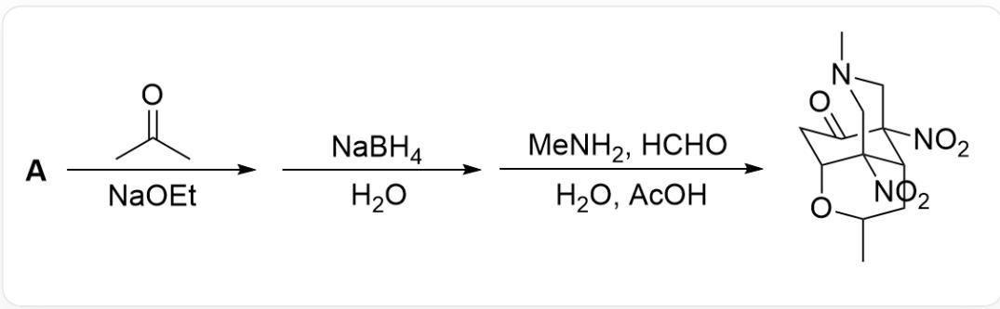
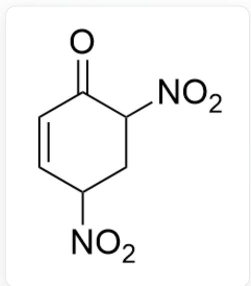
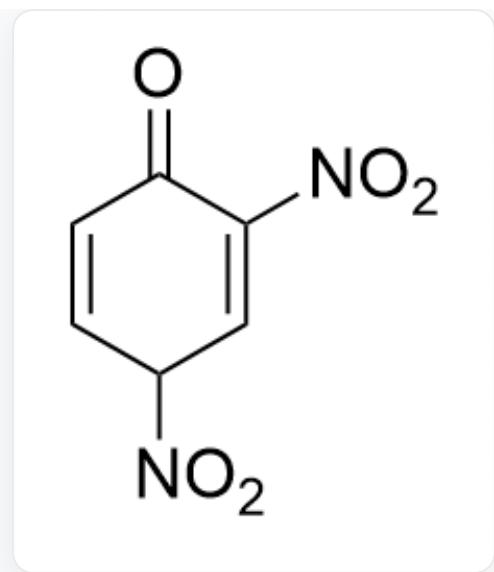
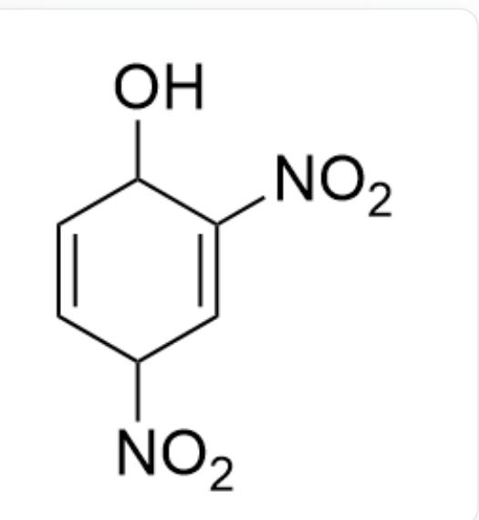
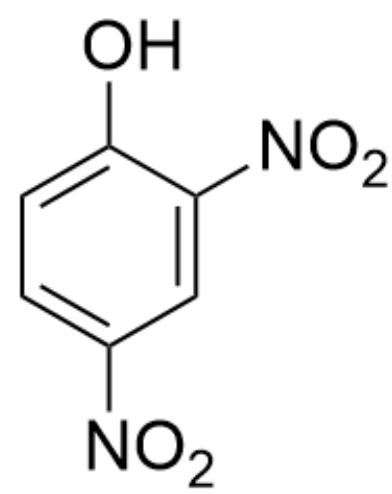
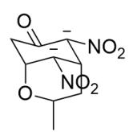
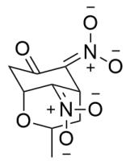
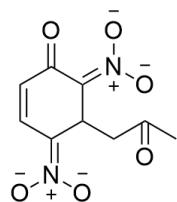
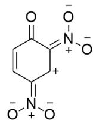
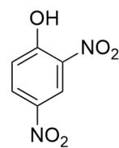

# 题目

图片描述了一步有机串联反应。底物A先与CC(C)=O，NaOEt反应；再与NaBH4,H2O反应；最后与MeNH2,HCHO,H2O,AcOH反应，得到产物CN1C[C@@]([C@@H]2[C@]3([N+][[O-])=O)C1)([N+]([O-])=O)[C@H](OC(C)C2)CC3=O

下列选项中, 关于上图反应的未知结构  $\mathrm{A}$  的结构, 正确的是:

A. 其他选项均不正确  
B.

$$
O = C 1 C ([ N + ] ([ O - ]) = O) C C ([ N + ] ([ O - ]) = O) C = C 1
$$

C.

[ \mathrm{O} = \mathrm{C1}\mathrm{C}([\mathrm{N} + ]([\mathrm{O} - ]) = \mathrm{O}) = \mathrm{CC}([\mathrm{N} + ]([\mathrm{O} - ]) = \mathrm{O})\mathrm{C} = \mathrm{C1} ]

D.

OC1C([N+]([O-])=O)=CC([N+][[O-]]=[O]-)C=C1

E.

  
F.

OC1=CC=C([N+]([O-])=O)C=C1[N+][[O-])=O

OC1=CC([N+][[O-]]=[O]-) = OC = CC = C1[N+][[O-]]=[O-] = O

# 答案

正确答案: E

# 详细解析

生成产物的最后一步很显然为Mannich反应；产物中的三级胺单元  $-\mathrm{CH}_2 - \mathrm{NCH}_3 - \mathrm{CH}_2-$  为Mannich反应得到的结构，因此逆合成第一步需要切断该三级胺片段，产生双碳负离子，  $O = C1[C-]([N+]([O-]) = O)$  [C@H]2[C-]([N+]([O-])=O)[C@H](OC(C)C2)C1。

# CHECKPOINT

1 PTS

生成产物的最后一步为Mannich反应

# CHECKPOINT

1 PTS

产物中的三级胺单元  $-\mathrm{CH}_2 - \mathrm{NCH}_3 - \mathrm{CH}_2-$  为Mannich反应得到的结构

# CHECKPOINT

1 PTS

切断该三级胺片段，产生双碳负离子，结构为  $O = C1[C-]([N+][[O-] = O)[C@H]2[C-][(N+][[O-]] = O)$  [C@H](OC(C)C2)C1

实际上碳负离子的负电荷可以转移到硝基上，即  $\mathrm{C} = \mathrm{NO}_2^-$  双键结构。因此第一步切断的结构为 $\mathrm{O = C(C[C@@H]1 / C([C@H] / 2CC(C)O1) = [N + ]([O - ])\backslash [O - ])C2 = [N + ]([O - ])\backslash [O - ]}$

# CHECKPOINT

1 PTS

第一步切断三级胺的结构为  $O = C(C[C@@H]1 / C([C@H] / 2CC(C)O1) = [N + ]([O - ])\backslash [O - ])C2 = [N + ]([O - ])\backslash$  [O-][O-]]

再向前一步加入了硼氢化钠，由于很明显可以看出产物的  $-\mathrm{O}-\mathrm{CHCH}_{3}-\mathrm{CH}_{2}-$  六元环片段来源于最开始加入的丙酮，考虑硼氢化钠用于还原羰基；但因为产物含有羰基，因此产物的羰基被还原时只能为α，β-不饱和酮结构防止被还原，因此丙酮结构的羰基被还原为醇羟基后发生分子内Micheal加成，亲核进攻α，β-不饱和酮形成六元环，符合逻辑。因此进一步切断的结构为  $O = C(C = C / C(C / 1CC(C) = O) = [N + ]([O - ])$ $[\mathrm{O - }])\mathrm{C}1 = [\mathrm{N + }]([\mathrm{O - }]) / [\mathrm{O - }]$  。

# CHECKPOINT

1 PTS

产物的  $-\mathrm{O}-\mathrm{CHCH}_{3}-\mathrm{CH}_{2}-$  六元环片段来源于丙酮

# CHECKPOINT

1 PTS

硼氢化钠用于还原羰基

# CHECKPOINT

1 PTS

丙酮的羰基被还原为醇羟基后发生分子内Micheal加成，亲核进攻α，β-不饱和酮形成六元环

# CHECKPOINT

1 PTS

进一步切断的结构为  $O = C(C = C / C(C / 1CC(C) = O) = [N + ]([O - ])\backslash [O - ])C1 = [N + ]([O - ]) / [O - ]$

丙酮结构的结合很显然通过将丙酮在醇钠条件下转化为烯醇负离子进行亲核进攻进行，因此切断丙酮结构得到六元环碳正离子，结构为  $\mathrm{O = C(C = C / C([CH + ] / 1) = [N + ]([O - ])\backslash [O - ])C1 = [N + ]([O - ]) / [O - ]}$

# CHECKPOINT

1 PTS

切断丙酮结构得到六元环碳正离子，结构为O=C(C=C/C([CH+]/1)=[N]+([O-])\[O-]\)C1=[N]+([O-])/[O-]

该结构此时带一个负电荷，需要得到一个氢离子；最终发现A含有四个氢，可以互变异构为苯环结构，而丙酮产生的负离子亲核进攻为芳香亲核取代反应。

# CHECKPOINT

1 PTS

A 含有四个氢，可以互变异构为苯环结构

# CHECKPOINT

1 PTS

丙酮产生的负离子亲核进攻为芳香亲核取代反应

因此A结构为OC1=CC=C([N+]([O-]=O)C=C1[N+]([O-]=O，选项E正确。

# CHECKPOINT

2 PTS

A结构为OC1=CC=C([N+]([O-])=O)C=C1[N+]([O-])=O

  
A

本图从左到右为产物逐步切断的中间体。切断三级胺片段，产生双碳负离子，结构为O=C1[C-]([N+]([O-])=O) [C@H]2[C-]([N+]([O-])=O) [C@H](OC(C)C2)C1；互变异构，为O=C(C[C@@H]1/C([C@H]/2CC(C)O1)=[N+]([O-])\([O-])C2=[N+]([O-])\backslash[O-]；之后切断六元环，结构为O=C(C=C/C(C/1CC(C)=O)=[N+]([O-])\backslash[O-])C1=[N+]([O-])/[O-]；切断丙酮结构得到六元环碳正离子，结构为O=C(C=C/C([CH+]/1)=[N+]([O-])\backslash[O-])C1=[N+]([O-])/[O-]；最终通过互变异构得到A结构为OC1=CC=C([N+][O-])=O)C=C1[N+]([O-])=O。