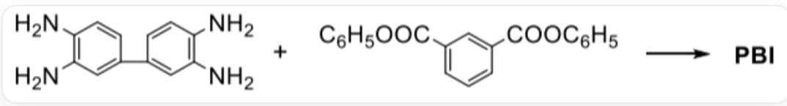
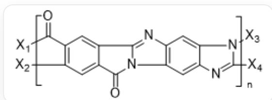
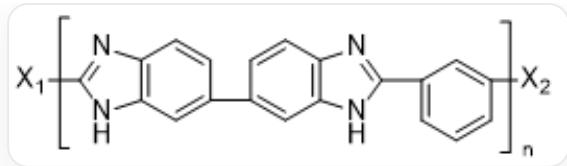
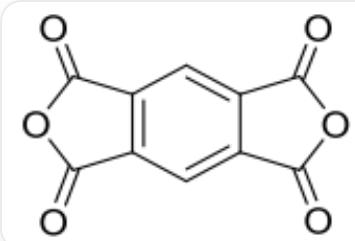
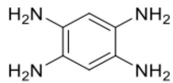

# Question

Polybenzimidazole PBI is a heat-resistant polymer that was studied relatively early. It has a melting point above  $400^{\circ}\mathrm{C}$ , and its films and fibers can maintain good mechanical properties up to  $300^{\circ}\mathrm{C}$ , but degrade rapidly beyond this temperature. The monomers are aromatic tetraamines and diacids or esters:

  
The reaction of NC1=C(N)C=C(C2=CC(N)=C(N)C=C2)C=C1 and O=C(OC1=CC=CC=C1)C2=CC(C(OC3=CC=CC=C3)=O)=CC=C2 can produce PBI

PBI has single bonds remaining in the main chain, which are easily broken when heated at high temperatures. Therefore, all-ladder polymers (molecular structure similar to a ladder) A are often used in aerospace equipment. It is known that the preparation of A requires two monomers, and the polycondensation proceeds in two steps. The first step can occur at room temperature without dehydration, and the second step occurs with slight heating, releasing two molecules of water.

  
The repeating unit structure of the polymer monomer is

$$
\begin{array}{l} \text {[ X 1 ] C (C 1 = C ([ X 2 ]) C = C (C (N 2 C 3 = N C 4 = C 2 C = C (N = C ([ X 4 ]) N 5 [ X 3 ]) C 5 = C 4) = O) C 3 = C 1) = O , X _ {1} i s c o n n e c t e d t o} \\ \quad \quad \quad \quad \quad \quad \quad \quad \quad \quad \quad \quad \quad \quad \quad \quad \quad \quad \quad \quad \quad \quad \quad \quad \quad \quad \quad \quad \quad \quad \quad \quad \quad \quad \quad \quad \quad \quad \quad \quad \quad \quad \quad \quad \quad \quad \quad \quad \quad \quad \end{array}
$$

The following information is available:

1. The PBI repeating unit has 5 rings.  
2. The entire reaction process for the formation of PBI involves two reaction mechanisms.

3. Phenyl ester is used here instead of diacid because the PBI synthesis reaction cannot be carried out in an acidic environment.  
4. The two monomers for synthesizing A have a total of 14 degrees of unsaturation.  
5. The first-step intermediate product is insoluble in water.

The option that contains all the correct statements is:

A. 1  
B. 1,3  
C. 1,4  
D. 1,5  
E. 2,3  
F. 1,3,4  
G. 3,5  
H. 4,5  
1. 3,4,5  
J. 1,3,4,5  
K. 所有说法都正确

# Answer

Correct Answer: C

# Detailed Explanation

The generation of PBI involves two reactions:

1. A nucleophilic substitution reaction occurs between an amine group and an ester group, forming an amide bond.  
2. Another amine group on the same side nucleophilically attacks the carbonyl group in the amide bond, forming a five-membered ring, with addition forming a hydroxyl group; then a hydroxyl elimination reaction occurs, forming a carbon-nitrogen double bond.

# CHECKPOINT

1 PTS

Nucleophilic substitution reaction occurs, amine group reacts with ester group to form amide bond

# CHECKPOINT

1 PTS

Addition-elimination reaction occurs, amine group adds to carbonyl group, forming hydroxyl group; hydroxyl group undergoes elimination reaction, forming carbon-nitrogen double bond

The repeating unit structure of PBI is:

The repeating unit structure of the polymer monomer is

[X1]C(N1)=NC2=C1C=C(C3=CC(NC(C4=CC=CC([X2]))=C4)=N5)=C5C=C3)C=C2,  $\mathbf{X}_{\mathbf{1}}$  is connected to  $\mathbf{X}_{\mathbf{2}}$ .

# CHECKPOINT

2 PTS

The repeating unit structure of the polymer monomer is  $\mathrm{[X1]C(N1) = NC2 = C1C = C(C3 = CC(NC(C4 = CC = CC([X2]) = C4) = N5) = C5C = C3)C = C2}$ ,  $\mathbf{X_1}$  is connected to  $\mathbf{X_2}$ .

The phenyl ester is used here instead of a diacid because the polycondensation reaction temperature is high, and decarboxylation easily occurs. Using a phenyl ester can overcome this disadvantage.

# CHECKPOINT

1 PTS

Phenyl ester is used instead of diacid because the polycondensation reaction temperature is high, and decarboxylation easily occurs

The monomers for the preparation of  $\mathbf{A}$  are:

The compound on the left is  $O = C(OC1 = O)C2 = C1C = C(C(OC3 = O) = O)C3 = C2$  ; the compound on the right is NC1=CC(N)=C(N)C=C1N

# CHECKPOINT

2 PTS

The monomers for the preparation of A are:  $\mathrm{O} = \mathrm{C}(\mathrm{OC1} = \mathrm{O})\mathrm{C2} = \mathrm{C1}\mathrm{C} = \mathrm{C}(\mathrm{C}(\mathrm{OC3} = \mathrm{O}) = \mathrm{O})\mathrm{C3} = \mathrm{C2}$  and NC1=CC(N)=C(N)C=C1N

The preparation of  $\mathbf{A}$  involves two reactions:

1. A nucleophilic substitution reaction occurs between an amine group and a lactone group, forming an amide bond; the five-membered ring opens, forming a carboxylic acid group. At this time, the carboxylic acid group is deprotonated, and the unreacted amine group is protonated, forming a water-soluble zwitterionic intermediate.  
2. Another amine group on the same side undergoes dehydration with another carboxylic acid group to form an amide bond; one of the amine groups then nucleophilically attacks the carbonyl group on the other side, forming a five-membered ring, with addition forming a hydroxyl group; then a hydroxyl elimination reaction occurs, forming a carbon-nitrogen double bond.

# CHECKPOINT

1 PTS

Nucleophilic substitution reaction occurs, one amine group reacts with one lactone group to form an amide bond; the five-membered ring opens, forming a carboxylic acid group. Carboxylic acid group and amine group undergo proton transfer, forming a zwitterion

# CHECKPOINT

1 PTS

Another amine group undergoes nucleophilic substitution reaction with carboxylic acid group, forming an amide bond; one amine group undergoes nucleophilic addition reaction with the carbonyl group on the other side, forming a hydroxyl group; then a hydroxyl elimination reaction occurs

Therefore, statements 1 and 4 are correct. Select option C.