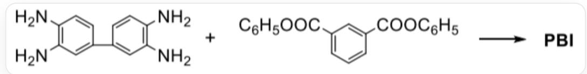
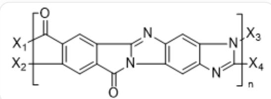
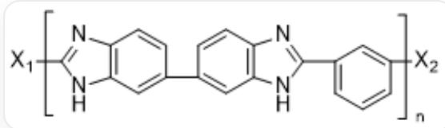
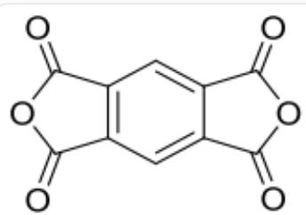
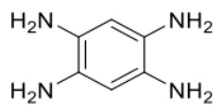

# 题目

聚苯并咪唑PBI是一种研究得较早的耐热高分子，熔点在  $400^{\circ}\mathrm{C}$  以上，薄膜和纤维达  $300^{\circ}\mathrm{C}$  仍能保持良好的力学性能，超过这一温度会迅速降解。单体是芳族四元胺和二元酸或酯：

$$
N C 1 = C (N) C = C (C 2 = C C (N) = C (N) C = C 2) C = C 1 \text {和}
$$

$$
O = C (O C 1 = C C = C C = C 1) C 2 = C C (C (O C 3 = C C = C C = C 3) = O) = C C = C 2 \text {反 应 可 以 生 成} P B I
$$

PBI中主链中留有单键，在高温下受热易断裂，所以在宇航设备中常使用全梯形聚合物（分子结构类似梯子）A。已知制备A需两个单体，缩聚分两步进行，第一步在室温下即可发生，不脱水，稍加热即可发生第二步反应，脱去两分子水。

  
聚合物单体重复单元结构为

$$
\begin{array}{r l} & {[ X 1 ] C (C 1 = C ([ X 2 ]) C = C (C (N 2 C 3 = N C 4 = C 2 C = C (N = C ([ X 4 ]) N 5 [ X 3 ]) C 5 = C 4) = O) C 3 = C 1) = O, \quad \mathbf {X} _ {1} \text {与} \mathbf {X} _ {3} \text {相 连};} \\ & {\qquad \mathbf {X} _ {2} \text {与} \mathbf {X} _ {4} \text {相 连 。}} \end{array}
$$

现有以下信息：

1. PBI 重复单元中有 5 个环。  
2. 整个PBI生成的反应过程涉及两种反应机理。  
3.这里使用苯酯而不用二元酸是因为PBI合成反应不能在酸性环境下进行。  
4.合成A的两个单体元一共有14个不饱和度。

5. 第一步中间产物不溶于水。

下面包含所有正确说法的选项是：

A. 1  
B. 1,3  
C. 1,4  
D. 1,5  
E. 2,3  
F. 1,3,4  
G. 3,5  
H. 4,5  
1. 3,4,5  
J. 1,3,4,5  
K. 所有说法都正确

# 答案

正确答案: C

# 详细解析

生成PBI过程经历两个反应：

1. 一个氨基与酯基发生亲核取代反应，生成酰胺键。  
2. 同侧另一个氨基亲核进攻酰胺键中的羰基，形成五元环，加成生成羟基；然后发生羟基消去反应，生成碳氮双键。

# CHECKPOINT

1 PTS

发生亲核取代反应，氨基与酯基反应生成酰胺键

# CHECKPOINT

1 PTS

发生加成-消去反应，氨基与羰基加成，生成羟基；羟基发生消去反应，生成碳氮双键

PBI的重复单元结构为：

聚合物单体重复单元结构为[X1]C(N1) = NC2 = C1C = C(C3 = CC(NC(C4 = CC([X2])) = C4) = N5) = C5C = C3) C = C2, X₁ 与 X₂ 相连。

# CHECKPOINT

2 PTS

聚類綜合檢測物質單體檢測儀重複檢測復雜檢測單元檢測結構構圖為

[X1]C(N1)=NC2=C1C=C(C3=CC(NC(C4=CC=CC([X2]))=C4)=N5)=C5C=C3)C=C2，  $\mathbf{X_1}$  与  $\mathbf{X_2}$  相连。

这里使用苯酯而不用二元酸是因为缩聚反应温度高，容易脱羧，改用苯酯可以克服这个缺点。

# CHECKPOINT

1 PTS

使用苯酯而不用二元酸是因为缩聚反应温度高，容易脱羧

制备A的单体为：

左边化合物为  $O = C(OC1 = O)C2 = C1C = C(C(OC3 = O) = O)C3 = C2$  ；右边化合物为NC1=CC(N)=C(N)C=C1N

# CHECKPOINT

2 PTS

制备A的单体为：  $O = C(OC1 = O)C2 = C1C = C(C(OC3 = O) = O)C3 = C2$  和NC1=CC(N)=C(N)C=C1N

制备A的过程经历两个反应：

1. 一个氨基与一个内酯基发生亲核取代反应，生成酰胺键；五元环打开，形成羧基。这时羧基脱质子化，未反应的氨基质子化，形成可溶于水的内盐中间产物。  
2. 同侧另一个氨基与另一个羧基脱水生成酰胺键；其中一个氨基再亲核进攻另一侧羰基，形成五元环，加成生成羟基；然后发生羟基消去反应，生成碳氮双键。

# CHECKPOINT

1 PTS

发生亲核取代反应，其中一个氨基与一个内酯基发生反应生成酰胺键；五元环打开，形成羧基。羧基、氨基质子转移，生成内盐

# CHECKPOINT

1 PTS

另一个氨基与羧基发生亲核取代反应，生成酰胺键；其中一个氨基与另一侧羰基发生亲核加成反应，生成羟基；然后再发生羟基消去反应

因此，说法1,4正确。选择选项C。