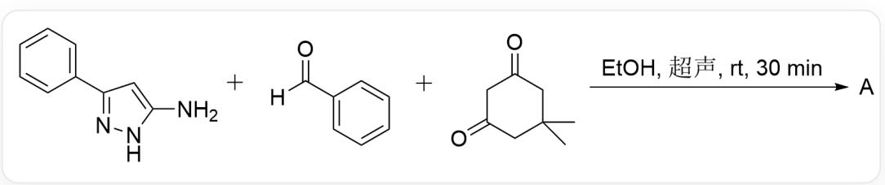
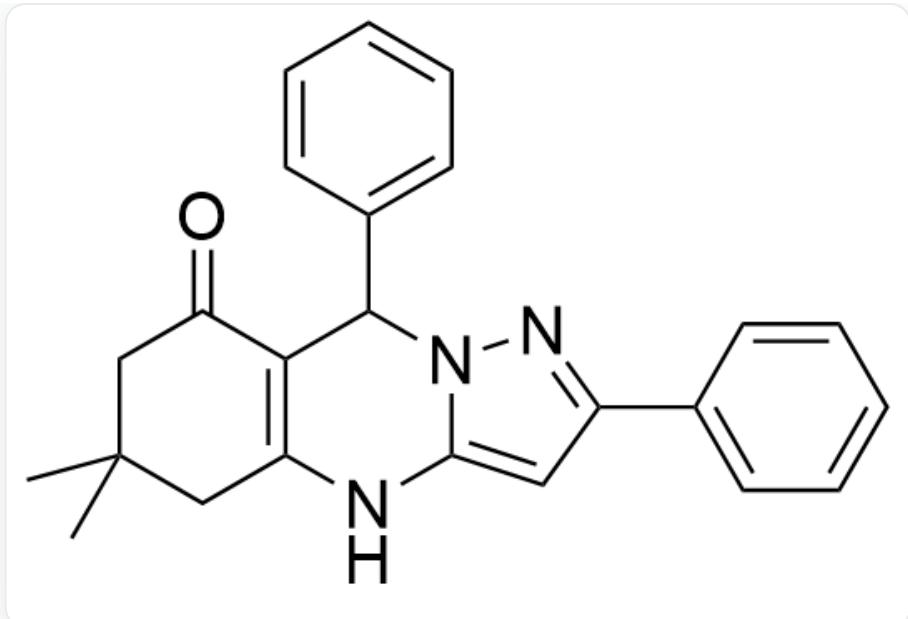
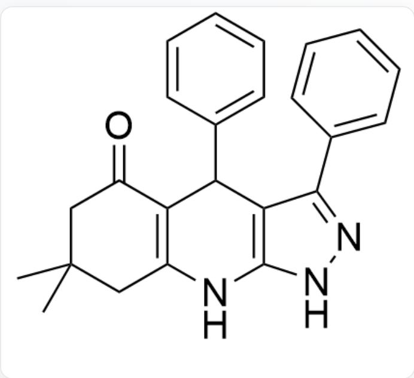
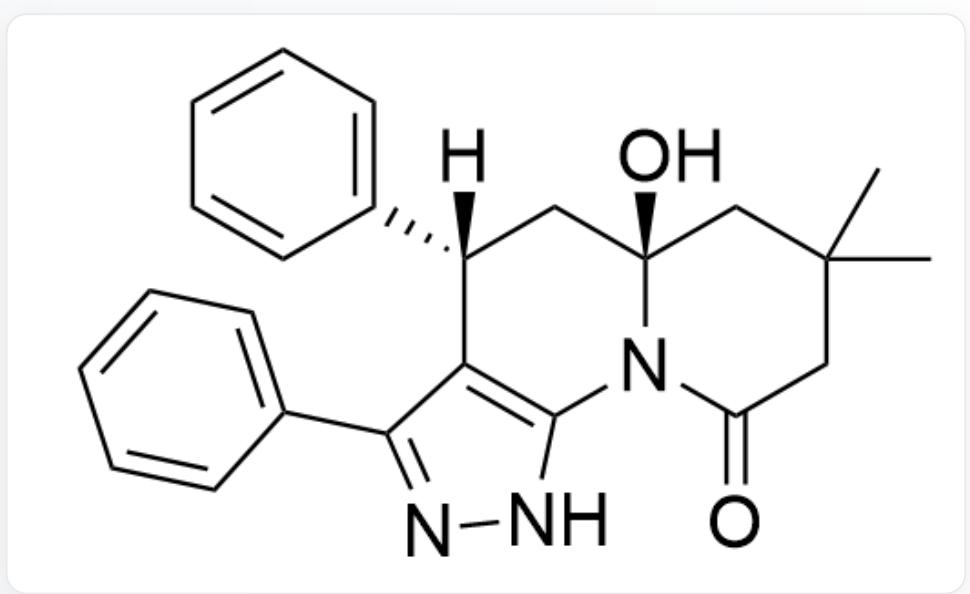
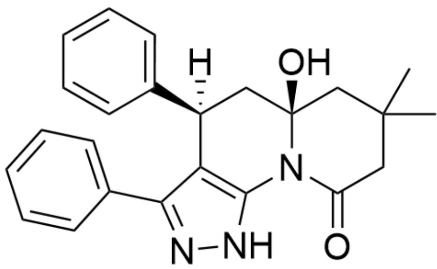
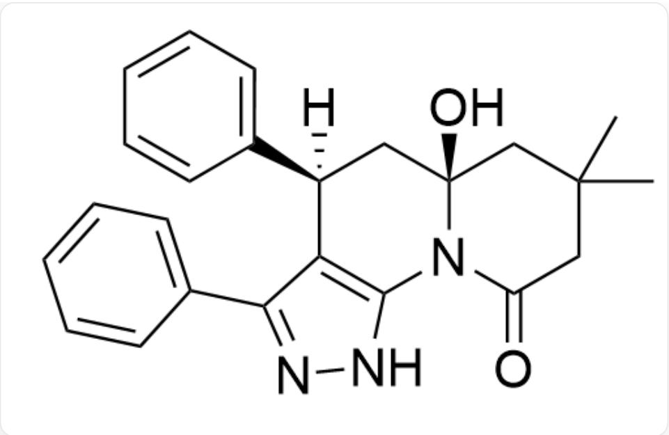
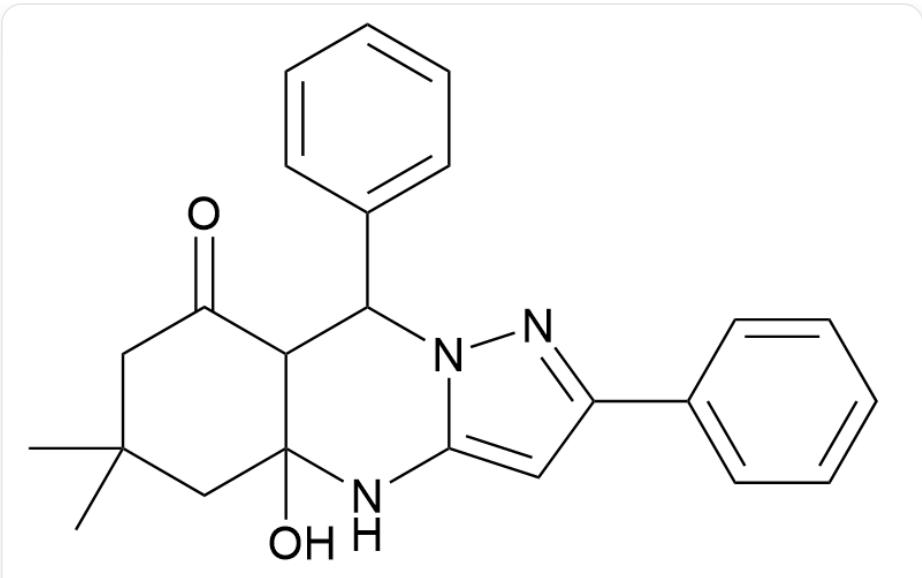
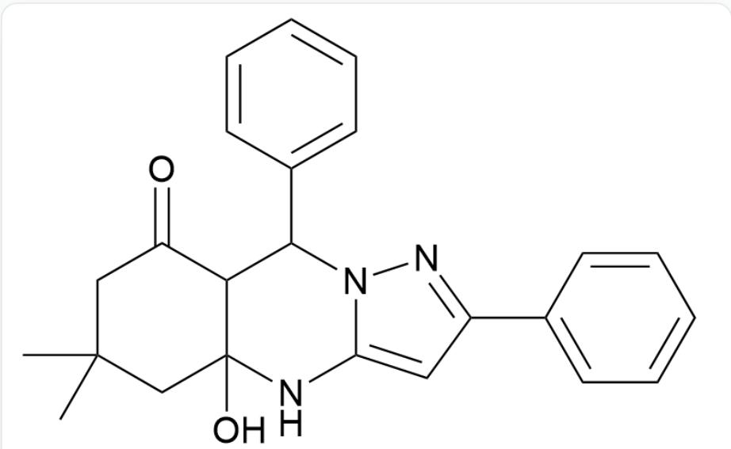

# Question

A.  
  
NC1=CC(C2=CC=CC=C2)=NN1.O=C(C1=CC=CC=C1)[H].O=C1CC(C)(C)CC(C1)=O>>[A], reaction conditions: solvent CCO (EtOH), ultrasonication, rt, 30 min

Please select the structural formula of product A and determine whether it has enantiomers.

B.  
  
O=C1C2=C(NC3=CC(C4=CC=CC=C4)=NN3C2C5=CC=CC=C5)CC(C)(C)C1

Has enantiomers

C.  
  
O=C1C2=C(NC3=CC(C4=CC=CC=C4)=NN3C2C5=CC=CC=C5)CC(C)(C)C1

No enantiomer

D.  
  
O=C1C2=C(NC(NN=C3C4=CC=CC=C4)=C3C2C5=CC=CC=C5)CC(C)(C)C1

Has enantiomers

  
E.

O=C1C2=C(NC(NN=C3C4=CC=CC=C4)=C3C2C5=CC=CC=C5)CC(C)(C)C1

No enantiomer

  
F.

O=C1N2C3=C(C(C4=CC=CC=C4)=NN3)[C@]([H])(C5=CC=CC=C5)C[C@]2(O)CC(C)(C)C1

Has enantiomers

  
G.

O=C1N2C3=C(C(C4=CC=CC=C4)=NN3)[C@]([H])(C5=CC=CC=C5)C[C@]2(O)CC(C)(C)C1

No enantiomer

  
H.

O=C1N2C3=C(C(C4=CC=CC=C4)=NN3)[C@@]([H])(C5=CC=CC=C5)C[C@]2(O)CC(C)(C)C1

Has enantiomers

  
O=C1N2C3=C(C(C4=CC=CC=C4)=NN3)[C@@]([H])(C5=CC=CC=C5)C[C@]2(O)CC(C)(C)C1

No enantiomer

# Answer

Correct Answer: A

# Detailed Explanation

Under ambient and neutral conditions, the reaction is kinetically controlled

# CHECKPOINT

1 PTS

Under ambient and neutral conditions, the reaction is kinetically controlled

The nucleophilic ability of the nitrogen atom's n-electrons is stronger than that of the  $\pi$ -electrons in a carbon-carbon double bond

# CHECKPOINT

1 PTS

The nucleophilic ability of the nitrogen atom's n-electrons is stronger than that of the  $\pi$ -electrons in a carbon-carbon double bond

First, a condensation reaction occurs via a mechanism similar to the Biginelli reaction to yield the intermediate

O=C1C2C(NC3=CC(C4=CC=CC=C4)=NN3C2C5=CC=CC=C5)(O)CC(C)(C)C1

# CHECKPOINT

1 PTS

First, a condensation reaction occurs via a mechanism similar to the Biginelli reaction to yield the intermediate

O=C1C2C(NC3=CC(C4=CC=CC=C4)=NN3C2C5=CC=CC=C5)(O)CC(C)(C)C1

Subsequently, an elimination reaction occurs to remove a molecule of  $H_{2}O$ , yielding product A