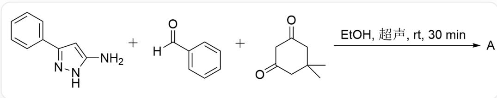
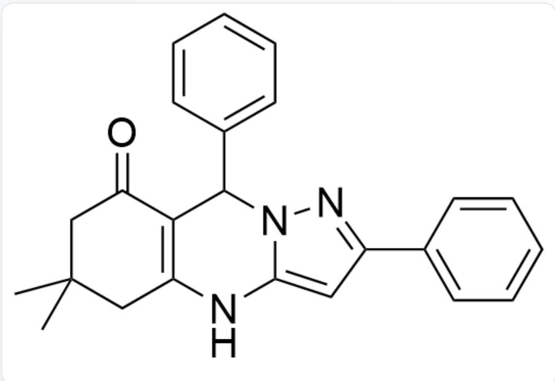
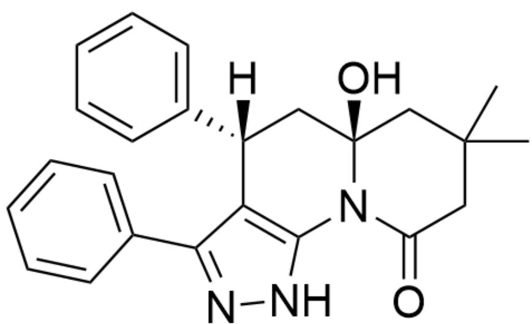
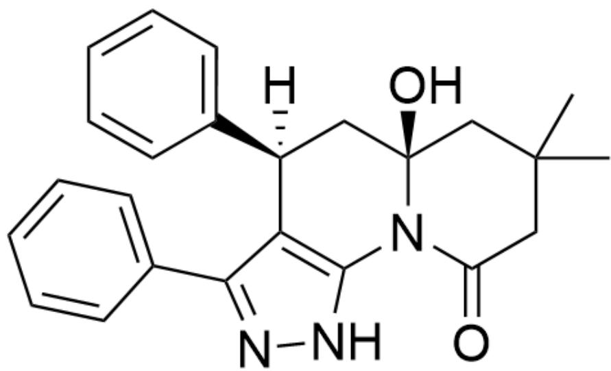
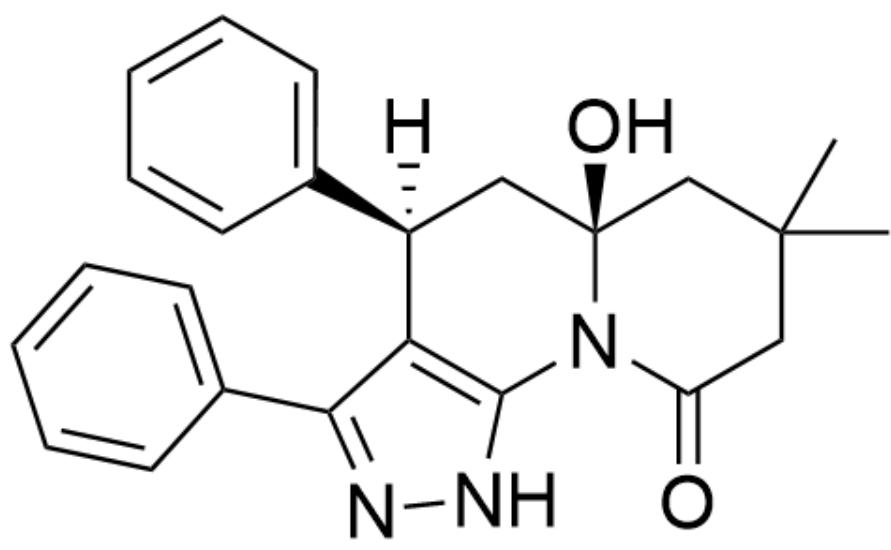
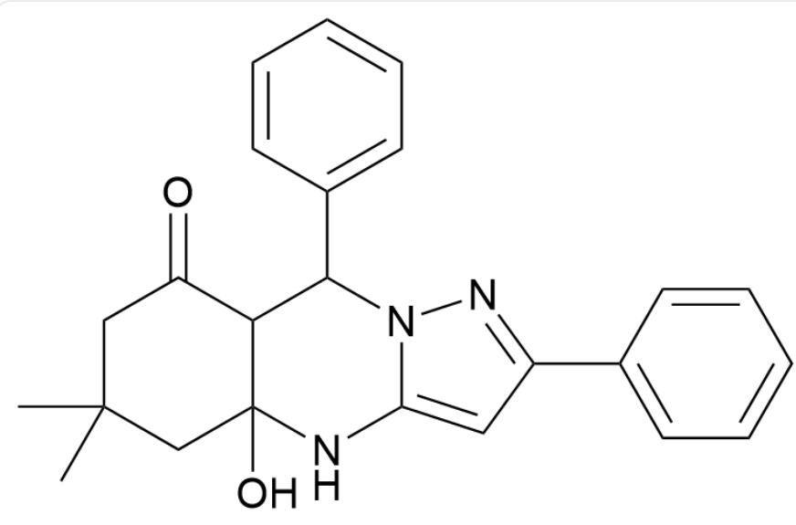
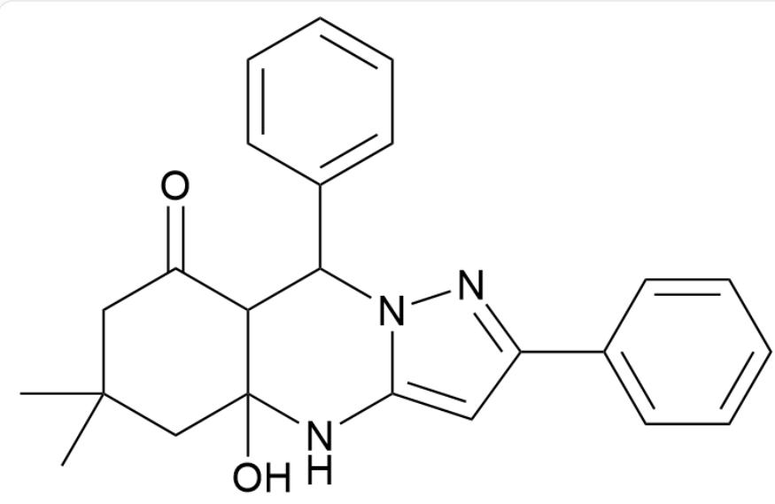

# 题目

NC1=CC(C2=CC=CC=C2)=NN1.O=C(C1=CC=CC=C1)[H].O=C1CC(C)(C)CC(C1)=O>>[A]，反应条件为溶

剂CCO（EtOH），超声，rt,30min

请选出产物A的结构简式，并判断是否有对映异构体

A.

$$
O = C 1 C 2 = C (N C 3 = C C (C 4 = C C = C C = C 4) = N N 3 C 2 C 5 = C C = C C = C 5) C C (C) (C) C 1
$$

有对映异构体

B.

C.  
  
O=C1C2=C(NC3=CC(C4=CC=CC=C4)=NN3C2C5=CC=CC=C5)CC(C)(C)C1

没有对映异构体

D.  
  
O=C1C2=C(NC(NN=C3C4=CC=CC=C4)=C3C2C5=CC=CC=C5)CC(C)(C)C1

有对映异构体

  
E.

O=C1C2=C(NC(NN=C3C4=CC=CC=C4)=C3C2C5=CC=CC=C5)CC(C)(C)C1

没有对映异构体

  
F.

$\mathrm{O = C1N2C3 = C(C(C4 = CC = CC = C4) = NN3)[C@]([H])}$ $(\mathrm{C5 = CC = CC = C5})\mathrm{C}[\mathrm{C@}]2(\mathrm{O})\mathrm{CC}(\mathrm{C})(\mathrm{C})\mathrm{C}1$

有对映异构体

  
G.

O=C1N2C3=C(C(C4=CC=CC=C4)=NN3)[C@]([H])(C5=CC=CC=C5)C[C@]2(O)CC(C)(C)C1

没有对映异构体

  
H.

O=C1N2C3=C(C(C4=CC=CC=C4)=NN3)[C@@]([H])(C5=CC=CC=C5)C[C@]2(O)CC(C)(C)C1

有对映异构体

O=C1N2C3=C(C(C4=CC=CC=C4)=NN3)[C@@]([H])(C5=CC=CC=C5)C[C@]2(O)CC(C)(C)C1

没有对映异构体

# 答案

正确答案: A

# 详细解析

在常温和中性的条件下，反应受到动力学控制

# CHECKPOINT

1 PTS

在常温和中性的条件下，反应受到动力学控制

氮原子的n电子的亲核能力强于碳碳双键中π电子的亲核能力

# CHECKPOINT

1 PTS

氮原子的n电子的亲核能力强于碳碳双键中π电子的亲核能力

首先通过类似Biginelli反应的机理，进行缩合反应得到中间体

O=C1C2C(NC3=CC(C4=CC=CC=C4)=NN3C2C5=CC=CC=C5)(O)CC(C)(C)C1

# CHECKPOINT

1 PTS

首先通过类似Biginelli反应的机理，进行缩合反应得到中间体

O=C1C2C(NC3=CC(C4=CC=CC=C4)=NN3C2C5=CC=CC=C5)(O)CC(C)(C)C1

接着发生消除反应脱去一分子  $H_{2} O$  得到产物 A