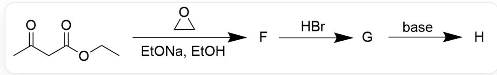
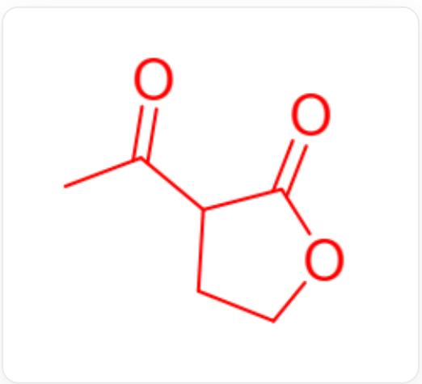
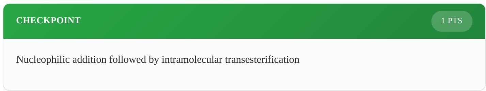
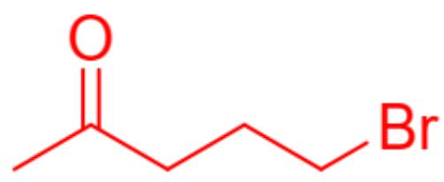
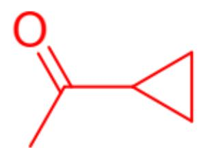

# Question

The following Figure 1 synthesizes a cyclic compound  $\mathbf{H}$  with significant ring strain. It is known that the molecular formula of  $\mathbf{H}$  is  $\mathrm{C}_5\mathrm{H}_8\mathrm{O}$ . Deduce the reaction mechanism and the structures of  $\mathbf{F}$ ,  $\mathbf{G}$ , and  $\mathbf{H}$ .

  
Fig. 1, the figure shows a three-step consecutive reaction. The first step reaction is described by SMILES as: CCOC(CC(C)=O)=O>01CC1>[F], where the reaction conditions are EtONa, EtOH. The second step is  $[F] >>[[G]]$ , the reaction condition is HBr. The third step is  $[G] >>[[H]]$ , the reaction condition is base.

There are the following statements:

1.  $\mathbf{F}$  contains an ethyl ester group structure  
2.  $\mathbf{G}$  contains a carboxyl group structure  
3.  $\mathbf{H}$  contains a four-membered ring in the molecule  
4. A substance that is a gas under normal pressure is generated in the entire reaction

The following options that are all correct and have the largest number of correct statements are:

A. All other options are incorrect  
B. 1  
C. 2  
D. 3

E. 4  
F. 1,2  
G. 1,3  
H. 1,4  
1. 2,3  
J. 2,4  
K. 3,4  
L. 1,2,3  
M. 1,2,4  
N. 1,3,4  
O. 2,3,4  
P. 1,2,3,4

# Answer

Correct Answer: E

# Detailed Explanation

First, according to the final product's molecular formula, it can be found that the number of carbons is reduced by 2 compared to the reactants, indicating that some molecules are substituted during the reaction. At the same time, it only contains one oxygen atom, most likely a carbonyl oxygen.

Ethyl acetohetate undergoes nucleophilic attack on ethylene oxide under basic conditions, resulting in an alcohol anion. This alkoxide may further undergo an intramolecular transesterification reaction. Considering the extremely small number of carbons in the final product, it is first assumed here that transesterification occurs, removing one molecule of ethanol. The hydroxyl anion substitutes ethanol, yielding  $\mathbf{F}$  as shown in Figure 2:

  
Fig. 2, 图中分子以SMILES描述为：CC(=O)C1CCOC1=O

# CHECKPOINT

1 PTS

The structure of  $\mathbf{F}$  is described by SMILES as: CC(=O)C1CCOC1=O

The structure of  $\mathbf{F}$  does not contain ethyl acetate, so statement 1 is incorrect.

In the second step, ester hydrolysis occurs under acidic conditions, yielding a  $\beta$ -keto acid.  $\beta$ -Keto acids are unstable under acidic heating conditions and can undergo decarboxylation. Considering that the final product contains only one oxygen atom, decarboxylation most likely occurred here. The hydroxyl group can be protonated by hydrobromic acid, and at the same time, the bromide ion can nucleophilically attack and substitute the hydroxyl group, yielding  $\mathbf{G}$  as shown in Figure 3:

  
Fig. 3, 图中分子以SMILES描述为：CC(=O)CCCBr

# CHECKPOINT

1 PTS

$\beta$ -Keto acid is unstable under acidic heating conditions and undergoes decarboxylation

# CHECKPOINT

1 PTS

Bromine substitutes the hydroxyl group to obtain  $\mathbf{G}$

# CHECKPOINT

1 PTS

The structure of  $\mathbf{G}$  is described by SMILES as: CC(=O)CCCBr

The structure of  $\mathbf{G}$  does not contain a carboxyl group, so statement 2 is incorrect.

In the third step, under the action of a base, the  $\beta$ -carbon of the carbonyl group can undergo deprotonation, and then nucleophilically substitute the bromine atom. According to the question, the final product  $\mathbf{H}$  is a highly strained cyclic compound, so the reaction produces a three-membered ring. The structure of  $\mathbf{H}$  is shown in Figure 4:

  
Fig. 4, 图中分子以SMILES描述为：CC(=O)C1CC1

# CHECKPOINT

1 PTS

Nucleophilic substitution of the bromine atom at the  $\beta$ -position of the carbonyl group, yielding H

# CHECKPOINT

1 PTS

The structure of  $\mathbf{H}$  is described by SMILES as: CC(=O)C1CC1

Verification confirms that the molecular formula matches the description in the question. The structure of  $\mathbf{H}$  is a three-membered ring rather than a four-membered ring, so statement 3 is incorrect.

Looking back at the initial assumptions, if transesterification does not occur in the first step, then the ester group is difficult to hydrolyze under the subsequent acidic and basic conditions. If decarboxylation does not occur in the second step, then the carboxyl group cannot be eliminated under the basic environment in the third step, which does not meet the molecular formula requirements of the question. Overall, the above assumptions are correct.

Decarboxylation in the second step produces  $\mathrm{CO}_{2}$  gas, so statement 4 is correct.

# CHECKPOINT

1 PTS

Decarboxylation in the second step produces  $\mathrm{CO}_{2}$  gas