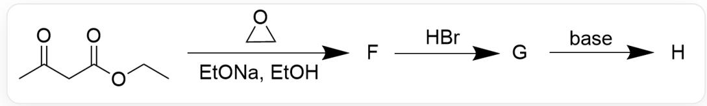
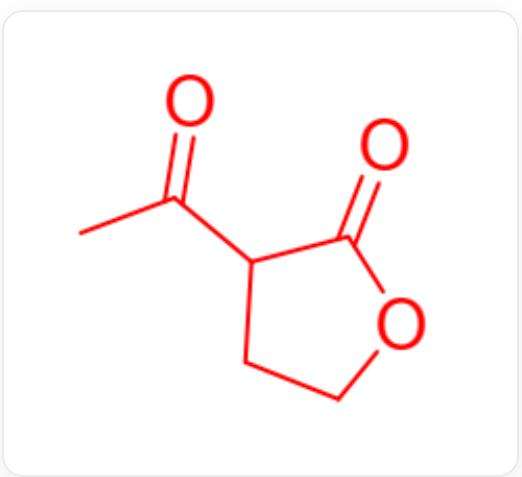
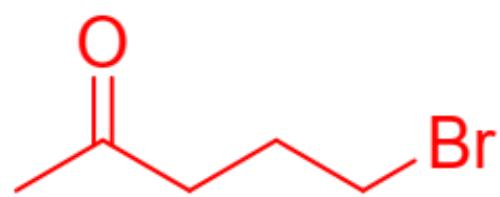
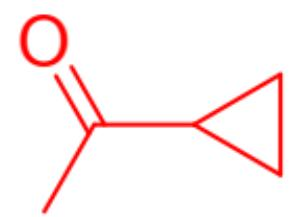

# 题目

下图1合成了一种具有较大张力的环状化合物  $\mathbf{H}$ ，已知  $\mathbf{H}$  的分子式为  $\mathrm{C}_{5} \mathrm{H}_{8} \mathrm{O}$ 。推测反应机理和  $\mathbf{F}$ 、 $\mathbf{G}$ 、 $\mathbf{H}$  的结构。

  
Fig. 1, 图中为三步连续反应。第一步反应以SMILES描述为: CCOC(CC(C)=O)=O>01CC1>[F]], 其中反应条件为EtONa, EtOH。第二步为[[F]]>>[[G]], 反应条件为HBr。第三步为[[G]]>>[[H]], 反应条件为碱。

有以下说法：

1. F内含有乙酯基结构  
2. G中含有羧基结构  
3. H分子内含有四元环  
4. 整个反应中有常压下为气体的物质生成

以下选项中说法全部正确且正确说法数量最多的为：

A. 其他选项均不正确  
B. 1  
C. 2  
D. 3

E. 4  
F. 1,2  
G. 1,3  
H. 1,4  
1. 2,3  
J. 2,4  
K. 3,4  
L. 1,2,3  
M. 1,2,4  
N. 1,3,4  
O. 2,3,4  
P. 1,2,3,4

# 答案

正确答案: E

# 详细解析

首先根据最终产物分子式可以发现，相较于反应物碳数反而降低2，说明反应中有一些分子被取代。同时只含有一个氧原子，最可能是羰基氧。

乙酰乙酸乙酯在碱作用下亲核进攻环氧乙烷，得到醇负离子。该醇盐还可能进一步发生分子内酯交换反应，考虑到最终产物中碳数极少，此处先假设会发生酯交换脱去一分子乙醇。羟基负离子取代乙醇，得到  $\mathbf{F}$  如图2：

  
Fig. 2, 图中分子以SMILES描述为: CC(=O)C1CCOC1=O

# CHECKPOINT

1 PTS

F结构以SMILES描述为：CC(=O)C1CCOC1=O

F结构不含乙酸乙酯，说法1错误。

第二步酸性条件下酯水解，得到β酮酸。β-酮酸在酸性加热条件下不稳定，可发生脱羧反应，考虑到最终产物仅含一个氧原子，此处很可能发生了脱羧。羟基可以被氢溴酸质子化，同时溴离子可以亲核进攻取代羟基，得到G如图3:

  
Fig. 3, 图中分子以SMILES描述为: CC(=O)CCCBr

# CHECKPOINT

1 PTS

β-酮酸在酸性加热条件下不稳定，发生脱羧反应

# CHECKPOINT

1 PTS

溴取代羟基得到G

# CHECKPOINT

1 PTS

G结构以SMILES描述为：CC(=O)CCCBr

G结构不含羧基，说法2错误。

第三步在碱的作用下，羰基α碳可以发生去质子化，然后亲核取代溴原子。根据题目，最终产物H为大张力环状化合物，因此反应生成三元环，H结构如图4：

  
Fig. 4, 图中分子以SMILES描述为: CC(=O)C1CC1

# CHECKPOINT

1 PTS

羰基  $\alpha$  位亲核取代溴原子, 得到  $\mathrm{H}$

# CHECKPOINT

1 PTS

H结构以SMILES描述为：CC(=O)C1CC1

验证分子式符合题中描述。H结构为三元环而非四元环，说法3错误。

回看开头的假设，若第一步不发生酯交换，那么酯基在后面的酸性碱性条件下较难水解。第二步不发生脱羧，那么第三步碱性环境下羧基无法消去，不符合题目分子式要求。综合来看，以上假设正确。

第二步脱羧产生  $\mathrm{CO}_{2}$  气体，说法4正确。

# CHECKPOINT

1 PTS

第二步脱羧产生  $\mathrm{CO}_{2}$  气体