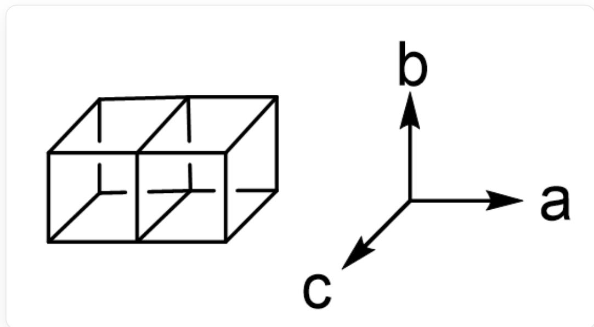

# Question

A, B and C represent an unknown element, respectively. The reaction of  $\mathbf{A}_3\mathbf{C}_2$  with BC yields a crystal X containing A, B and C. X belongs to the orthorhombic crystal system with unit cell parameters:  $a = 850.3$  pm,  $b = 1028.4$  pm,  $c = 503.4$  pm, where the arrangement of A and C is similar to that of NaCl. It can be regarded as two deformed hexahedrons connected coplanarly along the  $a$  axis to form the unit shown in the figure below. The two hexahedrons in each unit are then infinitely extended along the  $c$  axis in a coplanar manner to form an infinite chain structure; the chains are not directly connected, but form an infinite three-dimensional structure by sharing C atoms with the  $[\mathbf{BC}_3]$  unit. The  $[\mathbf{BC}_3]$  units in X are arranged perpendicular to the  $c$  axis, the B center has a planar triangular configuration with two orientations, and each  $[\mathbf{BC}_3]$  unit has a B-C bond parallel to the  $b$  axis. It is known that all C atoms in the crystal participate in the coordination of B.

  
"A schematic diagram. On the left is a structure consisting of two cubes connected coplanarly in the horizontal direction. On the right is a three-dimensional coordinate system with the a-axis pointing to the right, the b-axis pointing upwards, and the c-axis pointing to the front left."

According to the crystal diffraction results, the coordinates of some  $\mathbf{C}$  atoms in the crystal are: (0.500,0.624,0.750), (0.808,0.371,0.750); the bond length of the  $\mathbf{B} - \mathbf{C}$  bond parallel to the  $b$  axis is 186.3 pm. Select the correct  $\mathbf{C} - \mathbf{B} - \mathbf{C}$  bond angle from the following options.

A. All other options are incorrect.  
B.  $113^{\circ}$  and  $124^{\circ}$  
C.  $113^{\circ}$  and  $134^{\circ}$  
D.  $118^{\circ}$  and  $124^{\circ}$  
E.  $118^{\circ}$  and  $121^{\circ}$  
F.  $113^{\circ}$  and  $118^{\circ}$  
G.  $124^{\circ}$  and  $134^{\circ}$  
H.  $121^{\circ}$  and  $134^{\circ}$  
121° and 124°

# Answer

Correct Answer: C

# Detailed Explanation

According to the question, the coordination number of  $\mathbf{C}$  on the shared face of the two parallel hexahedral chains is 6, and the coordinating atoms are 1 B and 5 A, corresponding to the formation of  $\mathbf{B} - \mathbf{C}$  bonds parallel to the  $b$  axis; the coordination number of  $\mathbf{C}$  on the side faces is 5, and the coordinating atoms are 1 B and 4 A.

Therefore, each  $\mathbf{C}$  atom in the crystal is connected to 1  $\mathbf{B}$  atom, and there are 3  $\mathbf{C}$  atoms around 1  $\mathbf{B}$  atom, so the ratio of the number of  $\mathbf{B}$  atoms to  $\mathbf{C}$  atoms is  $1:3$ . Since  $\mathbf{A}$  and  $\mathbf{C}$  are alternately arranged in the parallelepiped, the ratio of the two is  $1:1$ . In summary, the crystal chemical formula is  $\mathbf{A}_3\mathbf{BC}_3$ .

# CHECKPOINT

1 PTS

There are two coordination forms of  $\mathbf{C}$  atoms, one with a coordination number of 6, and the coordinating atoms are 1 B and 5 A

# CHECKPOINT

1 PTS

The other coordination number of  $\mathbf{C}$  atoms is 5, and the coordinating atoms are 1 B and 4 A

# CHECKPOINT

1 PTS

The crystal chemical formula is  $\mathbf{A}_3\mathbf{B}\mathbf{C}_3$

According to the question, the hexahedral chain in the direction perpendicular to the  $c$  axis satisfies translational symmetry, so the lattice type of the crystal belongs to base-centered orthorhombic. Combining the translational symmetry of the space lattice, the coordinates of the  $\mathbf{C}$  atom with the same spatial environment as the  $\mathbf{C}$  atom at the position (0.808,0.371,0.750) are (0.308,0.871,0.750).

# CHECKPOINT

2 PTS

The lattice type of the crystal is base-centered orthorhombic

Assuming the coordinate of a  $\mathbf{B}$  atom in the crystal is  $x$ , the bond length of the  $\mathbf{B} - \mathbf{C}$  bond parallel to the  $b$  axis can be obtained as:

$$
1 8 6. 3 \mathrm {p m} = (x - 0. 6 2 4) \times 1 0 2 8. 4 \mathrm {p m}
$$

Substituting to solve for  $x = 0.805$ , so the coordinate of the B atom is (0.500, 0.805, 0.750).

# CHECKPOINT

2 PTS

The coordinate of the B atom connected to the C atom with coordinate (0.500,0.624,0.750) is (0.500,0.805,0.750)

Now calculate the bond angle based on the coordinates:

$$
\theta = \arctan [ (0. 8 7 1 - 0. 8 0 5) b / (0. 5 0 0 - 0. 3 0 8) a ] + 9 0 ^ {\circ} = 1 1 3 ^ {\circ}
$$

# CHECKPOINT

2 PTS

One  $\mathbf{C} - \mathbf{B} - \mathbf{C}$  bond angle is  $113^{\circ}$

Since  $\mathbf{B}$  is planar triangular coordination, the other  $\mathbf{C} - \mathbf{B} - \mathbf{C}$  bond angle is:

$$
3 6 0 ^ {\circ} - 1 1 3 ^ {\circ} \times 2 = 1 3 4 ^ {\circ}
$$

# CHECKPOINT

2 PTS

The other  $\mathbf{C} - \mathbf{B} - \mathbf{C}$  bond angle is  $134^{\circ}$

Actually,  $\mathbf{A}$ ,  $\mathbf{B}$  and  $\mathbf{C}$  represent elements  $\mathrm{Ca}$ ,  $\mathrm{Cr}$  and  $\mathrm{N}$  respectively.