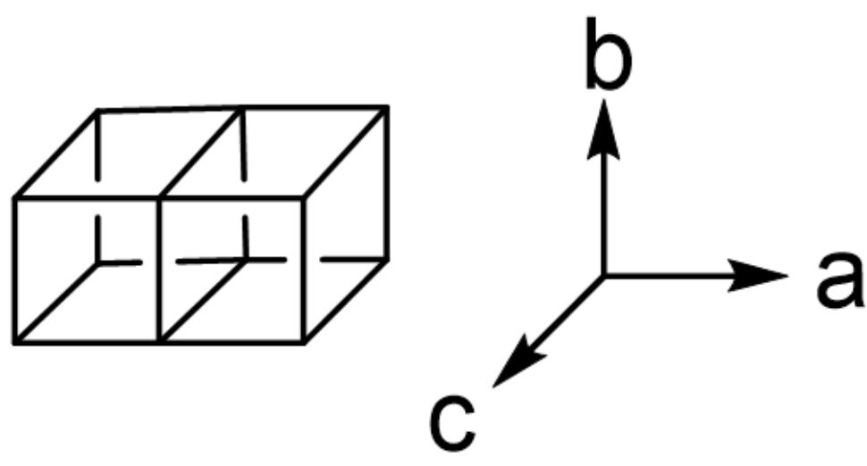

# 题目

A、B 和 C 分别表示一种未知元素， $\mathbf{A}_3\mathbf{C}_2$  与 BC 反应可得到含 A、B 和 C 的晶体 X，X 属于正交晶系，晶胞参数为： $a = 850.3 \mathrm{pm}$ ， $b = 1028.4 \mathrm{pm}$ ， $c = 503.4 \mathrm{pm}$ ，其中 A、C 的排布情况与 NaCl 类似，可视作两个变形六面体沿  $a$  轴方向共面连接形成下图所示单元，每个单元中的两个六面体再分别沿  $c$  轴通过共面的方式无限延伸形成无限链状结构；链间不直接相连，而是通过与  $[\mathbf{BC}_3]$  单元共用 C 原子形成无限三维结构。X 中  $[\mathbf{BC}_3]$  单元垂直于  $c$  轴排布，B 中心为平面三角形构型，有 2 种取向，每个  $[\mathbf{BC}_3]$  单元中均有一根 B-C 键与  $b$  轴平行。已知，该晶体中所有 C 原子均参与对 B 的配位。

  
“一张示意图。左侧是一个由两个沿水平方向共面连接的立方体组成的结构。右侧是一个三维坐标系，a轴指向右方，b轴指向上方，c轴指向左前方。”

根据晶体衍射结果，该晶体中部分  $\mathbf{C}$  原子的坐标为：(0.500,0.624,0.750)，(0.808,0.371,0.750)；与  $b$  轴平行的  $\mathbf{B} - \mathbf{C}$  键键长为  $186.3\mathrm{pm}$  。从下列选项中选出正确的  $\mathbf{C} - \mathbf{B} - \mathbf{C}$  键角大小。

A. 其他选项均不正确。  
B.  $113^{\circ}$  和  $124^{\circ}$

C.  $113^{\circ}$  和  $134^{\circ}$  
D.  $118^{\circ}$  和  $124^{\circ}$  
E.  $118^{\circ}$  和  $121^{\circ}$  
F.  $113^{\circ}$  和  $118^{\circ}$  
G.  $124^{\circ}$  和  $134^{\circ}$  
H.  $121^{\circ}$  和  $134^{\circ}$  
121°和124°

# 答案

正确答案: C

# 详细解析

根据题意，两条平行六面体链所共用面上的C配位数为6，配位原子为1个B、5个A，对应形成与  $b$  轴平行的B-C键；两侧面上的C配位数为5，配位原子为1个B、4个A。

因此该晶体中每个C原子均与1个B原子相连，而1个B原子周围有3个C原子，因此B原子和C原子个数比为  $1:3$  。而平行六面体中A、C交替排布，因此二者个数比为  $1:1$  ，综上晶体化学式为  $\mathbf{A}_3\mathbf{BC}_3$  。

# CHECKPOINT

1 PTS

C原子有两种配位形式，一种配位数为6，配位原子为1个B、5个A

# CHECKPOINT

1 PTS

C原子的另一种配位数为5，配位原子为1个B、4个A

# CHECKPOINT

1 PTS

晶体化学式为  $\mathrm{A}_{3} \mathrm{BC}_{3}$

再根据题意，在垂直于  $c$  轴方向六面体链满足平移对称性，因此该晶体所属的空间点阵型式为底心正交。结合空间点阵的平移对称性可知与 (0.808,0.371,0.750) 位置处 C 原子空间环境相同的 C 原子坐标为 (0.308,0.871,0.750)。

# CHECKPOINT

2 PTS

晶体的点阵型式为底心正交

假设晶体中一个B原子的坐标为  $x$  ，则根据与  $b$  轴平行的B－C键键长可得：

$$
1 8 6. 3 \mathrm {p m} = (x - 0. 6 2 4) \times 1 0 2 8. 4 \mathrm {p m}
$$

代入解得  $x = 0.805$  ，因此该B原子的坐标为(0.500,0.805,0.750)。

# CHECKPOINT

2 PTS

与坐标为 (0.500,0.624,0.750)的 C 原子相连的 B 原子的坐标为(0.500,0.805,0.750)

下面再结合坐标计算键角：

$$
\theta = \arctan [ (0. 8 7 1 - 0. 8 0 5) b / (0. 5 0 0 - 0. 3 0 8) a ] + 9 0 ^ {\circ} = 1 1 3 ^ {\circ}
$$

# CHECKPOINT

2 PTS

一种  $\mathbf{C} - \mathbf{B} - \mathbf{C}$  键角为  $113^{\circ}$

由于  $\mathbf{B}$  为平面三角形配位, 另一种  $\mathbf{C} - \mathbf{B} - \mathbf{C}$  键角为:

$$
3 6 0 ^ {\circ} - 1 1 3 ^ {\circ} \times 2 = 1 3 4 ^ {\circ}
$$

# CHECKPOINT

2 PTS

另一种  $\mathbf{C} - \mathbf{B} - \mathbf{C}$  键角为  $134^{\circ}$

实际上，A、B 和 C 分别表示元素  $\mathrm{Ca}$  、 $\mathrm{Cr}$  和  $\mathrm{N}$  。