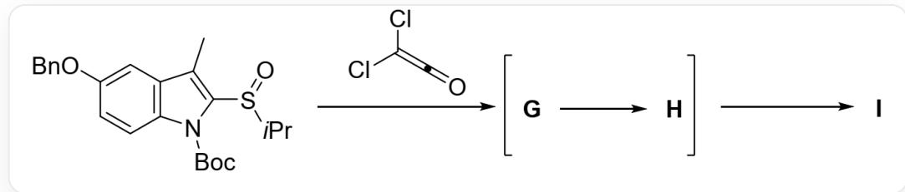
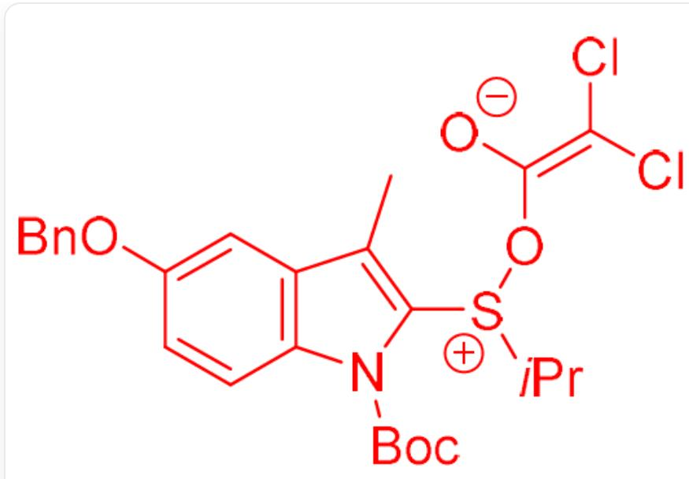
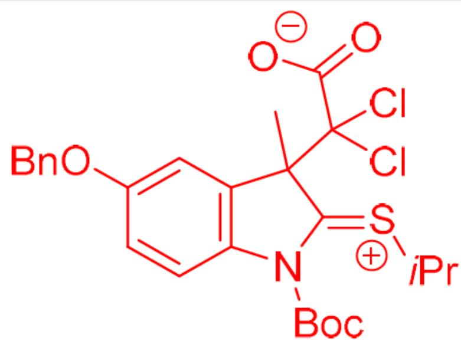
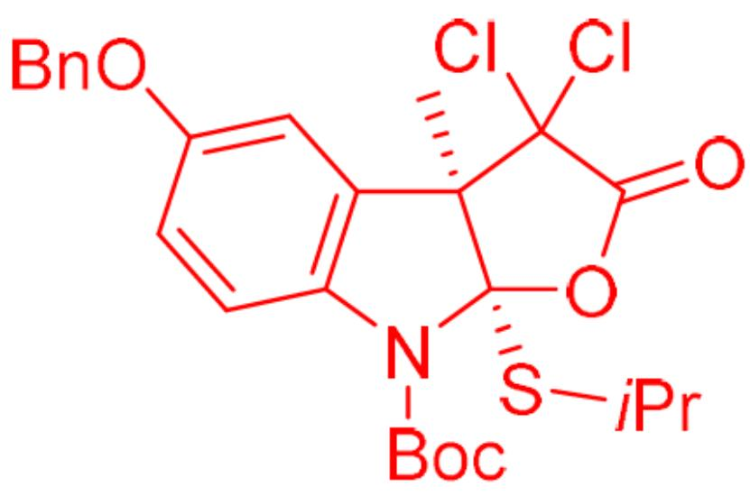

# Question

The following substrates, under the action of dichloroethenone, underwent charge-separated intermediates  $\mathbf{G}$  and  $\mathbf{H}$  to generate the five-membered ring lactone  $\mathbf{I}$ :

$\mathrm{O = S(C1 = C(C)C(C = C2OCC3 = CC = CC = C3) = C(C = C2)N1C(OC(C)(C)C) = O)C(C)C > ClC(Cl) = C = O > [I]}$ . Where  $[1] > 2 > [3]$  indicates that compound 1 reacts under the conditions of 2 to obtain compound 3. The formation of product I also successively involves intermediates  $\mathbf{G}$  and  $\mathbf{H}$  (i.e., intermediate  $\mathbf{G}$  is first formed, then  $\mathbf{G}$  is converted to  $\mathbf{H}$ , and finally  $\mathbf{H}$  is converted to product I).

The following are statements about  $\mathbf{G}$ ,  $\mathbf{H}$ , and  $\mathbf{I}$ :

1. A pericyclic reaction occurred during the formation of  $\mathbf{G}$  
2. S - O bond cleavage occurred during the process from  $\mathbf{G}$  to  $\mathbf{H}$  
3.  $\mathbf{H}$  has only one stereochemical center  
4. The process from  $\mathbf{H}$  to  $\mathbf{I}$  has selectivity for generating a thermodynamically stable trans-fused ring  
5. I has 3 six-membered rings  
6. I has an  $\mathrm{S - C - O}$  linkage

Which of the following options contains all the correct statements?

A. 1,4,5

B. 1,2,4,6  
C.  $1,2,3,4,5,6$  
D. 2,3,6  
E. 1,2,4,5  
F. 1,4  
G. 2,3,4,5  
H. 1,2,3,4,6  
1. 4  
J. 1,2,3,4,5  
K. 1,2,4  
L. All of the above options are incorrect or the answer is incomplete.

# Answer

Correct Answer: D

# Detailed Explanation

Dichloroketene is a strong electrophile and is also prone to cycloaddition reactions due to its structure with cumulative double bonds. Since the reaction first undergoes a charge-separated intermediate  $\mathbf{G}$ , the first step is not a pericyclic reaction, but an electrophilic reaction. The site with the strongest nucleophilicity in the substrate is the oxygen atom of the sulfoxide. Therefore, the first step is the nucleophilic addition of the oxygen in the sulfoxide group of the substrate to the carbonyl carbon of dichloroketene, yielding  $\mathbf{G}$ , with the following structure:

# CHECKPOINT

1 PTS

The first step is not a pericyclic reaction because it first undergoes a charge-separated intermediate  $\mathbf{G}$

# CHECKPOINT

1 PTS

The oxygen in the sulfoxide group of the substrate undergoes nucleophilic addition to the carbonyl carbon of dichloroketene

  
CC(C1=C2C=CC(OCC3=CC=CC=C3)=C1)=C([S+](C(C)C)O/C([O-])=C(Cl)/Cl)N2C(OC(C)(C)C)=O

# CHECKPOINT

1 PTS

G is CC(C1=C2C=CC(OCC3=CC=CC=C3)=C1)=C([S+](C(C)C)O/C([O-])=C(Cl)/Cl)N2C(OC(C)

$(\mathrm{C})\mathrm{C}) = 0$

No pericyclic reaction occurred during the formation of  $\mathbf{G}$ , statement 1 is incorrect.

Subsequently,  $\mathbf{G}$  undergoes a [3,3]- $\sigma$  rearrangement, breaking the S-O bond and forming a C-C bond, to give intermediate  $\mathbf{H}$ , with the following structure:

# CHECKPOINT

1 PTS

Undergoes a [3,3]- $\sigma$  rearrangement

  
[ \text{[O-]C(C1(C)C(C=C(C=C2)OCC3=CC=CC=C3)=C2N(/C1=[S+]C(C)C)(OC(C)(C)C)=O)(Cl)Cl}=O} ]

# CHECKPOINT

1 PTS

H is [O-]C(C1(C)C(C=C(C=C2)OCC3=CC=CC=C3)=C2N(/C1=[S+]\C(C)C)C(OC(C)(C)C)=O) (Cl)Cl)=O

The S - O bond is broken during the process from  $\mathbf{G}$  to  $\mathbf{H}$ ;  $\mathbf{H}$  has only one stereochemical center, statements 2 and 3 are correct.

Finally, due to conformational constraints, the carboxylate anion in intermediate  $\mathbf{H}$  can only attack the positively charged carbon atom in the carbon-sulfur double bond from the same face, yielding the cis-fused five-membered ring  $\mathbf{I}$ , with the following structure:

# CHECKPOINT

1 PTS

Due to conformational constraints, the carboxylate anion can only attack the positively charged carbon atom in the carbon-sulfur double bond from the same face

C[C@]1(C(Cl)2Cl)[C@@](SC(C)C)(OC2=O)N(C3=C1C=C(OCC4=CC=CC=C4)C=C3)C(OC(C)(C)C)=O

# CHECKPOINT

1 PTS

I is C[C@]1(C(Cl)2Cl)[C@@](SC(C)C)(OC2=O)N(C3=C1C=C(OCC4=CC=CC=C4)C=C3)C(OC(C) (C)C)=O

The process from  $\mathbf{H}$  to  $\mathbf{I}$  has selectivity for the formation of a cis-fused ring;  $\mathbf{I}$  has 2 six-membered rings; there is an  $\mathrm{S} - \mathrm{C} - \mathrm{O}$  linkage in  $\mathbf{I}$ , statements 4 and 5 are incorrect, and 6 is correct.

Therefore, the correct answer is D.