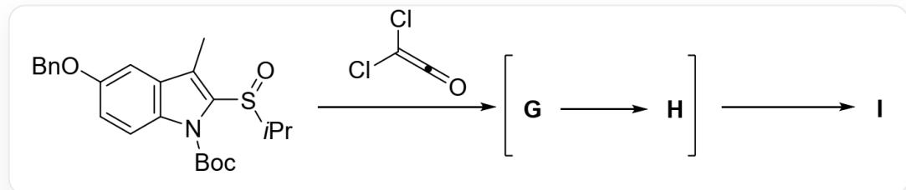
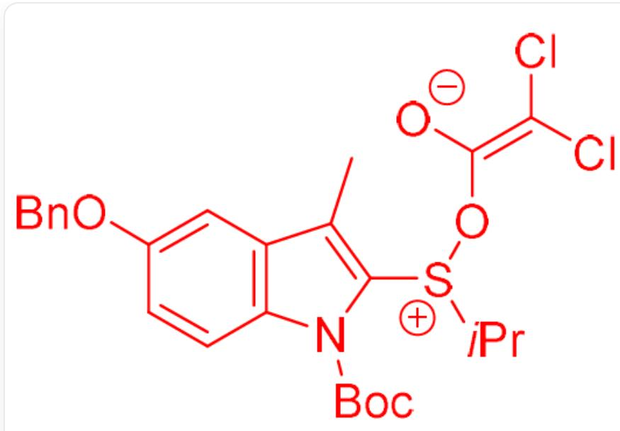
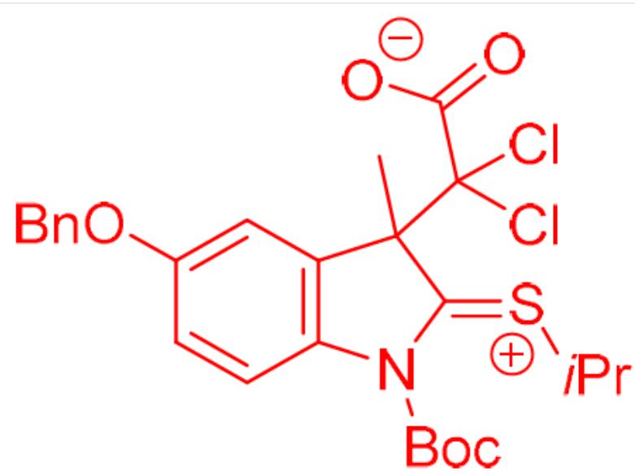
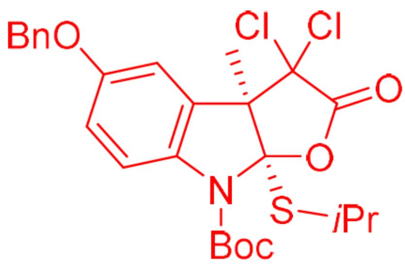

# 题目

以下底物在二氯代乙烯酮作用下,经历了电荷分离的中间体  $\mathbf{G}$  和  $\mathbf{H}$  生成了五元环内酯I:

$\mathrm{O = S(C1 = C(C)C(C = C2OCC3 = CC = CC = C3) = C(C = C2)N1C(OC(C)(C)C) = O)C(C)C > CIC(Cl) = C = O > [I]}$  。其中  $[1] > 2'[3]$  表示化合物1在2的条件下反应得到化合物3。在生成产物I的过程中还依次经历了中间体G和H(即首先反应生成中间体G，随后由G得到H，最后由H得到产物I。）

以下有关于  $\mathbf{G}$  、  $\mathbf{H}$  、  $\mathbf{I}$  的说法：

1.生成  $\mathbf{G}$  的过程中发生了周环反应  
2.G 到 H 的过程中发生了 S-O 键的断裂  
3. H 只有一个立体化学中心  
4.H到I的过程中具有生成热力学稳定的反式并环的选择性  
5.I中有3个六元环  
6. I 中有  $\mathrm{S} - \mathrm{C} - \mathrm{O}$  的键连关系

下列选项中，包含所有正确说法的选项是：

A. 1,4,5  
B. 1,2,4,6

C.  $1,2,3,4,5,6$  
D. 2,3,6  
E. 1,2,4,5  
F. 1,4  
G. 2,3,4,5  
H. 1,2,3,4,6  
1. 4  
J. 1,2,3,4,5  
K. 1,2,4  
L. 以上选项均不正确或答案不完全

# 答案

正确答案: D

# 详细解析

二氯代乙烯酮是一个强的亲电试剂，由于其累积双键的结构也易发生环加成反应。由于反应首先经历了电荷分离的中间体  $\mathbf{G}$ ，因此第一步不是发生周环反应，而是发生亲电反应。而底物中亲核能力最强的位点为亚砜的氧原子。因此，第一步为底物亚砜基团中的氧对二氯代乙烯酮羰基碳进行亲核加成，得到  $\mathbf{G}$ ，结构如下：

# CHECKPOINT

1 PTS

首先经历了电荷分离的中间体  $\mathbf{G}$ ，因此第一步不是发生周环反应

# CHECKPOINT

1 PTS

底物亚砜基团中的氧对二氯代乙烯酮羰基碳进行亲核加成

  
CC(C1=C2C=CC(OCC3=CC=CC=C3)=C1)=C([S+](C(C)C)O/C([O-])=C(Cl)/Cl)N2C(OC(C)(C)C)=O

# CHECKPOINT

1 PTS

G 是 CC(C1=C2C=CC(OCC3=CC=CC=C3)=C1)=C([S+](C(C)C)O/C([O-])=C(Cl)/Cl)N2C(OC(C)(C)C)=O

生成  $\mathbf{G}$  的过程中没有发生了周环反应，说法1错误

随后  $\mathbf{G}$  发生[3,3]- $\sigma$  迁移，断裂  $\mathrm{S} - \mathrm{O}$  键并生成  $\mathrm{C} - \mathrm{C}$  键，得到中间体  $\mathbf{H}$ ，结构如下：

# CHECKPOINT

1 PTS

发生[3,3]-  $\sigma$  迁移

  
[ \text{[O-]C(C1(C)C(C=C(C=C2)OCC3=CC=CC=C3)=C2N(/C1=[S+]C(C)C)(OC(C)(C)C)=O)(Cl)Cl}=O} ]

# CHECKPOINT

1 PTS

H 是 [O-]C(C1(C)C(C=C=C2)OCC3=CC=CC=C3)=C2N(/C1=[S+]\C(C)C(OC(C)(C)C)=O) (Cl)Cl)=O

G 到 H 的过程中发生了 S - O 键的断裂; H 只有一个立体化学中心, 说法2、3正确

最后，中间体 H 中的羧基负离子由于构象限制只能在同面进攻碳硫双键中的正电性的碳原子，得到顺式的五元并环 I，结构如下：

# CHECKPOINT

1 PTS

羧基负离子由于构象限制只能在同面进攻碳硫双键中的正电性的碳原子

  
C[C@]1(C(Cl)2Cl)[C@@](SC(C)C)(OC2=O)N(C3=C1C=C(OCC4=CC=CC=C4)C=C3)C(OC(C)(C)C)=O

# CHECKPOINT

1 PTS

I 是 C[C@]1(C(Cl)2Cl)[C@@](SC(C)C)(OC2=O)N(C3=C1C=C(OCC4=CC=CC=C4)C=C3)C(OC(C) (C)C)=O

H 到 I 的过程中具有生成顺式并环的选择性；I 中有 2 个六元环；I 中存在 S-C-O 的键连关系，说法 4、5 错误，6 正确

因此正确答案为D.