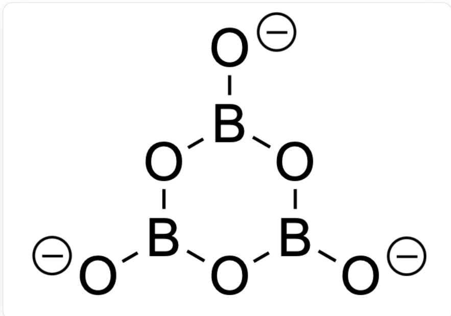
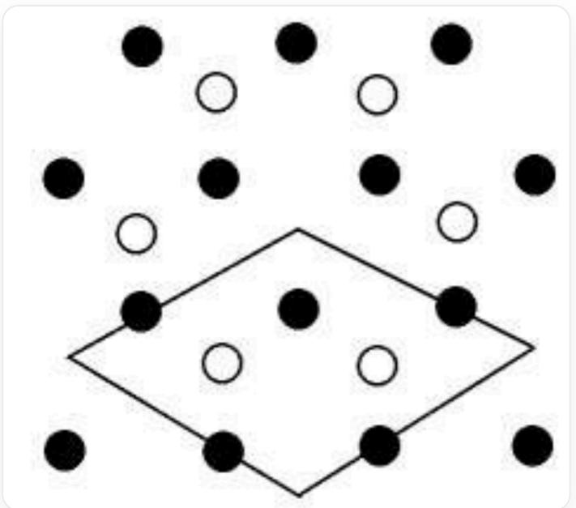
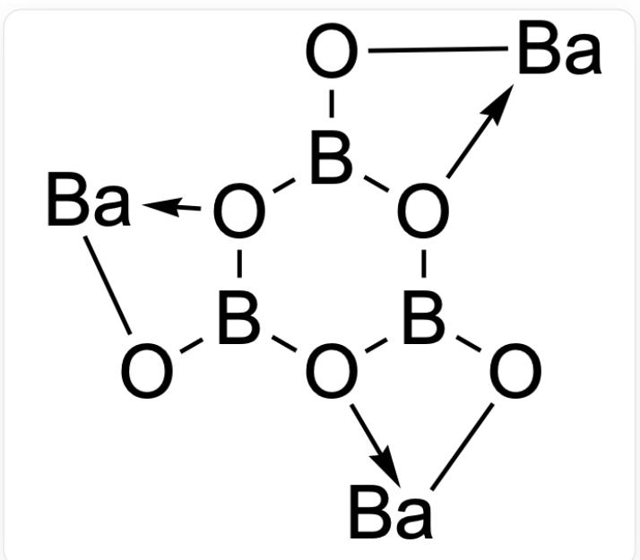
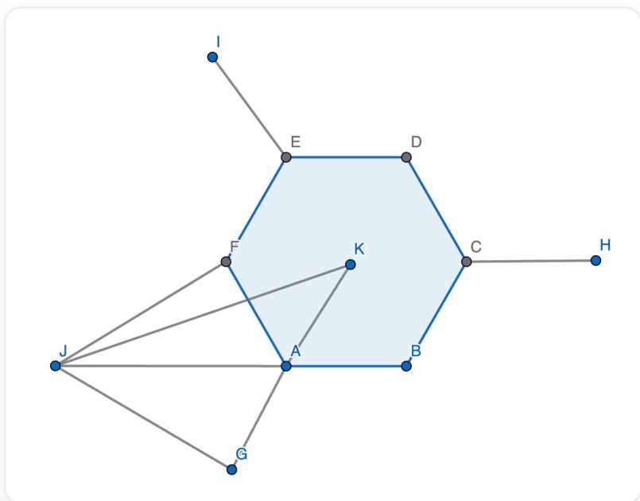

# Question

A crystal is composed of a metallic element  $\mathbf{M}$  and non-metallic elements boron and oxygen, where the mass fraction ratio of  $\mathbf{M}$  to  $\mathbf{B}$  is 6.35, and its anion belongs to the  $D_{3\mathrm{h}}$  point group. The crystal can be considered as being composed of stacked single-layer structures. The single-layer structure can be viewed as  $\mathbf{M}$  forming a close-packed layer, with anions orderly filling part of the triangular voids, so that the distribution of the centers of the anions is the same as the distribution of carbon atoms in a single layer of graphite. All anions within the layer have the same orientation. It is known that the anions within the layer are equivalent to hexadentate ligands, coordinating to the three adjacent  $\mathbf{M}$  atoms. Assume that all  $\mathbf{M}-\mathbf{O}$  bond lengths are  $282.3\mathrm{pm}$ , and all B-O bond lengths are  $137.5\mathrm{pm}$ . Which of the following options is correct:

A. The occupancy of anions is  $1 / 3$ , the coordination number of  $\mathbf{M}$  within the layer is 6, and the lattice parameter is  $a = 1233~\mathrm{pm}$ .  
B. The occupancy of anions is  $1 / 3$ , the coordination number of  $\mathbf{M}$  within the layer is 6, and the lattice parameter is  $a = 1672 \mathrm{pm}$ .  
C. The occupancy of anions is  $1 / 3$ , the coordination number of  $\mathbf{M}$  within the layer is 4, and the lattice parameter is  $a = 1233~\mathrm{pm}$ .  
D. The occupancy of anions in the interstitial sites is  $1/3$ , the coordination number of  $\mathbf{M}$  within the layer is 4, and the unit cell parameter is  $a = 1672 \mathrm{pm}$ .  
E. The occupancy of anions in interstitial sites is  $2/3$ , the coordination number of  $\mathbf{M}$  within the layer is 4, and the lattice parameter is  $a = 1233 \mathrm{pm}$ .  
F. The occupancy of anions is  $2/3$ , the coordination number of  $\mathbf{M}$  within the layer is 4, and the lattice parameter  $a = 1672 \mathrm{pm}$  
G. The occupancy of anions is  $2/3$ , the coordination number of  $\mathbf{M}$  within the layer is 6, and the lattice parameter is  $a = 1233 \mathrm{pm}$ .

H. The occupancy of anions is  $2/3$ , the coordination number of  $\mathbf{M}$  within the layer is 6, and the cell parameter is  $a = 1672 \mathrm{pm}$ .  
1. All other options are incorrect.

# Answer

Correct Answer: C

# Detailed Explanation

Starting from the anionic point group, the  $D_{3\mathrm{h}}$  point group could be  $\mathrm{BO}_3^{3-}$  or  $\mathrm{B}_3\mathrm{O}_6^{3-}$ . Assuming the former, there is no reasonable  $\mathbf{M}$  that can simultaneously satisfy the ratio of mass and oxidation state, resulting in no reasonable solution. Therefore, the anion can only be  $\mathrm{B}_3\mathrm{O}_6^{3-}$ , and  $\mathbf{M}$  can be determined as  $\mathrm{Ba}$ , with the simplest crystal formula being  $\mathrm{BaB}_2\mathrm{O}_4$ .

  
[ \mathrm{O} - \mathrm{B1OB}(\mathrm{O} - \mathrm{)OB}([\mathrm{O} - \mathrm{)]\mathrm{O}1} ]，即阴离子  $\mathrm{B}_3\mathrm{O}_6^{3-}$  结构

CHECKPOINT

1 PTS

M为Ba

# CHECKPOINT

1 PTS

晶体最简式为  $\mathrm{BaB_2O_4}$

(In the following description,  $\mathbf{M}$  is equivalent to Ba.)

$\mathbf{M}$  adopts a close-packed arrangement, and the anions fill the triangular voids formed by  $\mathbf{M}$  in a graphite-like manner, as shown in the figure below, which can outline a unit cell.

这是一张晶体的二维平面层示意图，由代表Ba的实心黑球和代表阴离子的空心白球组成。其中Ba原子作密堆积排布，阴离子以石墨的方式填充M围成的三角形空隙。图像的下半部分用一个菱形轮廓线标示出了一个最小的二维周期结构（二维晶胞），该菱形的四个顶点都位于Ba原子的三角形空隙中心，菱形的边长为  $\sqrt{3}$  倍的Ba-Ba间距。在一个二维晶胞中包含有3个Ba原子和2个  $\mathrm{B}_{3} \mathrm{O}_{6}^{3-}$  阴离子。

# CHECKPOINT

1 PTS

最小的二维周期性结构中包含3个Ba原子和2个  $\mathrm{B}_3\mathrm{O}_6^{3-}$  阴离子

In each unit cell, Ba forms 6 triangular voids, while the anions occupy 2, with an anion occupancy rate of  $1/3$ .

# CHECKPOINT

1 PTS

在每个晶胞中，Ba围成6个三角形空隙，而阴离子占据2个

# CHECKPOINT

1 PTS

阴离子填隙率为1/3

The anion  $\mathrm{B}_3\mathrm{O}_6^{3-}$  has 6 oxygen atoms and is a hexadentate ligand. Since each anion is surrounded by 3 Ba, each two adjacent O coordinate to one Ba; and each Ba is surrounded by 2 anions, so the coordination number of Ba within the layer is  $2 \times 2 = 4$ .

  
[ \mathrm{O}][\mathrm{O}(\mathrm{Ba})_2][\mathrm{O}]3\mathrm{B}(\mathrm{O}[\mathrm{Ba})_3][\mathrm{O}]4\mathrm{B}1\mathrm{O}[\mathrm{Ba}]_4 ]，仅表示配位连接方式

# CHECKPOINT

1 PTS

Ba在层内的配位数为4

For the unit cell parameters, first calculate the shortest distance between the solid black spheres (Ba) and hollow white spheres (anions) in the figure above:

本图中示出了一个阴离子和其最近的一个Ba的几何结构。图中A,B,C,D,E,F构成正六边形，其中A,C,E为硼原子，B,D,F为氧原子。每个硼原子分别再向外连接一个氧原子，记为G,H,I；J为钡原子，K为正六边形的中心。钡原子J与氧原子F,G配位。由于AF=AG，JA平分∠FAG。求出JK的长度，由二维晶胞示意

图可知，JK长度的三倍即为晶胞参数  $a$

Since the Ba-O distances are the same, JA bisects  $\angle FAG$ , and the angle  $\angle FAJ$  of O-B-Ba is  $180^{\circ} - 120^{\circ} = 60^{\circ}$ . From the law of sines, the angle  $\angle AJF$  formed by B-Ba-O is  $\arcsin \frac{d_{\mathrm{B - O}}}{d_{\mathrm{M - O}}} \times \sin 60^{\circ} = 24.95^{\circ}$

# CHECKPOINT

1 PTS

$$
\angle \mathbf {A J F} = \angle \mathbf {A J G} = 2 4. 9 5 ^ {\circ}
$$

Therefore, the angle  $\angle \mathbf{JFA} = \angle \mathbf{JGA}$  of Ba-O-B is  $180^{\circ} - 60^{\circ} - 24.95^{\circ} = 95.05^{\circ}$

# CHECKPOINT

1 PTS

$$
\angle \mathbf {J F A} = \angle \mathbf {J G A} = 9 5. 0 5 ^ {\circ}
$$

Obviously,  $\mathbf{G},\mathbf{A},\mathbf{K}$  are collinear. In the triangle JGK, from the law of cosines, the shortest distance JK (denoted as  $d$ ) between the solid black sphere (Ba) and the hollow white sphere (anion center) is:

$$
d = \sqrt {d _ {\mathrm {M - O}} ^ {2} + (2 d _ {\mathrm {B - O}}) ^ {2} - 2 \cdot d _ {\mathrm {M - O}} \cdot (2 d _ {\mathrm {B - O}}) \cdot \cos 9 5 . 0 5 ^ {\circ}} = 4 1 1 \mathrm {p m}
$$

# CHECKPOINT

1 PTS

$$
d = 4 1 1 \mathrm {p m}
$$

Therefore, the unit cell parameter  $a$  is three times the shortest distance between the solid black sphere (Ba) and the hollow white sphere (anion), i.e.,  $a = 3d = 1233 \, \mathrm{pm}$

# CHECKPOINT

2 PTS

$$
a = 1 2 3 3 \mathrm {p m}
$$

In summary, option C should be selected for this question.