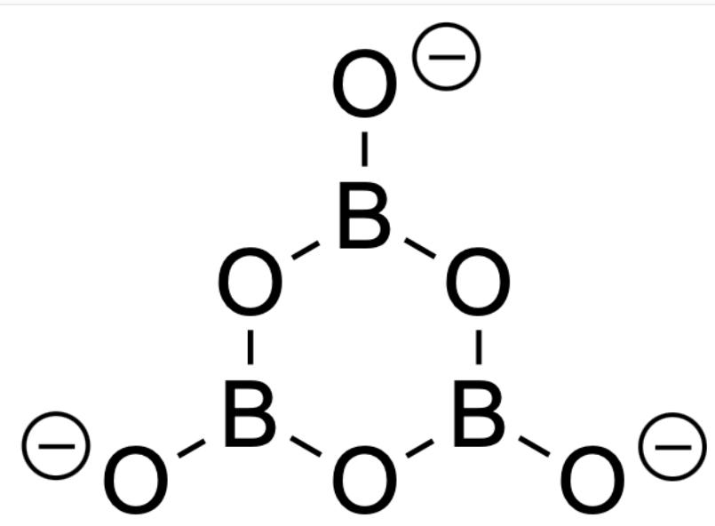
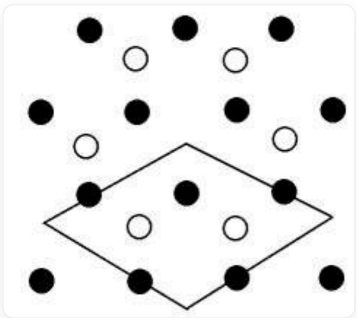
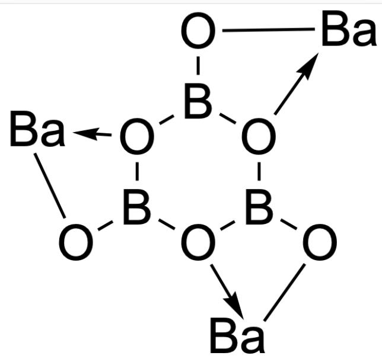
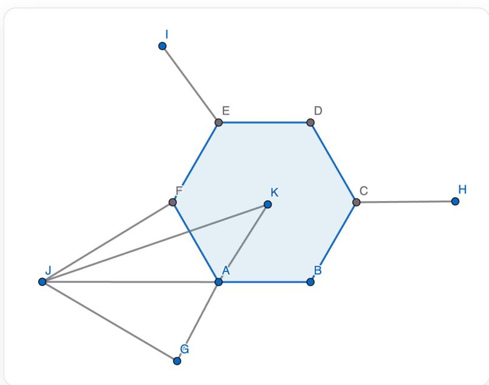

# 题目

某晶体由一种金属元素M和非金属元素硼、氧组成，其中M与B的质量分数之比为6.35，其阴离子属于  $D_{3\mathrm{h}}$  点群。该晶体可看作由单层结构堆叠而成。单层结构可以看作M形成密置层，阴离子有序地填入部分三角形空隙，使得阴离子的中心的分布与石墨单层中碳原子的分布相同。单层内所有的阴离子都具有相同的取向。已知层内阴离子相当于六齿配体，向与之相邻的三个M原子配位。假设所有的M-O键长度均为  $282.3 \mathrm{pm}$ ，所有B-O键长度均为  $137.5 \mathrm{pm}$  。下列选项正确的是：

A. 阴离子的填隙率为  $1 / 3$ ,  $\mathbf{M}$  在层内的配位数为 6 , 晶胞参数  $a = 1233 \mathrm{pm}$  
B. 阴离子的填隙率为  $1 / 3$ ,  $\mathbf{M}$  在层内的配位数为 6 , 晶胞参数  $a = 1672 \mathrm{pm}$  
C. 阴离子的填隙率为  $1 / 3$ ,  $\mathbf{M}$  在层内的配位数为 4 , 晶胞参数  $a = 1233 \mathrm{pm}$  
D. 阴离子的填隙率为  $1 / 3$ ,  $\mathbf{M}$  在层内的配位数为 4 , 晶胞参数  $a = 1672 \mathrm{pm}$  
E. 阴离子的填隙率为  $2 / 3$ ,  $\mathbf{M}$  在层内的配位数为 4 , 晶胞参数  $a = 1233 \mathrm{pm}$  
F. 阴离子的填隙率为  $2 / 3$ ,  $\mathbf{M}$  在层内的配位数为 4 , 晶胞参数  $a = 1672 \mathrm{pm}$  
G. 阴离子的填隙率为  $2 / 3$ ,  $\mathbf{M}$  在层内的配位数为 6 , 晶胞参数  $a = 1233 \mathrm{pm}$  
H. 阴离子的填隙率为  $2 / 3$ ,  $\mathbf{M}$  在层内的配位数为 6 , 晶胞参数  $a = 1672 \mathrm{pm}$

I. 其他选项均不正确

# 答案

正确答案: C

# 详细解析

从阴离子点群入手， $D_{3\mathrm{h}}$  点群可能是  $\mathrm{BO}_{3}^{3-}$  或  $\mathrm{B}_{3}\mathrm{O}_{6}^{3-}$ ，假设为前者，则没有合理的  $\mathbf{M}$  能够同时满足质量之比与氧化态，无合理解。因此阴离子只可能是  $\mathrm{B}_{3}\mathrm{O}_{6}^{3-}$ ，可求得  $\mathbf{M}$  为  $\mathrm{Ba}$ ，晶体最简式为  $\mathrm{BaB}_{2}\mathrm{O}_{4}$ 。

[O-]B1OB([O-])OB([O-])O1，即阴离子  $\mathrm{B}_3\mathrm{O}_6^{3-}$  结构

CHECKPOINT

1 PTS

M为Ba

# CHECKPOINT

1 PTS

晶体最简式为  $\mathrm{BaB_2O_4}$

（在以下的描述中M与Ba等价。）

M作密堆积排布，阴离子以石墨的方式填充M围成的三角形空隙，如下图所示，可以框出一个晶胞。

这是一张晶体的二维平面层示意图，由代表Ba的实心黑球和代表阴离子的空心白球组成。其中Ba原子作密堆积排布，阴离子以石墨的方式填充M围成的三角形空隙。图像的下半部分用一个菱形轮廓线标示出了一个最小的二维周期结构（二维晶胞），该菱形的四个顶点都位于Ba原子的三角形空隙中心，菱形的边长为  $\sqrt{3}$  倍的Ba-Ba间距。在一个二维晶胞中包含有3个Ba原子和2个  $\mathrm{B}_{3} \mathrm{O}_{6}^{3-}$  阴离子。

# CHECKPOINT

1 PTS

最小的二维周期性结构中包含3个Ba原子和2个  $\mathrm{B}_3\mathrm{O}_6^{3-}$  阴离子

在每个晶胞中，Ba围成6个三角形空隙，而阴离子占据2个，阴离子填隙率为1/3.

# CHECKPOINT

1 PTS

在每个晶胞中，Ba围成6个三角形空隙，而阴离子占据2个

# CHECKPOINT

1 PTS

阴离子填隙率为1/3

阴离子  $\mathrm{B}_{3} \mathrm{O}_{6}^{3-}$  中有 6 个氧原子，且为 6 齿配体，由每个阴离子周围有 3 个 Ba 可知，每两个相邻的 O 对一个 Ba 进行配位；而每个 Ba 周围有 2 个阴离子，因此 Ba 在层内的配位数为  $2 \times 2 = 4$ 。

  
[O]12B(O[Ba]2)[O]3B(O[Ba]3)[O]4B1O[Ba]4，仅表示配位连接方式

# CHECKPOINT

1 PTS

Ba在层内的配位数为4

对于晶胞参数，先计算上图中实心黑球（Ba）与空心白球（阴离子）的最短距离：

本图中示出了一个阴离子和其最近的一个Ba的几何结构。图中A,B,C,D,E,F构成正六边形，其中A,C,E为硼原子，B,D,F为氧原子。每个硼原子分别再向外连接一个氧原子，记为G,H,I；J为钡原子，K为正六边形的中心。钡原子J与氧原子F,G配位。由于AF=AG，JA平分∠FAG。求出JK的长度，由二维晶胞示意

图可知，JK长度的三倍即为晶胞参数  $a$

由于Ba-O距离相同，因此JA平分∠FAG，O-B-Ba的夹角  $\angle \mathbf{FAJ}$  为  $180^{\circ} - 120^{\circ} = 60^{\circ}$ ，由正弦定理可得B-Ba-O所形成的夹角  $\angle \mathbf{AJF}$  为  $\arcsin \frac{d_{\mathrm{B - O}}}{d_{\mathrm{M - O}}} \times \sin 60^{\circ} = 24.95^{\circ}$

# CHECKPOINT

1 PTS

$$
\angle \mathbf {A J F} = \angle \mathbf {A J G} = 2 4. 9 5 ^ {\circ}
$$

因此Ba-O-B的夹角  $\angle \mathbf{JFA} = \angle \mathbf{JGA}$  为  $180^{\circ} - 60^{\circ} - 24.95^{\circ} = 95.05^{\circ}$

# CHECKPOINT

1 PTS

$$
\angle \mathbf {J F A} = \angle \mathbf {J G A} = 9 5. 0 5 ^ {\circ}
$$

显然  $\mathbf{G}, \mathbf{A}, \mathbf{K}$  共线。在三角形JGK中，由余弦定理，实心黑球（Ba）与空心白球（阴离子中心）的最短距离JK（记为  $d$ ）：

$$
d = \sqrt {d _ {\mathrm {M} - \mathrm {O}} ^ {2} + (2 d _ {\mathrm {B} - \mathrm {O}}) ^ {2} - 2 \cdot d _ {\mathrm {M} - \mathrm {O}} \cdot (2 d _ {\mathrm {B} - \mathrm {O}}) \cdot \cos 9 5 . 0 5 ^ {\circ}} = 4 1 1 \mathrm {p m}
$$

# CHECKPOINT

1 PTS

$$
d = 4 1 1 \mathrm {p m}
$$

因此晶胞参数  $a$  为三倍实心黑球（Ba）与空心白球（阴离子）的最短距离，即  $a = 3d = 1233\mathrm{pm}$

# CHECKPOINT

2 PTS

$$
a = 1 2 3 3 \mathrm {p m}
$$

综上所述，本题应选择C选项。