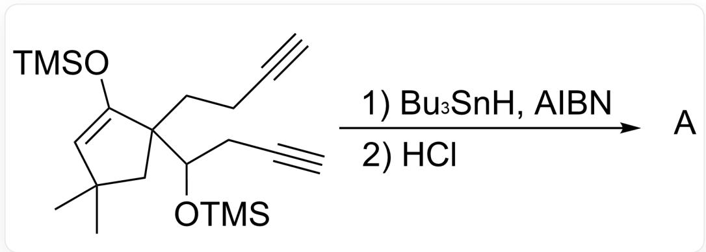
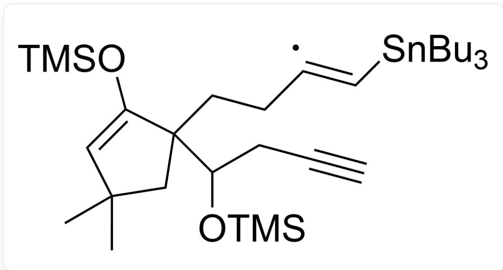
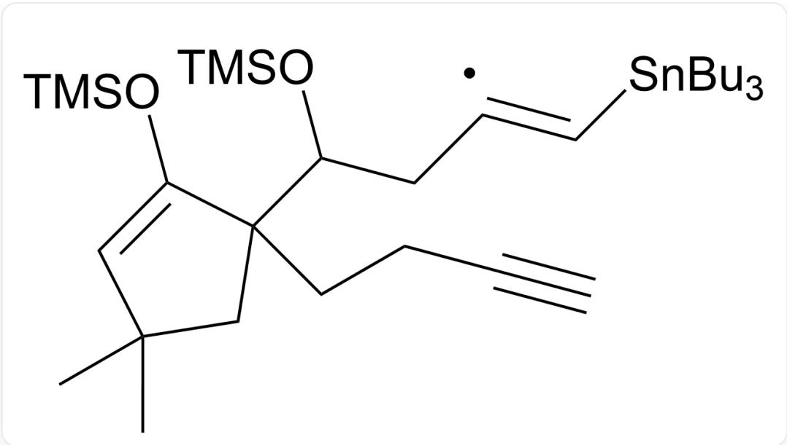
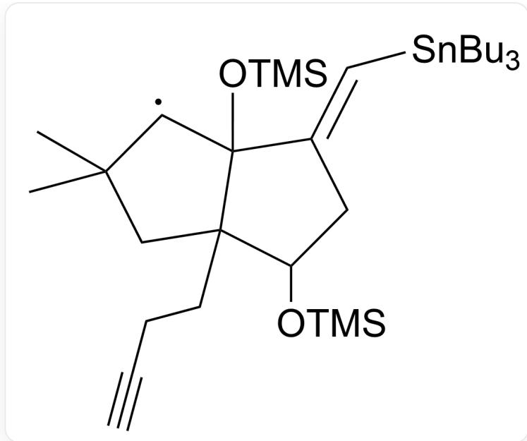
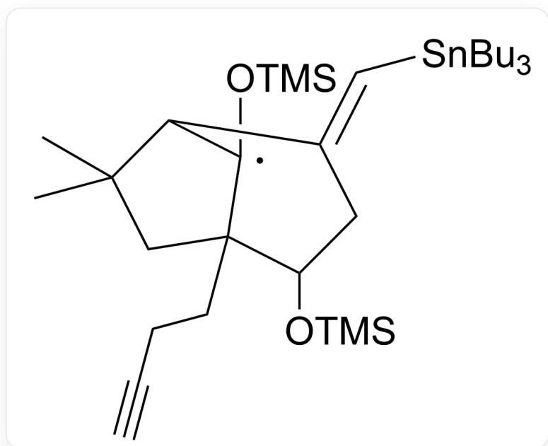
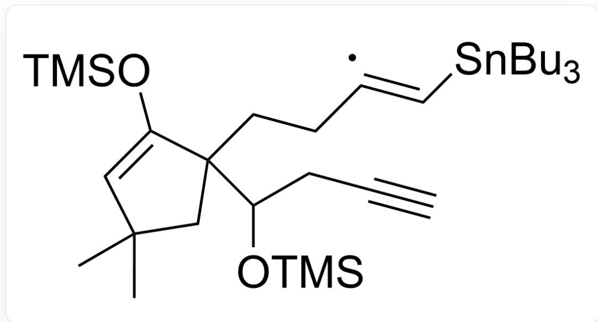
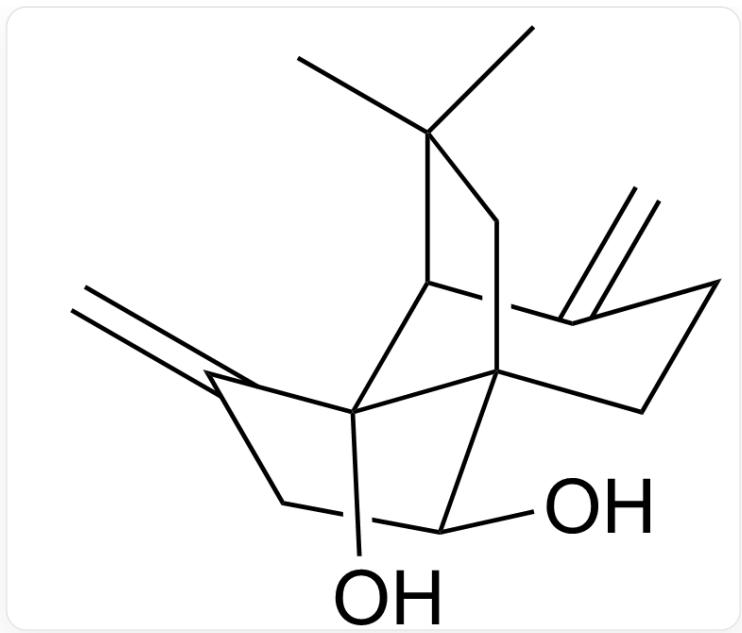

# Question

Radical rearrangement reactions have wide applications in organic synthesis.

C#CCCC1(C(O[Si](C)(C)C)CC#C)CC(C)(C)C=C1O[Si](C)(C)C>[Bu_3SnH].[AlBN]>[A],A is the reaction product. After the reaction is complete,  $HCl$  is added.

C#CCCC1(CC(C)(C=C1O[Si](C)(C)C)C(C/C([X])=C/[Sn](CCCC)(CCCC)CCCCCC)O[Si](C)(C)C,X is a single

electron, Option 1

Option 1

  
C#CCCC1(CC(C)(C=C1O[Si](C)(C)C)C(C/C([X])=C/[Sn](CCCC)(CCCC)CCCCCC)O[Si](C)(C)C,X is a single  
electron, Option 2

Option 2

  
C#CCC(C1(CC(C)(C(C1/2O[Si](C)(C)C)[X])C)CCC2=C\[Sn](CCCC)(CCCC)CCCCCC)O[Si](C)(C)C,X is a  
single electron, Option 3

Option 3

  
CC1(C([X])C2(C(CCC#C)(C1)C(C/C2=C\[Sn](CCCC)(CCCC)CCCCCC)O[Si](C)(C)C)O[Si](C)(C)C,C,X is a single electron, Option 4

Option 4

  
CC1(C2C(CCCC#C)(C1)C(C/C2=C\[Sn](CCCC)(CCCCCC)CCCCCC)O[Si](C)(C)C([X])O[Si](C)(C)C,C,X is a single electron, Option 5

Option 5

  
CC1(C2C(C(C(CC#C)O[Si](C)(C)C)(C1)CC/C2=C\Sn)(CCCC)(CCCC)CCCCCC)([X])O[Si](C)(C)C,C,X is a single electron, Option 6

Option 6

  
CC1(C2C3(C(C(C/C2=C([X])\[H])O[Si](C)(C)C)(C1)CC/C3=C\[Sn](CCCC)(CCCC)CCCCCC)O[Si](C)(C)C,C,X  
is a single electron, Option 7

Option 7

CC1(C2C3(C(CC/C2=C([X])\[H])(C1)C(C/C3=C\Sn)(CCCC)(CCCC)CCCCCCO[Si](C)(C)O[Si](C)(C)C,C,X

is a single electron, Option 8

# Option 8

Without considering enantiomers, please select all possible intermediates in the options.

A. All other options are incorrect  
B. Option 1, 3, 5  
C. Option 2, 4, 5  
D. Option 1, 3, 7  
E. Option 2, 4, 8  
F. Options 1, 3, 6

G. Option 2, 5  
H. Options 2, 5, 6  
I. Options 1, 4, 6

# Answer

Correct Answer: F

# Detailed Explanation

The carbon radical with the electron-withdrawing group  $-OTMS$  introduced at the  $\gamma$  position is relatively unstable.

# CHECKPOINT

1 PTS

The carbon radical with the electron-withdrawing group  $-OTMS$  introduced at the  $\gamma$  position is relatively unstable

First, an intermediate is formed.

C#CCCC1(CC(C)(C=C1O[Si](C)(C)C)C(C/C([X]=C/[Sn](CCCC)(CCCC)CCCC)O[Si](C)(C)C,X为单电子

# CHECKPOINT

1 PTS

First, an intermediate is formed: C#CCCC1(CC(C)(C=C1O[Si](C)(C)C)C(C/C([X])=C/[Sn](CCCCCC) (CCCCCC)O[Si](C)(C)C,X is single electron

The reaction rate of 5-exo-trig is faster.

# CHECKPOINT

1 PTS

The reaction rate of 5-exo-trig is faster

Therefore, the intermediate is preferentially generated.

CC1(C([X])C2(C(CCC#C)(C1)C(C/C2=C\[Sn](CCCC)(CCCC)CCCCCC)O[Si](C)(C)C)O[Si](C)(C)C),X is single

electron

# CHECKPOINT

1 PTS

Next, the intermediate is preferentially formed: CC1(C([X])C2(C(CCC#C)(C1)C(C/C2=C\Sn](CCCC) (CCCC)CCCC)O[Si](C)(C)C)O[Si](C)(C)C)C,X is single electron

Then, a fast 1,2-rearrangement reaction yields a carbon radical stabilized by n electrons of oxygen.

# CHECKPOINT

1 PTS

Then, a fast 1,2-rearrangement reaction yields a carbon radical stabilized by n electrons of oxygen

CC1(C2C(C(CC#C)O[Sij](C)(C)C)(C1)CC/C2=C\Sn](CCCC)(CCCC)CCC)([X])O[Sij](C)(C)C,C,X是单电子

Finally, the obtained product A is

CC1(C)[C@@H]2[C@@](C(C[C@@H]3O)=C)(O)[C@]3(C1)CCC2=C