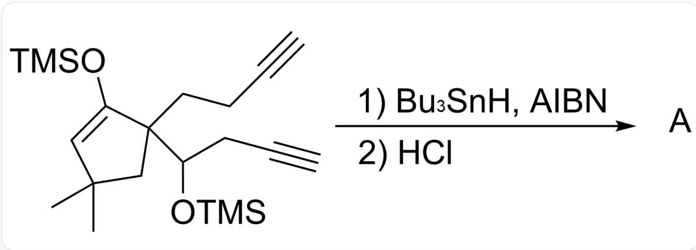
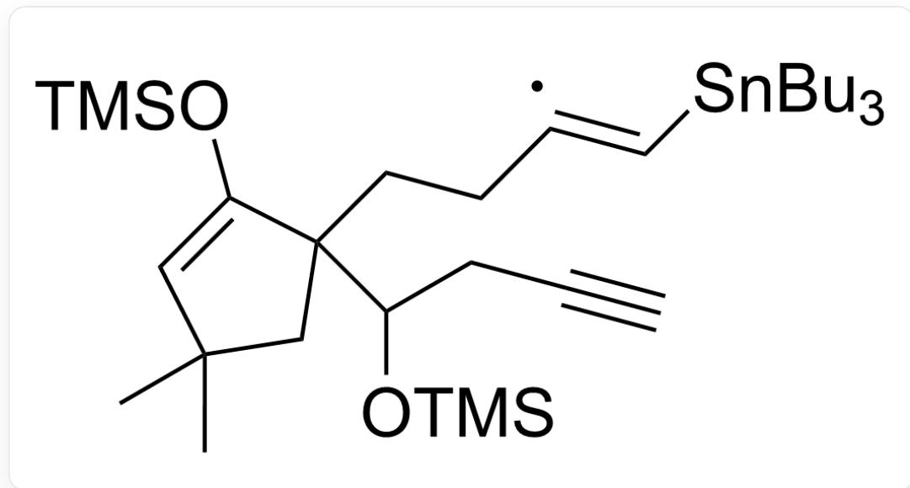
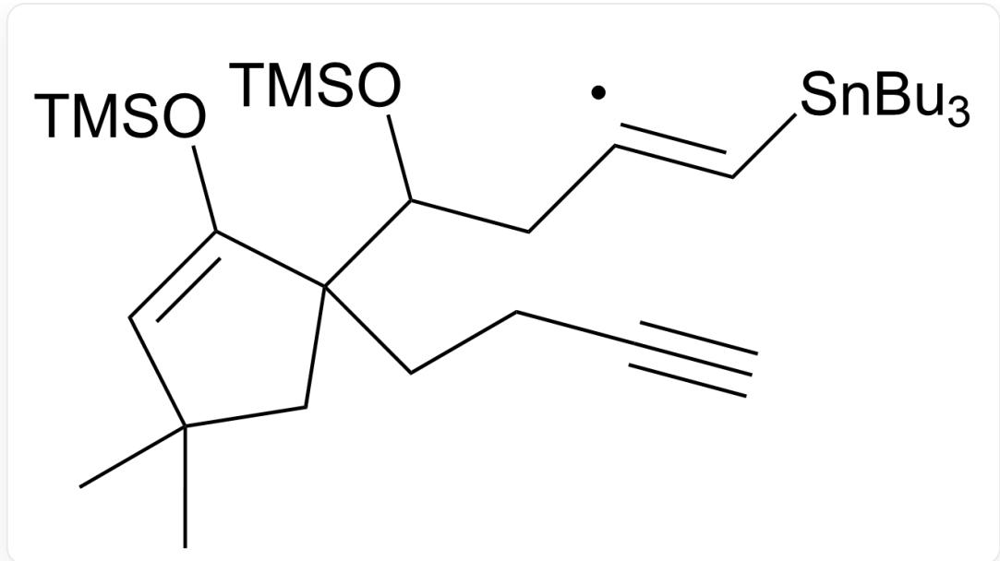
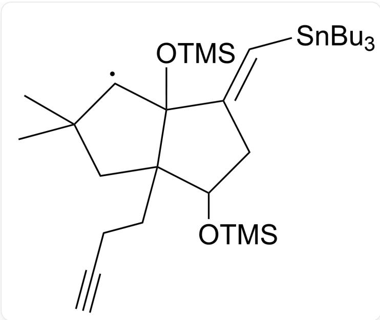
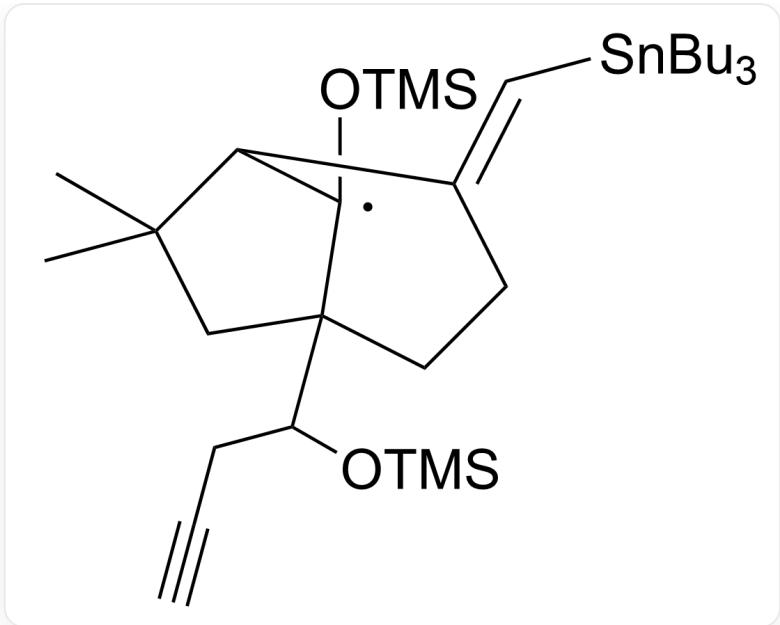
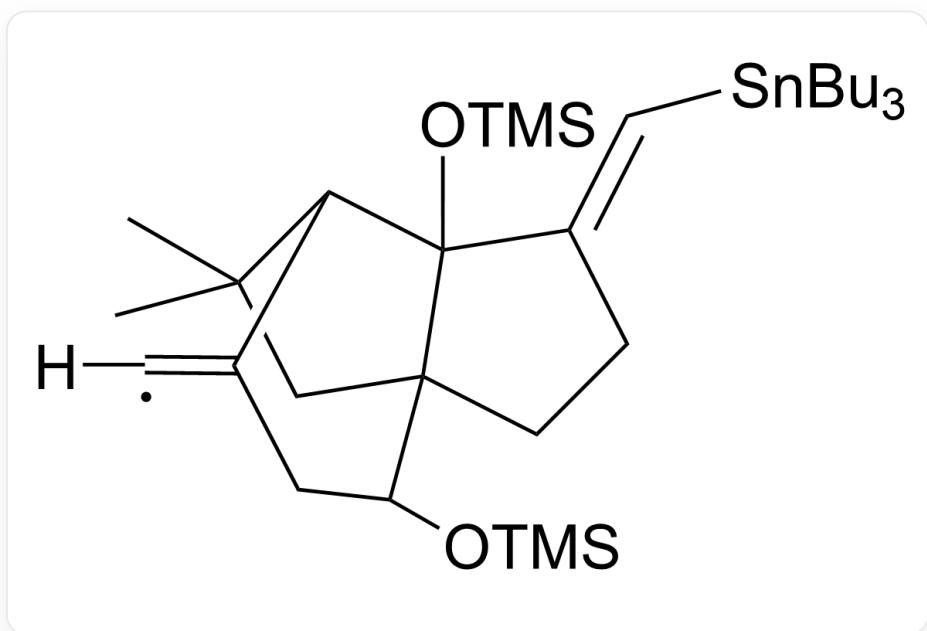
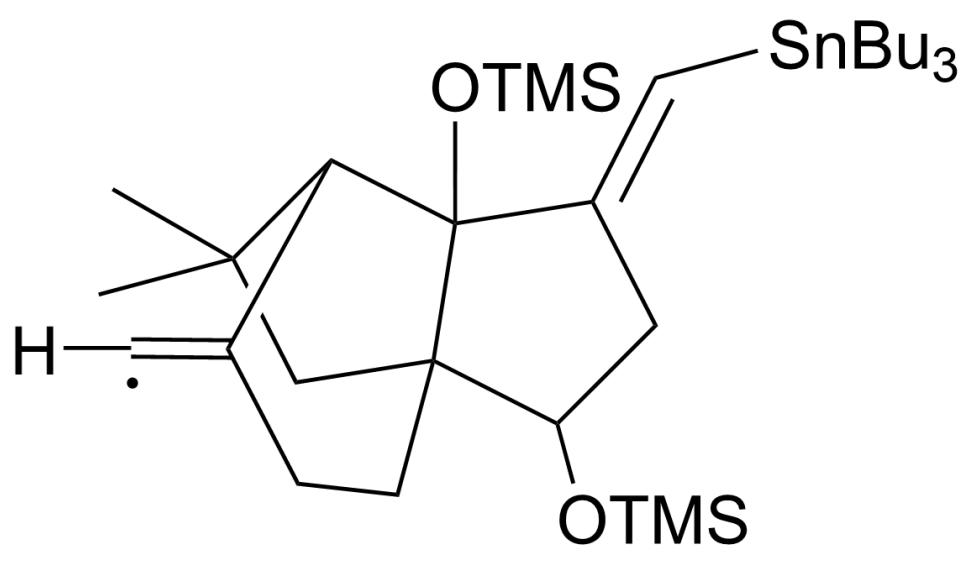
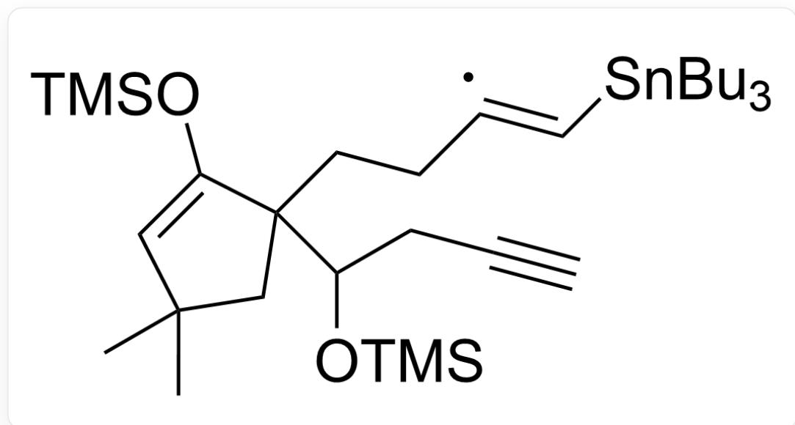
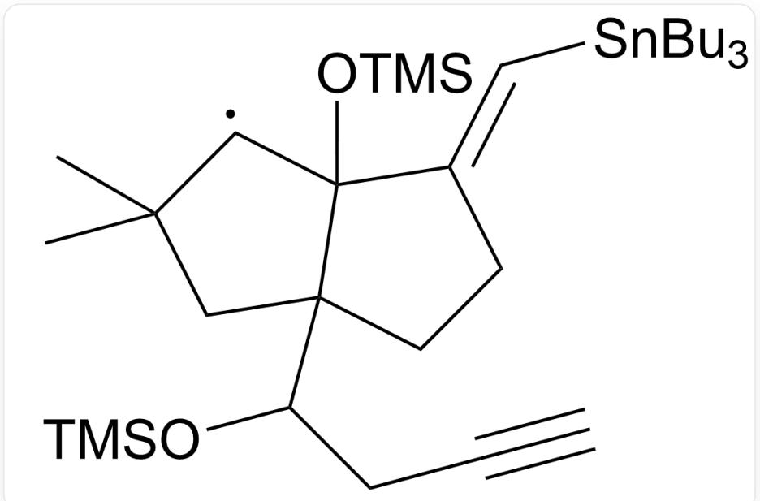
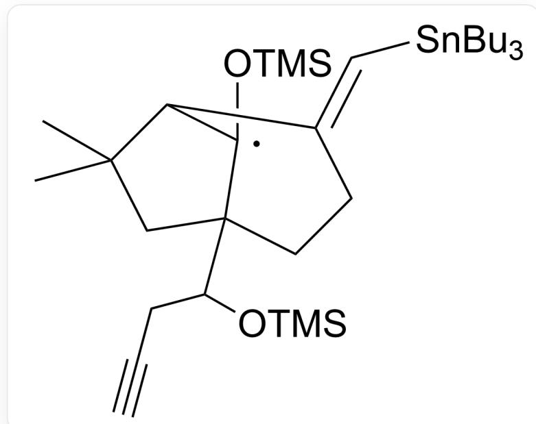

# 题目

自由基重排反应在有机合成中有着广泛的应用

C#CCCC1(C(O[Si](C)(C)C)CC#C)CC(C)(C)C=C1O[Si](C)(C)C> [Bu_3SnH].[AlBN]>[A],A是反应产物，反应完成后加入HCI

C#CCCC1(CC(C)(C=C1O[Si](C)(C)C)C(C/C([X])=C/[Sn](CCCC)(CCCC)CCCC)O[Si](C)(C)C,X为单电子，

选项1

选项1

C#CCCC1(CC(C)(C=C1O[Si](C)(C)C)C(C/C([X])=C/[Sn](CCCC)(CCCC)CCCC)O[Si](C)(C)C,X为单电子，

选项2

选项2

C#CCC(C1(CC(C)(C(C1/2O[Si](C)(C)C)[X])C)CCC2=C\[Sn](CCCC)(CCCC)CCCCCC)O[Si](C)(C)C,X是单电

子,选项3

选项3

CC1(C([X])C2(C(CCC#C)(C1)C(C/C2=C\[Sn](CCCC)(CCCC)CCCCCC)O[Sij](C)(C)C)O[Si](C)(C)C)C,X是单电

子，选项4

选项4

CC1(C2C(CCCC#C)(C1)C(C/C2=C\[Sn](CCCC)(CCCC)CCCCCC)O[Si](C)(C)C([X])O[Si](C)(C)C)C,X是单电

子,选项5

选项5

CC1(C2C(C(C(CC#C)O[Si](C)(C)C)(C1)CC/C2=C\[Sn](CCCC)(CCCC)CCCCCC)([X])O[Si](C)(C)C,C,X是单电

子,选项6

选项6

CC1(C2C3(C(C(C/C2=C([X])\[H])O[Si](C)(C)C)(C1)CC/C3=C\[Sn](CCCC)(CCCC)CCCCCC)O[Si](C)(C)C)C,X

是单电子,选项7

选项7

CC1(C2C3(C(CC/C2=C([X])\[H])(C1)C(C/C3=C\Sn)(CCCC)(CCCC)CCCCCCO[Si](C)(C)O[Si](C)(C)C,C,X

是单电子,选项8

# 选项8

不考虑对映异构的情况下，请选出选项中所有可能的中间体

A. 其他选项均不正确  
B. 选项1、3、5  
C. 选项2、4、5  
D. 选项1、3、7  
E. 选项2、4、8  
F. 选项1、3、6

G. 选项2、5  
H. 选项2、5、6  
I. 选项1、4、6

# 答案

正确答案: F

# 详细解析

在  $\gamma$  位引入-OTMS吸电子基团的碳自由基相对较为不稳定

# CHECKPOINT

1 PTS

在  $\gamma$  位引入-OTMS吸电子基团的碳自由基相对较为不稳定

首先形成中间体

C#CCCC1(CC(C)(C=C1O[Sij](C)(C)C)C(C/C([X])=C/[Sn](CCCC)(CCCC)CCCCCC)O[Si](C)(C)C,X为单电子

# CHECKPOINT

1 PTS

首先形成中间体：C#CCCC1(CC(C)(C=C1O[Si](C)(C)C)C(C/C([X])=C/[Sn](CCCCCC) (CCCCCC)CCCCO[Si](C)(C)C,X为单电子

5-exo-trig的反应速率较快

# CHECKPOINT

1 PTS

5-exo-trig的反应速率较快

因此优先生成中间体

CC1(C([X])C2(C(CCC#C)(C1)C(C/C2=C\Sn](CCCC)(CCCC)CCCCCC)O[Si](C)(C)C)O[Si](C)(C)C),X是单电子

# CHECKPOINT

1 PTS

接下来优先形成中间体：CC1(C([X])C2(C(CCC#C)(C1)C(C/C2=C\[Sn](CCCC)(CCCC)CCCCCC)O[Si](C)  
(C)C)O[Si](C)(C)C)C,X是单电子

然后再经过一步快速的1,2重排反应得到被氧的n电子稳定的碳自由基

# CHECKPOINT

1 PTS

然后再经过一步快速的1,2重排反应得到被氧的n电子稳定的碳自由基

CC1(C2C(C(CC#C)O[Sij](C)(C)C)(C1)CC/C2=C\Sn](CCCC)(CCCC)CCC)([X])O[Sij](C)(C)C,C,X是单电子

最后经得到的产物A为

CC1(C)[C@@H]2[C@@](C(C[C@@H]3O)=C)(O)[C@]3(C1)CCC2=C