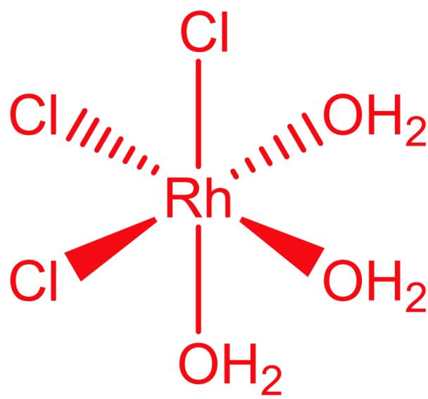
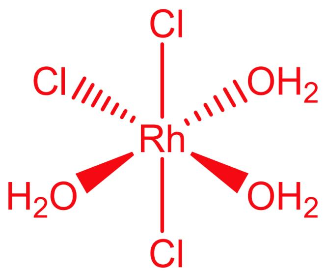
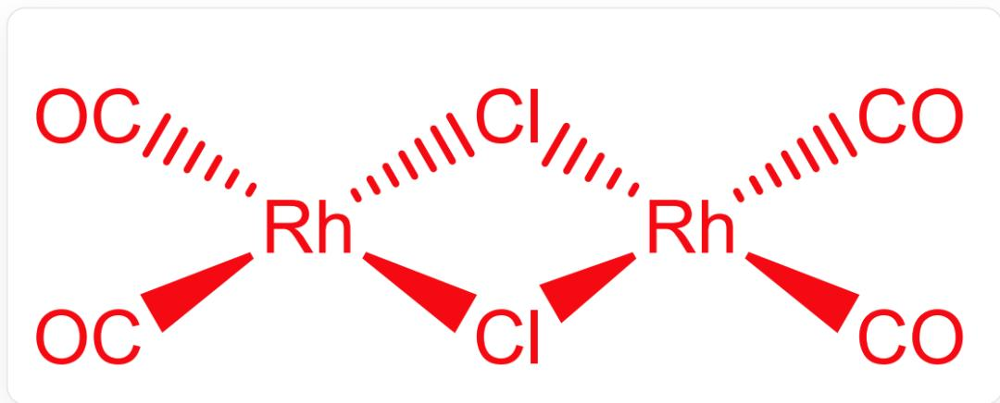
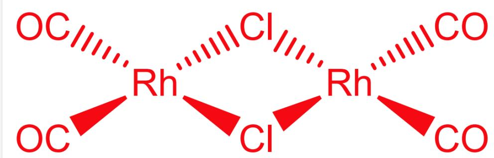
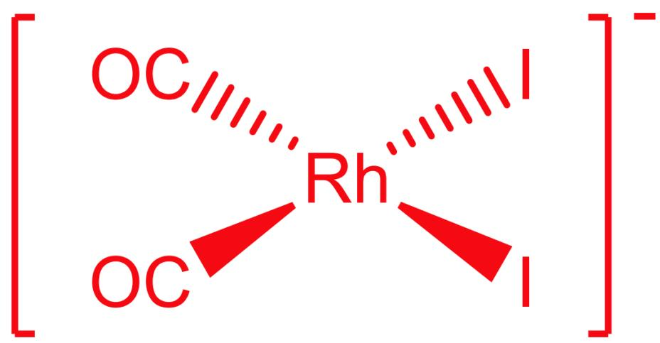

# Question

Rhodium(III) chloride trihydrate  $(\mathrm{RhCl}_3\cdot 3\mathrm{H}_2\mathrm{O})$  is a red solid, but its composition is relatively complex; column chromatographic separation and spectroscopic studies of its aqueous solution reveal the presence of two hexacoordinate mononuclear complex molecules,  $\mathbf{A}_1,\mathbf{A}_2$ ; in  $\mathbf{A}_1$ , the chemical environment of the same kind of atom is the same. The reaction of  $\mathrm{RhCl}_3\cdot 3\mathrm{H}_2\mathrm{O}$  with CO gas flow yields  $\mathbf{B}$ ;  $\mathbf{B}$  is a dinuclear complex molecule, Rh is 4-coordinate,  $+1$  oxidation state, and the ligands are only  $\mathrm{Cl}^-$  and CO.  $\mathbf{B}$  reacts with tetramethylammonium iodide to obtain  $\mathbf{C}$ ;  $\mathbf{C}$  is a 1:1 type salt, Rh is in the  $+1$  oxidation state, and the ligands are only  $\mathrm{I}^-$  and CO.  $\mathbf{B}$  is a diamagnetic species.

Using the anion of  $\mathbf{C}$  as a catalyst and iodomethane as a co-catalyst, the preparation of acetic acid can be achieved:  $\mathrm{CH}_3\mathrm{OH} + \mathrm{CO} \rightarrow \mathrm{CH}_3\mathrm{COOH}$ . In the reaction, the anion of  $\mathbf{C}$  undergoes an oxidative addition reaction with iodomethane to obtain  $\mathbf{D}$ ;  $\mathbf{D}$  undergoes methyl migration to obtain  $\mathbf{E}$ ;  $\mathbf{E}$  coordinates with  $\mathrm{CO}$  to obtain  $\mathbf{F}$ ;  $\mathbf{F}$  undergoes reductive elimination, releasing the small molecule  $\mathbf{G}$  and regenerating  $\mathbf{C}$ ;  $\mathbf{G}$  reacts with water to produce acetic acid and HI; HI reacts with methanol to produce iodomethane and water.

There are the following statements:

1, Ignoring hydrogen atoms, the point groups to which  $\mathbf{A_1},\mathbf{A_2},\mathbf{B}$  belong are  $C_{2v},C_{3v},D_{2h}$ , respectively.  
2, The theoretical magnetic moments of  $\mathbf{A}_1$ ,  $\mathbf{C}$  are 0 and 2.83 B.M., respectively.  
3, The oxidation states of Rh in  $\mathbf{D},\mathbf{E},\mathbf{F}$  are not all the same.  
4, The molecular weight of  $\mathbf{G}$  is 297.9.

Then the option that contains all the correct statements is:

A. All other options are incorrect  
B. 1

C. 2  
D. 3  
E. 4  
F. 1, 2  
G. 1, 3  
H. 1, 4  
1. 2,3  
J. 2, 4  
K. 3, 4  
L. 1, 2, 3  
M. 1, 2, 4  
N. 1,3，4  
O. 2,3,4  
P. 1, 2, 3, 4

# Answer

Correct Answer: A

# Detailed Explanation

$\mathrm{RhCl}_3 \cdot 3\mathrm{H}_2\mathrm{O}$  exists in both mer and fac isomers, where the fac isomer has the same chemical environment for the same type of atoms. Therefore,  $\mathbf{A_1}$  is the fac isomer, and  $\mathbf{A_2}$  is the mer isomer.

# CHECKPOINT

1 PTS

$\mathbf{A_1}$  is the

fac structure of  $\mathrm{RhCl}_3\cdot 3\mathrm{H}_2\mathrm{O}$

# CHECKPOINT

1 PTS

$\mathbf{A}_2$  is the

  
mer structure of  $\mathrm{RhCl}_3\cdot 3\mathrm{H}_2\mathrm{O}$

The reaction of  $\mathrm{RhCl}_3\cdot 3\mathrm{H}_2\mathrm{O}$  with CO gas flow yields  $\mathbf{B}$ , which is a dinuclear complex. Rh is 4-coordinated, in a  $+1$  oxidation state, and  $\mathbf{B}$  is a diamagnetic species; therefore, the coordination geometry is square planar. Thus, the structure of  $\mathbf{B}$  can be deduced as

  
$\mathrm{O = C[Rh]1(Cl[Rh](C = O)(Cl1)C = O)C = O}$

# CHECKPOINT

2 PTS

B is

$\mathrm{O = C[Rh]1(Cl[Rh](C = O)(Cl1)C = O)C = O}$

Therefore, the point groups to which  $\mathbf{A}_1,\mathbf{A}_2,\mathbf{B}$  belong are  $C_{3v},C_{2v},D_{2h}$  respectively. Statement 1 is incorrect.

B reacts with tetramethylammonium iodide to yield C; C is a 1:1 type salt, Rh is in the  $+1$  oxidation state, and the ligands are only  $\mathrm{I}^{-}$  and CO. Therefore, there are two  $\mathrm{I}^{-}$  and two CO ligands. Based on the positional relationship of CO in B, the structure of C can be obtained as

  
I[Rh-](I)([C]=O)[C]=O, the two CO groups are in cis position

# CHECKPOINT

1 PTS

C does not have any unpaired electrons

The theoretical magnetic moments of  $\mathbf{A}_1, \mathbf{C}$  are both 0. Statement 2 is incorrect.

C undergoes oxidative addition with iodomethane, readily yielding D with the chemical formula  $\left[\mathrm{Rh}(\mathrm{CO})_{2}\mathrm{I}_{3}(\mathrm{CH}_{3})\right]^{-}$ . D undergoes methyl migration to yield  $\left[\mathrm{Rh}(\mathrm{CO})\mathrm{I}_{3}(\mathrm{CH}_{3}\mathrm{CO})\right]^{-}$ ;  $\left[\mathrm{Rh}(\mathrm{CO})\mathrm{I}_{3}(\mathrm{CH}_{3}\mathrm{CO})\right]^{-}$  coordinates with CO to yield  $\left[\mathrm{Rh}(\mathrm{CO})_{2}\mathrm{I}_{3}(\mathrm{CH}_{3}\mathrm{CO})\right]^{-}$ ;  $\left[\mathrm{Rh}(\mathrm{CO})_{2}\mathrm{I}_{3}(\mathrm{CH}_{3}\mathrm{CO})\right]^{-}$  undergoes reductive elimination, eliminating the small molecule  $\mathrm{CH}_3\mathrm{COI}$  and regenerating C.

# CHECKPOINT

3 PTS

$\mathbf{D}$  is  $[\mathrm{Rh}(\mathrm{CO})_2\mathrm{I}_3(\mathrm{CH}_3)]^{-}$ ,  $\mathbf{E}$  is  $[\mathrm{Rh}(\mathrm{CO})\mathrm{I}_3(\mathrm{CH}_3\mathrm{CO})]^{-}$ ,  $\mathbf{F}$  is  $[\mathrm{Rh}(\mathrm{CO})_2\mathrm{I}_3(\mathrm{CH}_3\mathrm{CO})]^{-}$ .

# CHECKPOINT

1 PTS

G is  $\mathrm{CH}_3\mathrm{COI}$

The oxidation state of Rh in  $\mathbf{D},\mathbf{E},\mathbf{F}$  is all  $+3$  , and the molecular weight of  $\mathbf{G}$  is 169.9. Statements 3 and 4 are incorrect.

Choose A