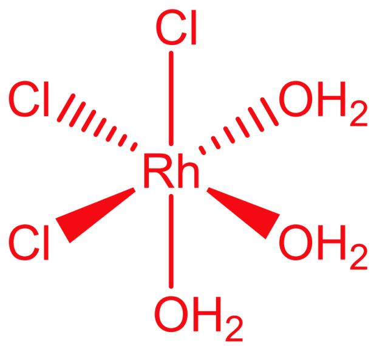
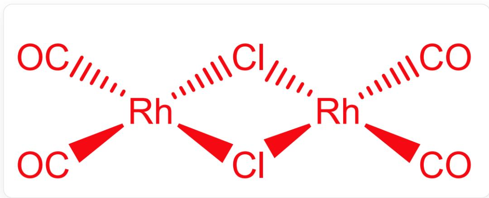
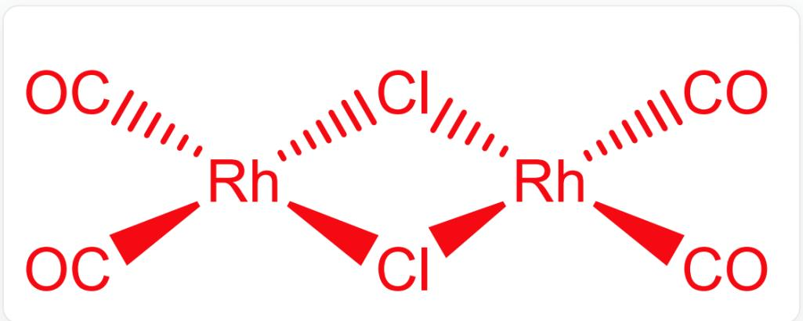
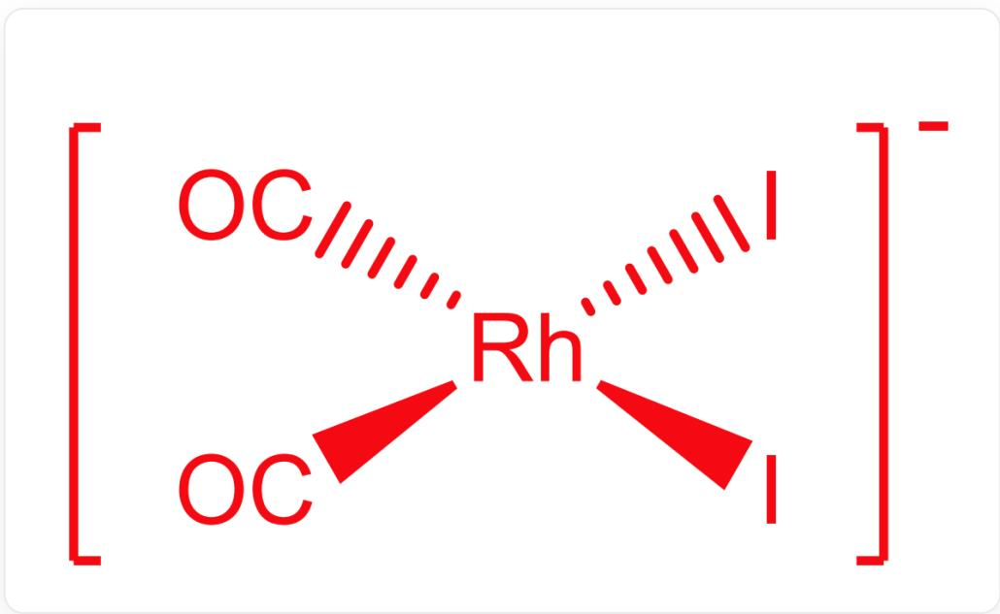

# 题目

三水合三氯化铑  $\left(\mathrm{RhCl}_{3} \cdot 3 \mathrm{H}_{2} \mathrm{O}\right)$  是一种红色固体，但其组成比较复杂；对其水溶液进行柱色谱分离和光谱研究，发现其中包含  $\mathbf{A}_{1}, \mathbf{A}_{2}$  两种六配位单核配合物分子； $\mathbf{A}_{1}$  中同种原子化学环境相同。 $\mathrm{RhCl}_{3} \cdot 3 \mathrm{H}_{2} \mathrm{O}$  与 CO 气流反应，得到 B；B 是双核配合物分子，Rh 为 4 配位，+1 氧化态，配体只有  $\mathrm{Cl}^{-}$  和 CO。B 与四甲基碘化铵反应得到 C；C 为 1:1 型盐，Rh 为 +1 氧化态，配体只有  $\mathrm{I}^{-}$  和 CO。B 为抗磁性物种。

以C的阴离子为催化剂，以碘甲烷为助催化剂，可以实现醋酸的制备：  $\mathrm{CH}_3\mathrm{OH} + \mathrm{CO}\rightarrow \mathrm{CH}_3\mathrm{COOH}$  。反应中，C的阴离子与碘甲烷发生氧化加成反应得到D；D发生甲基迁移得到E；E与CO配位得到F；F发生还原消除，脱去小分子G并得回C；G遇水生成醋酸和HI；HI与甲醇反应生成碘甲烷和水。

有以下几个说法：

1，忽略氢原子，则  $\mathbf{A_1},\mathbf{A_2},\mathbf{B}$  所属的点群分别为  $C_{2v},C_{3v},D_{2h}$  。  
2,  $\mathbf{A_1},\mathbf{C}$  的理论磁矩分别为0，2.83B.M.。  
3, D,E,F中Rh的化合价不完全相同。  
4，G的分子量为297.9。

则下列选项中包含所有正确说法的选项为:

A. 其他选项均不正确  
B. 1  
C. 2  
D. 3

E. 4  
F. 1, 2  
G. 1, 3  
H. 1, 4  
1. 2,3  
J. 2, 4  
K. 3, 4  
L. 1, 2, 3  
M. 1, 2, 4  
N. 1,3，4  
O. 2, 3, 4  
P. 1, 2, 3, 4

# 答案

正确答案: A

# 详细解析

$\mathrm{RhCl}_{3} \cdot 3 \mathrm{H}_{2} \mathrm{O}$  存在经式和面式两种异构体, 其中面式中同种原子化学环境相同。因此  $\mathbf{A}_{1}$  为面式,  $\mathbf{A}_{2}$  为经式。

CHECKPOINT

1 PTS

$\mathbf{A}_1$  为

  
$\mathrm{RhCl}_{3} \cdot 3 \mathrm{H}_{2} \mathrm{O}$  的面式结构

# CHECKPOINT

1 PTS

$\mathbf{A}_2$  为

  
$\mathrm{RhCl}_3 \cdot 3\mathrm{H}_2\mathrm{O}$  的经式结构

$\mathrm{RhCl}_{3} \cdot 3 \mathrm{H}_{2} \mathrm{O}$  与  $\mathrm{CO}$  气流反应得到  $\mathrm{B}$  是双核配合物,  $\mathrm{Rh}$  为4配位,  $+1$  氧化态且  $\mathrm{B}$  为抗磁性物种, 因此配位构型为平面四边形。从而可以得出  $\mathrm{B}$  的结构为

  
$\mathrm{O = C[Rh]1(Cl[Rh](C = O)(Cl1)C = O)C = O}$

# CHECKPOINT

2 PTS

B为

$\mathrm{O = C[Rh]1(Cl[Rh](C = O)(Cl1)C = O)C = O}$

因此  $\mathbf{A}_1, \mathbf{A}_2, \mathbf{B}$  所属的点群分别为  $C_{3v}, C_{2v}, D_{2h}$ ，说法1错误。

B与四甲基碘化铵反应得到C；C为1:1型盐，Rh为+1氧化态，配体只有  $\mathrm{I}^{-}$  和CO，因此配体中有两个 $\mathrm{I}^{-}$  和两个CO，根据B中CO的位置关系就可以得到C的结构为

I[Rh-](I)([C]=O)[C]=O，两个CO处于顺式

# CHECKPOINT

1 PTS

C中没有单电子

A1, C的理论磁矩均为0，说法2错误。

C 与碘甲烷发生氧化加成，容易得到 D 化学式为  $\left[\mathrm{Rh}(\mathrm{CO})_{2} \mathrm{I}_{3}\left(\mathrm{CH}_{3}\right)\right]^{-}, \mathrm{D}$  发生甲基迁移得到  $\left[\mathrm{Rh}(\mathrm{CO})_{3}\left(\mathrm{CH}_{3} \mathrm{CO}\right)\right]^{-}; \left[\mathrm{Rh}(\mathrm{CO})_{3}\left(\mathrm{CH}_{3} \mathrm{CO}\right)\right]^{-}$  与 CO 配位得到  $\left[\mathrm{Rh}(\mathrm{CO})_{2} \mathrm{I}_{3}\left(\mathrm{CH}_{3} \mathrm{CO}\right)\right]^{-};$ $\left[\mathrm{Rh}(\mathrm{CO})_{2} \mathrm{I}_{3}\left(\mathrm{CH}_{3} \mathrm{CO}\right)\right]^{-}$  发生还原消除，脱去小分子  $\mathrm{CH}_{3} \mathrm{COI}$  并得回 C。

# CHECKPOINT

3 PTS

$\mathbf{D}$  为  $[\mathrm{Rh}(\mathrm{CO})_2\mathrm{I}_3(\mathrm{CH}_3)]^-$ ,  $\mathbf{E}$  为  $[\mathrm{Rh}(\mathrm{CO})\mathrm{I}_3(\mathrm{CH}_3\mathrm{CO})]^-,$ $\mathbf{F}$  为  $[\mathrm{Rh}(\mathrm{CO})_2\mathrm{I}_3(\mathrm{CH}_3\mathrm{CO})]^{-}$

# CHECKPOINT

1 PTS

G为  $\mathrm{CH}_3\mathrm{COI}$

D, E, F 中 Rh 的化合价均为 +3, G 的分子量为 169.9。说法3和说法4错误

选A