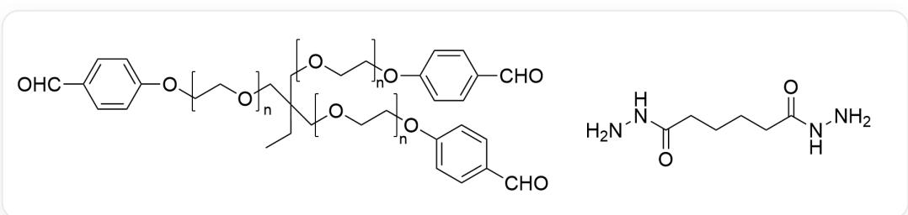

# Question

This image describes two organic structural formulas. The left side is a polymer with three repeating monomers, each with the structure [a]OCC[b], where a and b represent the monomer connection sites. The structure connecting the three a sites is  $[^{*}]\mathrm{CC(CC)(C[*])C[*]}$ , where  $*$  represents the site connected to a. The structure connecting the three b sites is [B]OC1=CC=C(C=O)C=C1, where B represents the connection site. The structure on the right is O=C(NN)CCCCC(NN)=O.

Some polymer compounds have self-healing properties. The two compounds shown in the figure above can be fully polymerized in aqueous solution to produce a self-healing hydrogel; the degree of repair varies with the pH of the system.

To test the self-healing ability of the hydrogel, a piece of hydrogel was cut open and left to stand for  $48\mathrm{h}$ , and the recovery of the two cut surfaces was observed.

Which of the following statements is correct:

A. All other options are incorrect  
B. Replacing the monomer structure in the polymer with polyethylene monomers results in hydrogels with similar properties.  
C.  $\mathrm{pH} = 8 - 10$ , the cut surfaces on both sides will adhere.  
D. pH=1~4, the two cut surfaces will adhere.

E.  $\mathrm{pH} = 4 \sim 6$ , the two cut surfaces will not adhere.  
F.  $\mathrm{pH} = 7 - 8$ , a catalytic amount of aniline exists in the system, and the cut surfaces on both sides will adhere.  
G. At  $\mathrm{pH} = 7$ , the two cut surfaces will adhere.

# Answer

Correct Answer: F

# Detailed Explanation

The polymer's monomer is polyethylene glycol, which can form hydrogen bonds with water, thereby enhancing hydrophilicity. Therefore, if it is replaced with a polyethylene segment that does not contain oxygen atoms, it will not be hydrophilic, so option B is incorrect.

# CHECKPOINT

1 PTS

The polymer's monomer is polyethylene glycol, which can form hydrogen bonds with water, thereby enhancing hydrophilicity

Weakly acidic conditions can catalyze the hydrolysis of imine bonds and the condensation reaction of amino and aldehyde groups, thereby forming a dynamic equilibrium. Acid catalysis realizes the reversible exchange of chemical bonds, promotes the reformation of the hydrogen bond network, and achieves self-healing of the cut surface. Therefore, when  $\mathrm{pH} = 4\sim 6$ , the cut surface can automatically heal, and options C and E are incorrect.

# CHECKPOINT

1 PTS

Weakly acidic conditions can catalyze the hydrolysis of imine bonds and the condensation reaction of amino and aldehyde groups

# CHECKPOINT

1 PTS

Acid catalysis realizes the reversible exchange of chemical bonds, promotes the reformation of the hydrogen bond network, and achieves self-healing of the cut surface

Under strongly acidic conditions, the hydrolysis of the imine bond is very thorough, and the polymer will be completely hydrolyzed, so gel healing cannot be observed, and option D is incorrect.

# CHECKPOINT

1 PTS

Under strongly acidic conditions, the hydrolysis of the imine bond is very thorough, and the polymer will be completely hydrolyzed

When  $\mathrm{pH} = 7$ , the concentration of hydrogen ions is too low, and dynamic equilibrium is difficult to achieve, so healing cannot be observed, and option G is incorrect.

# CHECKPOINT

1 PTS

When  $\mathrm{pH} = 7$ , the concentration of hydrogen ions is too low, and dynamic equilibrium is difficult to achieve

However, in the presence of aniline, aniline can act as a nucleophilic catalyst, performing nucleophilic attack on the imine and leaving, promoting the imine hydrolysis reaction, so healing can be observed, and option F is correct.

# CHECKPOINT

1 PTS

Aniline can act as a nucleophilic catalyst, performing nucleophilic attack on the imine and leaving, promoting the imine hydrolysis reaction