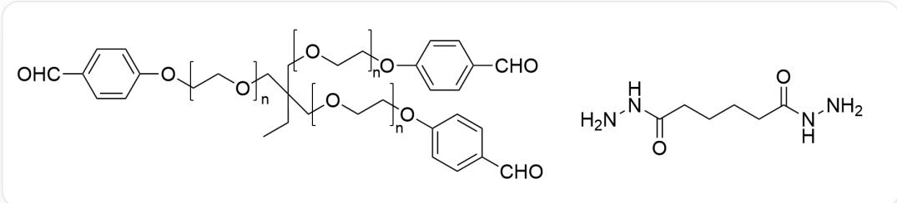

# 题目

本图片描述了两个有机结构式。左边为高分子，具有三个重复单体，其结构均为[a]OCC[b]，其中a,b表示单体连接位点。连接三个a位点的结构为[*]CC(CC)(C[*])C[*]，*表示与a相连的位点。连接三个b位点的结构为[B]OC1=CC=C(C=O)C=C1，B表示连接位点。右边结构为O=C(NN)CCCCC(NN)=O。

有些高分子化合物具有自修复功能，上图所示的两种化合物在水溶液中充分聚合，可制成一种自修复水凝胶；随体系pH不同，修复程度也不相同。

为测试水凝胶的自修复能力，取一块水凝胶切开后静置  $48\mathrm{h}$ ，观察两侧切面的恢复情况。

下列说法正确的是：

A. 其他选项均不正确  
B. 高分子中的单体结构用聚乙烯单体替换后, 得到的水凝胶具有类似的性质  
C. pH=8-10时, 两侧切面会发生粘合  
D. pH=1~4时, 两侧切面会发生粘合  
E. pH=4~6时, 两侧切面不会发生粘合  
F. pH=7-8时, 体系中存在催化量的苯胺, 两侧切面会发生粘合

G.  $\mathrm{pH} = 7$  时, 两侧切面会发生粘合

# 答案

正确答案: F

# 详细解析

高分子的单体为聚乙二醇，其能与水形成氢键，从而增强亲水性，因此若换为不含氧原子的聚乙烯链段时不具有亲水性，选项B错误。

# CHECKPOINT

1 PTS

高分子的单体为聚乙二醇，其能与水形成氢键，从而增强亲水性

弱酸性条件可催化亚胺键的水解反应，以及氨基与醛基的缩合反应，从而形成动态平衡，通过酸催化实现化学键的可逆交换，促进氢键网络的重新形成，实现切面自愈合。因此  $\mathrm{pH} = 4\sim 6$  时，切面可自动愈合，选项C,E错误。

# CHECKPOINT

1 PTS

弱酸性条件可催化亚胺键的水解反应，以及氨基与醛基的缩合反应

# CHECKPOINT

1 PTS

酸催化实现化学键的可逆交换，促进氢键网络的重新形成，实现切面自愈合

强酸性条件下，亚胺键的水解非常彻底，聚合物会彻底水解，因此观察不到凝胶愈合，选项D错误。

# CHECKPOINT

1 PTS

强酸性条件下，亚胺键的水解非常彻底，聚合物会彻底水解

$\mathrm{pH} = 7$  时，氢离子浓度过低，动态平衡难以实现，因此观察不到愈合，选项G错误。

# CHECKPOINT

1 PTS

$\mathrm{pH} = 7$  时, 氢离子浓度过低, 动态平衡难以实现

但苯胺存在时，苯胺可作为亲核性催化剂，对亚胺进行亲核进攻且可离去，促进了亚胺水解反应，因此可观察到愈合，选项F正确。

# CHECKPOINT

1 PTS

苯胺可作为亲核性催化剂，对亚胺进行亲核进攻且可离去，促进了亚胺水解反应