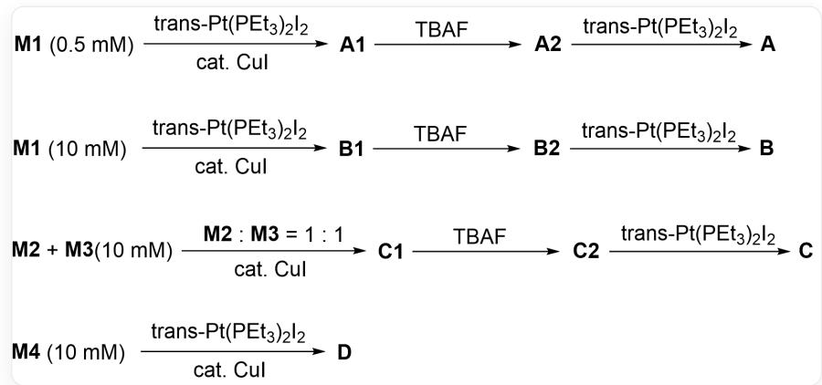

# Question

A certain Chevron-shaped four-armed monomer structure is as follows:

[ \text{[R]OC(C(C#C[R2]) = C1) = C(C#C[R2]) = C1C#CC(C = C2) = CC = C2N(C3 = CC = C(C = C3)C#CC4 = CC(C#C[R1]) = CC(O[R]) = C4)C(C = C5) = CC = C5C#CC6 = CC(O[R]) = CC(C} ]

Let  $\mathrm{R}_1 = \mathrm{TIPS}$ ,  $\mathrm{R}_2 = \mathrm{H}$ , the monomer is denoted as M1; when  $\mathrm{R}_1 = \mathrm{H}$ ,  $\mathrm{R}_2 = \mathrm{TIPS}$ , the monomer is denoted as M2; when  $\mathrm{R}_1 = \mathrm{TIPS}$ ,  $\mathrm{R}_2 = \mathrm{Pt}(\mathrm{PEt}_3)_2\mathrm{I}$ , the monomer is denoted as M3; when  $\mathrm{R}_1 = \mathrm{H}$ ,  $\mathrm{R}_2 = \mathrm{H}$ , the monomer is denoted as M4.

When  $\mathbb{R}_1$  and  $\mathbb{R}_2$  are different, the four-armed monomer can undergo polymerization to obtain polymers (or oligomers)  $\mathbf{A} \sim \mathbf{D}$  with different structures:

The figure shows the reactions for synthesizing A, B, C to D, respectively. 1.  $0.5mM$  M1 reacts under trans -  $Pt(PEt_3)_2I_2$ , cat. CuI conditions to obtain intermediate A1, continues to react under TBAF conditions to obtain intermediate A2, and continues to react under trans -  $Pt(PEt_3)_2I_2$  conditions to obtain A. 2.  $10mM$  M1 reacts under trans -  $Pt(PEt_3)_2I_2$ , cat. CuI conditions to obtain intermediate B1, continues to react under TBAF conditions to obtain intermediate B2, and continues to react under trans -  $Pt(PEt_3)_2I_2$  conditions to obtain B. 3.  $10mM$  M2+10mM M3 reacts under M2 : M2 = 1 : 1, cat. CuI conditions to obtain intermediate C1, continues to react under TBAF conditions to obtain intermediate C2, and continues to react under trans -  $Pt(PEt_3)_2I_2$  conditions to obtain C. 4.  $10mM$  M4 reacts under trans -  $Pt(PEt_3)_2I_2$ , cat. CuI conditions to obtain D.

It is known that  $\mathbf{A} \sim \mathbf{D}$  can be regarded as 1) a cyclic structure 2) a network structure 3) a one-dimensional helical chain 4) a one-dimensional linear chain, respectively. Please correspond them one by one and represent them with a four-digit number (e.g., if  $\mathbf{A}$  corresponds to 1),  $\mathbf{B}$  corresponds to 2),  $\mathbf{C}$  corresponds to 3), and  $\mathbf{D}$  corresponds to 4), then it is represented as 1234).

A. All other options are incorrect  
B. 1,2,3,4

C.  $1,4,2,3$  
D. 3,1,2,4  
E. 1,3,4,2  
F. 4,1,2,3  
G. 2,4,3,1  
H. 2,1,3,4  
1. 2,3,1,4  
J. 3,2,4,1  
K. 3,4,1,2  
L. 4,3,2,1  
M. 4,2,3,1

# Answer

Correct Answer: E

# Detailed Explanation

If the alkyne terminus is hydrogen, it can react with trans -  $\mathrm{Pt}(\mathrm{PEt}_3)_2\mathrm{I}_2$  under CuI catalysis to lose HI, polymerizing the monomer M with a trans C - Pt - C bond (linear).

# CHECKPOINT

1 PTS

The alkyne of  $\mathbf{M}$  can achieve polymerization via linear coordination to Pt

For M1, the first polymerization reaction occurs at the lower alkyne. After TBAF removes the TIPS group, the upper alkyne can continue to react later. Aligning the upper and lower alkynes, it can be found that six M1 can undergo two rounds of polymerization, inner and outer, to obtain a hexamer similar to hexabenzene, i.e., 1) cyclic structure; if multiple M1 participate in the polymerization in the first step, it will extend in a helical form, i.e., 3) one-dimensional helical chain.

# CHECKPOINT

1 PTS

M1 can be polymerized to obtain 1) and 3)

When the concentration of M1 is low (0.5 mM), the probability of intramolecular polymerization to form a closed loop is relatively higher, which is conducive to the formation of 1) cyclic structure A; when the concentration of M1 is high (10 mM), intermolecular polymerization reactions are more dominant, which is conducive to monomers connecting one by one to form 3) one-dimensional helical chain B.

# CHECKPOINT

1 PTS

At higher concentrations, intermolecular reactions are more likely to occur, A corresponds to 1), B corresponds to 3)

After alternating copolymerization of M2 and M3, a six-membered ring can be formed, and the formed polymer chain extends macroscopically into a 4) one-dimensional linear chain.

# CHECKPOINT

1 PTS

C corresponds to 4)

All four alkynes of M4 are reactive and can participate in polymerization together, without directionality, thus obtaining a network D.

# CHECKPOINT

1 PTS

D corresponds to 2)