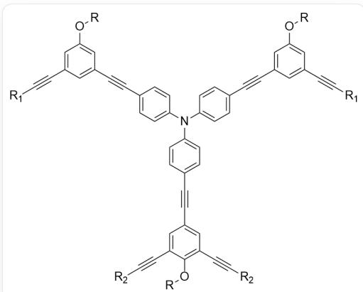
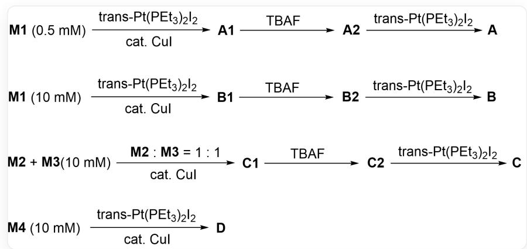

# 题目

某Chevron形状的四臂单体结构如下：

[ \text{[R]OC(C(C#C[R2]) = C1) = C(C#C[R2]) = C1C#CC(C = C2) = CC = C2N(C3 = CC = C(C = C3)C#CC4 = CC(C#C[R1]) = CC(O[R]) = C4)C(C = C5) = CC = C5C#CC6 = CC(O[R]) = CC(C} ]

记  $\mathrm{R_1 = TIPS}$  、  $\mathrm{R}_2 = \mathrm{H}$  时单体为M1；  $\mathrm{R_1 = H}$  、  $\mathrm{R_2 = TIPS}$  时单体为M2；  $\mathrm{R_1 = TIPS}$  、  $\mathrm{R_2 = Pt(PEt_3)_2I}$  时单体为M3；  $\mathrm{R_1 = H}$  、  $\mathrm{R_2 = H}$  时单体为M4。

当  $\mathrm{R}_1$  和  $\mathbb{R}_2$  不同时，该四臂单体可以发生聚合得到不同结构的聚合物（或寡聚物）  $\mathbf{A}\sim \mathbf{D}$  ：

  
图中分别为合成A、B、C至D的反应。1.0.5mMM1在trans-  $P t(P E t_{3})_{2}I_{2}$  ,cat.CuI条件下反应得到中间体A1，继续在TBAF条件下反应得到中间体A2，继续在trans-  $P t(P E t_{3})_{2}I_{2}$  条件下反应得到A。2.10mMM1在trans-  $P t(P E t_{3})_{2}I_{2}$  ,cat.CuI条件下反应得到中间体B1，继续在TBAF条件下反应得到中间体B2，继续在trans-  $P t(P E t_{3})_{2}I_{2}$  条件下反应得到B。3.10mMM2+10mMM3在M2:M2=1:1,cat.CuI条件下反应得到中间体C1，继续在TBAF条件下反应得到中间体C2，继续在trans-  $P t(P E t_{3})_{2}I_{2}$  条件下反应得到C。4.10mMM4在trans-  $P t(P E t_{3})_{2}I_{2}$  ,cat.CuI条件下反应得到D。

已知  $\mathbf{A} \sim \mathbf{D}$  可以分别看作1)环状结构2)网状结构3)一维螺旋状链4)一维直线型链，请将其一一对应并用一个四位数表示（如A对应1)，B对应2)，C对应3)，D对应4)则表示为1234）。

A. 其他选项均不正确  
B. 1,2,3,4  
C.  $1,4,2,3$

D. 3,1,2,4  
E. 1,3,4,2  
F. 4,1,2,3  
G. 2,4,3,1  
H. 2,1,3,4  
1. 2,3,1,4  
J. 3,2,4,1  
K. 3,4,1,2  
L. 4,3,2,1  
M. 4,2,3,1

# 答案

正确答案: E

# 详细解析

若炔基末端为氢，则可以在  $\mathrm{CuI}$  催化下与trans-  $\mathrm{Pt}(\mathrm{PET}_3)_2\mathrm{I}_2$  反应失去HI，以transC-  $\mathrm{Pt - C}$  键（直线型）将单体M聚合起来。

# CHECKPOINT

1 PTS

M的炔基可以对Pt直线型配位实现聚合

对于M1，第一步聚合反应发生在下方的炔基，TBAF脱去TIPS基团后上方的炔基才能之后继续反应。上下炔基对齐可以发现，6个M1恰好可以经历内外两圈的两次聚合得到类似并六苯的六聚体，即1)环状结构；而第一步反应若有多个M1参与聚合，则会以螺旋的形式延伸下去，即3)一维螺旋状链。

# CHECKPOINT

1 PTS

M1可以聚合得到1)和3)

当M1浓度较低（0.5mM）时，分子内聚合形成闭环的概率相对更高，有利于生成1)环状结构A；当M1浓度较高（10mM）时，分子间聚合反应更占优势，有利于单体逐个连接形成3)一维螺旋状链B

# CHECKPOINT

1 PTS

浓度更高时，更容易发生分子间反应，A对应1)，B对应3)

M2和M3交替共聚后可以形成六元环，形成的聚合物链在宏观上延伸为4)一维直线型链

# CHECKPOINT

1 PTS

C对应4)

M4的四个炔基均有反应活性，可以一起参与聚合，不具有方向性，因此得到网状的D

# CHECKPOINT

1 PTS

D对应2)