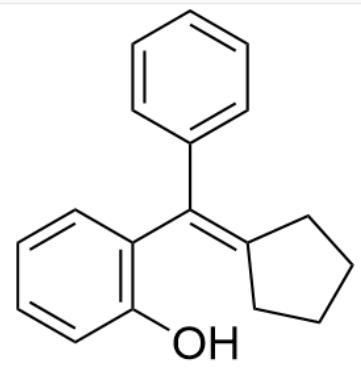
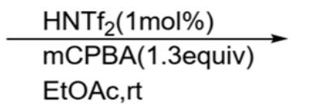
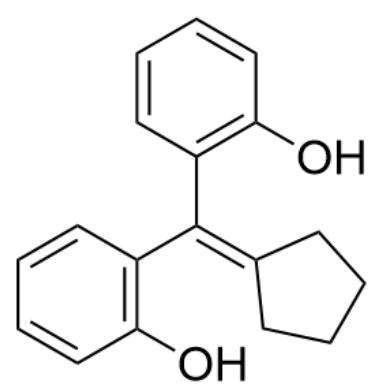
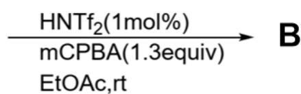
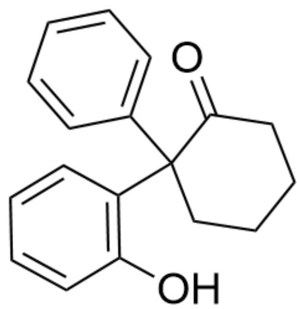
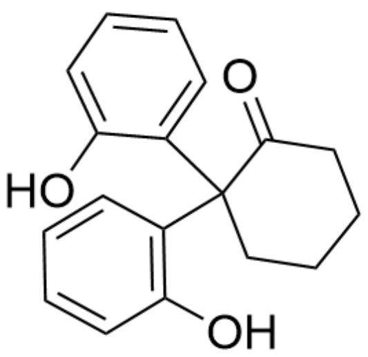
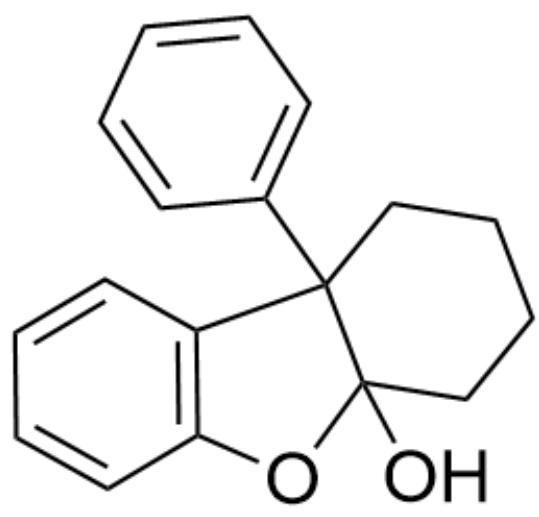

# Question

Give the products  $\mathbf{A}$  of the reaction in Figure 1 and the product  $\mathbf{B}$  of the reaction in Figure 2.

Fig. 1, the reaction in the figure is described by SMILES as:  
  
OC(C=CC=C1)=C1/C(C2=CC=CC=C2)=C3CCCC\3>>[[A]], where the reaction conditions are HNTf $_2$  (1mol%), mCPBA (1.3equiv), EtOAc, rt

Fig. 2, the reaction in the figure is described by SMILES as:  
  
OC(C=CC=C1)=C1/C(C2=C(O)C=CC=C2)=C3CCCC\3>>[[B]], where the reaction conditions are

  
$\mathrm{HNTf}_2(1\mathrm{mol}\%)$ , mCPBA(1.3equiv), EtOAc, rt

The following statements are made:

1. Only one carbon-carbon single bond cleavage occurs during the formation of both A and B.

2. A has three rings of six members or less.  
3. B has five rings of six members or less.  
4. The most important reason why the products of Figure 1 and Figure 2 are different is the electron richness of the benzene ring.

A. All other options are incorrect  
B. 1  
C. 2  
D. 3  
E. 4  
F. 1,2  
G. 1,3  
H. 1,4  
1. 2,3  
J. 2,4  
K. 3,4

L. 1,2,3  
M. 1,2,4  
N. 1,3,4  
O. 2,3,4  
P. 1,2,3,4

# Answer

Correct Answer: G

# Detailed Explanation

Figures 1 and 2 share the same principle in the first half of the reaction: mCPBA introduces an epoxy group onto the reactant double bond.

# CHECKPOINT

1 PTS

mCPBA introduces an epoxy group onto the reactant double bond

$\mathrm{HNTf}_2$  is a strong acid, protonating the epoxy group and dissociating into a hydroxyl group, generating the most stable carbocation on the carbon with simultaneous conjugation stabilization of the two benzene rings.

# CHECKPOINT

1 PTS

$\mathrm{HNTf}_2$  catalyzes the opening of the epoxide, forming a carbocation at the benzylic position

This intermediate structure is similar to the structure after the departure of a hydroxyl group in the Pinacol rearrangement, so a concerted carbon-carbon bond migration occurs in the adjacent position, yielding the intermediate in Figure 3 or the intermediate in Figure 4.

  
Fig. 3, the molecule in the figure is described by SMILES as: OC1=C(CCCCC2) (C3=CC=CC=C3)C2=O)C=CC=C1

# CHECKPOINT

1 PTS

The carbocation intermediate undergoes a Pinacol-like rearrangement, and the intermediate generated in the reaction of Figure 1 is represented by SMILES as: OC1=C(C(CCCC2)(C3=CC=CC=C3)C2=O)C=CC=C1

  
Fig. 4, the molecule in the figure is described by SMILES as: OC1=C(CCCCC2) (C3=CC=CC=C3O)C2=O)C=CC=C1

# CHECKPOINT

1 PTS

The carbocation intermediate undergoes a Pinacol-like rearrangement, and the intermediate generated in the reaction of Figure 2 is represented by SMILES as: OC1=C(C(CCCC2)(C3=CC=CC=C3O)C2=O)C=CC=C1

The carbonyl group of the intermediate can readily form an acetal or hemiacetal structure with the intramolecular hydroxyl group, yielding the final product A in Figure 5 or the final product B in Figure 6.

Fig. 5, the molecule in the figure is described by SMILES as:  
  
OC12CCCCC1(C3=CC=CC=C3)C4=C(O2)C=CC=C4

# CHECKPOINT

1 PTS

The reaction in Figure 1 forms an intramolecular hemiacetal structure, and the final product  $\mathbf{A}$  is represented by SMILES as: OC12CCCCC1(C3=CC=CC=C3)C4=C(O2)C=CC=C4

  
Fig. 6, the molecule in the figure is described by SMILES as: C1([C@]2(C3=C(O4)C=CC=C3)CCCC[C@]24O5)=C5C=CC=C1

# CHECKPOINT

1 PTS

The reaction in Figure 2 forms an intramolecular hemiacetal structure, and the final product  $\mathbf{B}$  is represented by SMILES as: C1([C@]2(C3=C(O4)C=CC=C3)CCCC[C@]24O5)=C5C=CC=C1

According to the above mechanism, only one carbon-carbon single bond cleavage occurs in the process of generating  $\mathbf{A}$  and  $\mathbf{B}$ , so statement 1 is correct.

A has four rings with six or fewer members, so statement 2 is incorrect.  
B has five rings with six or fewer members, so statement 3 is correct.

The most important reason why the products of Figure 1 and Figure 2 are different is that the last step forms an acetal or hemiacetal, which is not related to the electron-richness of the benzene ring.