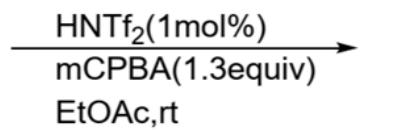
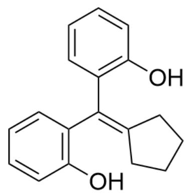
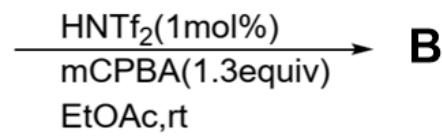
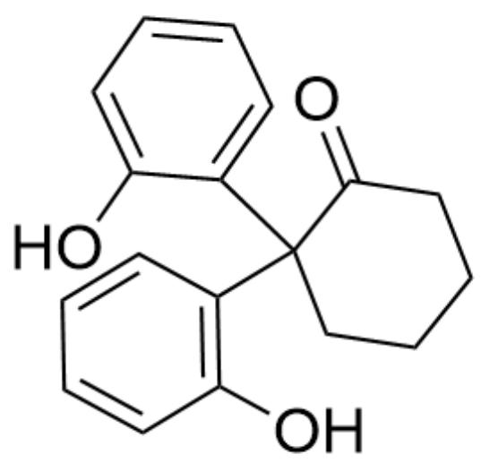
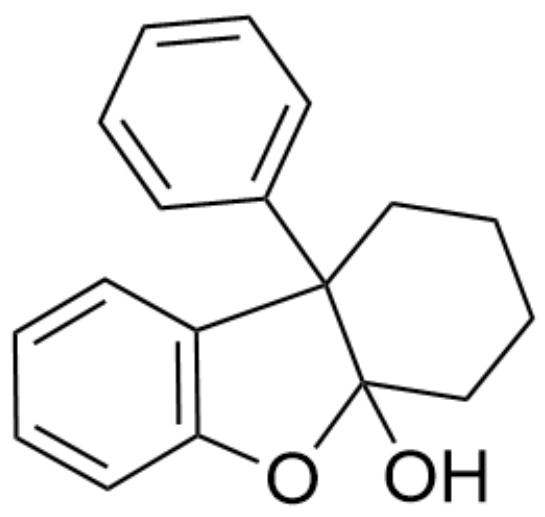
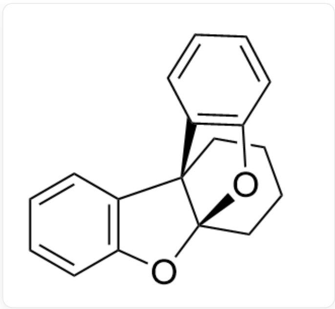

# 题目

给出图1反应的产物A和图2反应产物B。

  
Fig. 1, 图中反应以SMILES描述为: OC(C=CC=C1)=C1/C(C2=CC=C2)=C3CCCC\3>>[[A]], 其中反应条件为  $\mathrm{HNTf}_2(1\mathrm{mol}\%)$ , mCPBA(1.3equiv), EtOAc, rt

  
Fig. 2, 图中反应以SMILES描述为: OC(C=CC=C1)=C1/C(C2=C(O)C=CC=C2)=C3CCCC\3>>[[B]], 其中反应条件为HNTf₂(1mol%), mCPBA(1.3equiv), EtOAc, rt

有以下说法：

1. 生成  $\mathbf{A}$  和  $\mathbf{B}$  的过程中都只发生了一次碳碳单键的断裂  
2. A中有三个六元及以下的环

3. B中有五个六元及以下的环  
4. 图1和图2产物不一样的最重要原因是苯环的富电子程度

A. 其他选项均不正确  
B. 1  
C. 2  
D. 3  
E. 4  
F. 1,2  
G. 1,3  
H. 1,4  
1. 2,3  
J. 2,4  
K. 3,4  
L. 1,2,3

M. 1,2,4  
N. 1,3,4  
O. 2,3,4  
P. 1,2,3,4

# 答案

正确答案: G

# 详细解析

图1图2反应的前半段原理相同：mCPBA在反应物双键上引入一个环氧基团。

# CHECKPOINT

1 PTS

mCPBA在反应物双键上引入一个环氧基团

$\mathrm{HNTf}_2$  为强酸，质子化环氧基团并解离为羟基，两个苯环同时共轭稳定的碳上生成最稳定的碳正离子。

# CHECKPOINT

1 PTS

$\mathrm{HNTf}_2$  催化下打开环氧，在苄位形成碳正离子

该中间结构与Pinacol重排中一个羟基离去后的结构类似，因此邻位发生一步碳碳键迁移，得到图3中间体或图4中间体。

  
Fig. 3, 图中分子以SMILES描述为: OC1=C(CCCCC2)(C3=CC=CC=C3)C2=O)C=CC=C1

# CHECKPOINT

1 PTS

碳正离子中间体发生类Pinacol重排，图1反应生成中间体以SMILES表示为：OC1=C(CCCCC2)  
 $\mathrm{(C3 = CC = CC = C3)C2 = O)C = CC = C1}$

  
Fig. 4, 图中分子以SMILES描述为: OC1=C(CCCCC2)(C3=CC=CC=C3O)C2=O)C=CC=C1

# CHECKPOINT

1 PTS

碳正离子中间体发生类Pinacol重排，图2反应生成中间体以SMILES表示为：OC1=C(CCCCC2)  
 $\mathrm{(C3 = CC = CC = C3O)C2 = O)C = CC = C1}$

中间体羰基恰好可以与分子内的羟基形成缩醛或者半缩醛结构，得到图5最终产物A或图6最终产物B。

  
Fig. 5, 图中分子以SMILES描述为: OC12CCCCC1(C3=CC=CC=C3)C4=C(O2)C=CC=C4  
图1反应形成分子内半缩醛结构，最终产物A以SMILES表示为：OC12CCCCC1(C3=CC=CC=C3)C4=C(O2)C=CC=C4

# CHECKPOINT

1 PTS

  
Fig. 6, 图中分子以SMILES描述为: C1([C@]2(C3=C(O4)C=CC=C3)CCCC[C@]24O5)=C5C=CC=C1

# CHECKPOINT

1 PTS

图2反应形成分子内半缩醛结构，最终产物B以SMILES表示为：C1([C@]2(C3=C(O4)C=CC=C3)CCCC[C@]24O5)=C5C=CC=C1

根据以上机理，生成A和B的过程中都只发生了一次碳碳单键的断裂，说法1正确。

A中有四个六元及以下的环，说法2错误。

B中有五个六元及以下的环，说法3正确。

图1和图2产物不一样的最重要原因是最后一步形成缩醛或半缩醛，与苯环富电子程度无关。