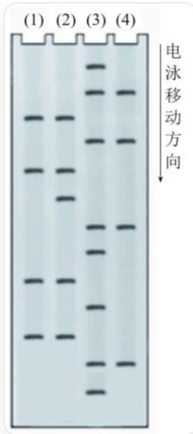

# Question

A certain single-stranded DNA to be sequenced is truncated to obtain a segment, and then the  $5^{\prime}$  end of the segment is labeled with  ${}^{32}\mathrm{P}$ , and then placed in 4 different reaction tubes for the following two-step treatment.

In the first step, the 4 reaction tubes are treated as follows, respectively: Tube (1) is treated with hot, nearly neutral dimethyl sulfate aqueous solution; Tube (2) is treated with formic acid aqueous solution; Tube (3) is treated with alkaline hydrazine aqueous solution; Tube (4) is treated with alkaline hydrazine aqueous solution containing  $1.5\mathrm{mol/L}$  NaCl.

In the second step, the above 4 reaction tubes are treated with  $90^{\circ}\mathrm{C}$  piperidine solution; by controlling the amount of reagents and reaction conditions, on average, only about 1 site on each DNA single strand is cleaved.

The products obtained from the four reaction tubes are separated by gel electrophoresis and autoradiography under the same conditions, and the corresponding bands are displayed on the X-ray film, as shown in the figure below.

The image shows the result of a gel electrophoresis, containing four lanes, numbered (1), (2), (3), and (4) from left to right. There is a vertical black arrow on the right side of the image, with the text "Direction of Electrophoretic Migration" next to the arrow, pointing downwards. There are different numbers and positions of horizontal bands on the gel. The electrophoresis results can be represented in a table as follows: |(1)|(2)|

(3) \( \left| \left( 4\right) \right| \left| \text{---}\right| \text{---}\left| \text{---}\right| \text{---}\left| \text{---}\right| \left| \left| \left| +\right| \right| \left| \left| \left| +\right| \right| \left| \left| +\right| \right| \left| \left| +\right| \right| \left| \left| +\right| \right| \left| \left| +\right| \right| \left| \left| +\right| \right| \left| \left| +\right| \right| \left| \left| +\right| \right| \left| \left| ++1\right| \right| \left| \left| +1\right| \right| \left| \left| +1\right| \right| \left| \left| +1\right| \right| \left| \left| +1\right| \right| \left| \left| +1\right| \right| \left| \left| +1\right| \right| \left| \left| +1\right| \right| \left| \left| +1+1\right| \right| \left| \left| +1\right| \right| \left| \left| +1\right| \right| \left| \left| +1\right| \right| \left| \left| +1\right| \right| \left| \left| +1\right| \right| \left| \left| +1\right| \right|

According to the electrophoresis results, which of the following polypeptide fragments could not be synthesized from this DNA segment as the coding strand:

A. All other options are incorrect  
B. S-C-Q-A  
C. R-V-S-A  
D. F-V-S-A  
E. L-V-S-A

F. I-V-S-A  
G. V-V-S-A  
H. S-R-L-C  
I. V-S-A-L

# Answer

Correct Answer: H

# Detailed Explanation

Since DNA with a larger volume experiences greater resistance during electrophoresis, its migration distance is shorter. Also, because the  $5^{\prime}$  end of single-stranded DNA is labeled with  ${}^{32}\mathrm{P}$ , fragments with cleavage sites closer to the  $5^{\prime}$  end migrate further after being cleaved.

# CHECKPOINT

1 PTS

Fragments with cleavage sites closer to the  $5^{\prime}$  end migrate further

The nitrogen atom on the guanine pentagonal ring has stronger nucleophilicity, so dimethyl sulfate can selectively cleave guanine groups. Aqueous formic acid solution can cleave all purine groups. Treatment with alkaline hydrazine aqueous solution can cleave all pyrimidine groups, while alkaline hydrazine aqueous solution containing  $1.5\mathrm{mol} / \mathrm{L}$  NaCl can selectively cleave cytosine groups.

# CHECKPOINT

2 PTS

Aqueous formic acid solution cleaves all purine groups, and alkaline hydrazine aqueous solution cleaves all pyrimidine groups

# CHECKPOINT

2 PTS

Dimethyl sulfate selectively cleaves guanine groups, and alkaline hydrazine aqueous solution containing 1.5 mol/L NaCl selectively cleaves cytosine groups

Therefore, (1) causes cleavage at guanine, (2) causes cleavage at all purines, (3) causes cleavage at all pyrimidines, and (4) causes cleavage at cytosine.

# CHECKPOINT

2 PTS

(1) and (2) lanes both have signals for G, (2) lane has a unique signal for A, (3) lane has a unique signal for T, and (3) and (4) lanes both have signals for C

The electrophoresis results are:

<table><tr><td>(1)</td><td>(2)</td><td>(3)</td><td>(4)</td></tr><tr><td></td><td></td><td>+</td><td></td></tr><tr><td>+</td><td>+</td><td></td><td></td></tr><tr><td>+</td><td>+</td><td></td><td></td></tr><tr><td>+</td><td>+</td><td></td><td></td></tr><tr><td>+</td><td></td><td></td><td></td></tr><tr><td>+</td><td>+</td><td></td><td></td></tr><tr><td>+</td><td></td><td></td><td></td></tr><tr><td>+</td><td>+</td><td></td><td></td></tr><tr><td>+</td><td>+</td><td></td><td></td></tr><tr><td>+</td><td></td><td></td><td></td></tr><tr><td>+</td><td>+</td><td></td><td></td></tr><tr><td>+</td><td>+</td><td></td><td></td></tr><tr><td>+</td><td></td><td></td><td></td></tr></table>

Therefore, the sequence from bottom to top is the base sequence from  $5'$  to  $3'$ , and it is easy to obtain the sequence as

5'-TCGTGTCAGCGCT-3'

# CHECKPOINT

2 PTS

DNA sequence is  $5^{\prime}$ -TCGTGTCAGCGCT-3'

The following analyzes possible composition methods:

$5^{\prime}$  -TCG-TGT-CAG-CGC-T-3' corresponds to S-C-Q-R

5'-T-CGT-GTC-AGC-GCT-3' corresponds to R-V-S-A

5'-TC-GTG-TCA-GCG-CT-3' has V-S-A in the middle, -TC- at the 5' end can be F, L, I, V, and -CT- at the 3' end can only be L

Therefore, the possible situations are (F, L, I, V)-V-S-A and V-S-A-L

# CHECKPOINT

2 PTS

Possible situations are S-C-Q-R, R-V-S-A, (F, L, I, V)-V-S-A and V-S-A-L

Therefore, only option H is impossible in the options.