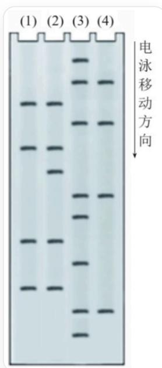

# 题目

将某种待测序的单链DNA截取其中一段，然后将该片段的  $5^{\prime}$  端用  ${ }^{32} \mathrm{P}$  标记，然后置于4个不同的反应管中，进行如下两步处理。

第一步，分别对4个反应管进行以下处理：(1)号管用热的近中性硫酸二甲酯水溶液处理；(2)号管用甲酸水溶液处理；(3)号管用碱性肼水溶液处理；(4)号管用含  $1.5 \mathrm{~mol} / \mathrm{L}$  的  $\mathrm{NaCl}$  的碱性肼水溶液处理。

第二步，将以上4个反应管用  $90^{\circ}\mathrm{C}$  六氢吡啶溶液处理；通过控制试剂用量和反应条件，使每条DNA单链平均只有1个左右的位点发生断裂。

将四个反应管所得产物在相同条件下进行凝胶电泳分离和放射自显影，在X线片底板上显示相应谱带，如下图所示。

该图像显示了一个凝胶电泳的结果，包含四条泳道，从左到右依次编号为（1）、（2）、（3）、（4）。图像的右侧有一条垂直的黑色箭头，箭头旁边标注有“电泳移动方向”的文字，箭头指向下方。凝胶上有不同数量和位置的水平条带。电泳结果用表格可以表示为：|（1）|(2）|(3）|(4)|---|---|---|---|||+||||+|+|+|||+|+|

$$
| + | + | | | | + | | | | | | + | | | | + | | + | | | | + | + | | | | + | + | | | | | + | + | | | + |
$$

根据电泳结果，以下哪个多肽片段的氨基酸残基序列不可能由这段DNA作为编码链合成得到：

A. 其他选项均不正确  
B. S-C-Q-A  
C. R-V-S-A  
D. F-V-S-A  
E. L-V-S-A  
F. I-V-S-A  
G. V-V-S-A  
H. S-R-L-C  
I. V-S-A-L

# 答案

正确答案: H

# 详细解析

由于体积较大的DNA在电泳时受到的阻力较大，因此移动距离较短。又因为单链DNA的5'端用  ${ }^{32} \mathrm{P}$  标记，所以在切断后切断位点越靠近5'端的片段移动距离更远。

# CHECKPOINT

1 PTS

切断位点越靠近5'端的片段移动距离更远

鸟嘌呤五元环上的氮原子亲核性更强，因此使用硫酸二甲酯能选择性的使鸟嘌呤基团断裂。甲酸水溶液则可以使所有嘌呤基团断裂。碱性肼水溶液处理可以使所有嘧啶基团断裂，含  $1.5 \mathrm{~mol} / \mathrm{L}$  的  $\mathrm{NaCl}$  的碱性肼水溶液则可以选择性的使胞嘧啶基团断裂。

# CHECKPOINT

2 PTS

甲酸水溶液使所有嘌呤基团断裂，碱性肼水溶液使所有嘧啶基团断裂

# CHECKPOINT

2 PTS

硫酸二甲酯选择性使鸟嘌呤基团断裂，含  $1.5 \mathrm{~mol} / \mathrm{L}$  的  $\mathrm{NaCl}$  的碱性肼水溶液选择性的使胞嘧啶基团断裂

因此（1）处理后在鸟嘌呤处断裂，（2）处理后在所有嘌呤处断裂，（3）处理后在所有嘧啶处断裂，（4）处理后在胞嘧啶处断裂。

# CHECKPOINT

2 PTS

(1) (2) 号泳道都有的信号为G，(2) 号泳道特有的信号为A，(3) 号泳道特有信号为T，(4) 号泳道都有的信号为C

电泳结果为：

<table><tr><td>(1)</td><td>(2)</td><td>(3)</td><td>(4)</td></tr><tr><td></td><td></td><td>+</td><td></td></tr><tr><td>+</td><td>+</td><td></td><td></td></tr><tr><td>+</td><td>+</td><td></td><td></td></tr><tr><td>+</td><td>+</td><td></td><td></td></tr><tr><td>+</td><td></td><td></td><td></td></tr><tr><td>+</td><td>+</td><td></td><td></td></tr><tr><td>+</td><td></td><td></td><td></td></tr><tr><td>+</td><td>+</td><td></td><td></td></tr><tr><td>+</td><td></td><td></td><td></td></tr><tr><td>+</td><td>+</td><td></td><td></td></tr><tr><td>+</td><td>+</td><td></td><td></td></tr><tr><td>+</td><td></td><td></td><td></td></tr></table>

因此从下往上的顺序即为5'到3'的碱基序列，很容易得到序列为

5'-TCGTGTCAGCGCT-3'

CHECKPOINT

2 PTS

DNA序列为5'-TCGTGTCAGCGCT-3'

下面分析可能的组成方式：

5'-TCG-TGT-CAG-CGC-T-3'对应S-C-Q-R

5'-T-CGT-GTC-AGC-GCT-3'对应R-V-S-A

5'-TC-GTG-TCA-GCG-CT-3'中间三个为V-S-A，5'端的-TC-可能的情况为F，L，I，V，3'端的-CT-只可能为L

从而可能的情况为(F，L，I，V)-V-S-A和V-S-A-L

# CHECKPOINT

2 PTS

可能的情况有S-C-Q-R，R-V-S-A，(F，L，I，V)-V-S-A和V-S-A-L

因此选项中只有选项H不可能