# Question

The following transformation process is now presented:

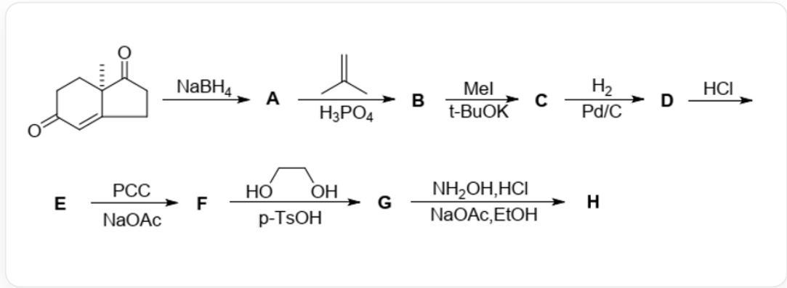

The compound  $\{\mathrm{SMILES}$  code: C[C@]12CCC(=O)C=C2CCC1=O\} is treated with  $NaBH_{4}$  to yield compound A. Compound A reacts with the compound  $\{\mathrm{SMILES}$  code: C=C(C)C\} under  $H_{3}PO_{4}$  catalysis to give compound B. Compound B reacts with excess  $CH_{3}I$  under tBuOK catalysis to produce compound C. Compound C reacts with  $H_{2}$  under  $Pt / C$  catalysis to yield compound D. Compound D is treated with  $HCl$  to give compound E. Compound E reacts with PCC reagent in the presence of  $NaOAc$  to obtain compound F. Compound F reacts with the compound  $\{\mathrm{SMILES}$  code: OCCO\} under  $p - TsOH$  catalysis to give compound G. Compound G reacts with  $NH_{2}OH\cdot HCl$  in EtOH in the presence of  $NaOAc$  to yield compound H.

Please analyze the structures of each compound and select the correct option.

A. Compound A is

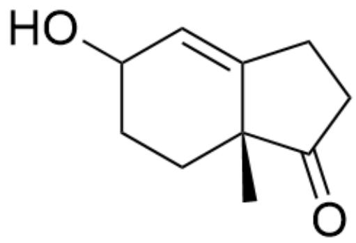

C[C@@]12CCC(C=C1CCC2=O)O

B. The compound B is

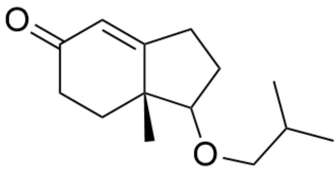

C[C@@]12CCC(C=C1CCC2OCC(C)C)=O

C. Compound C is

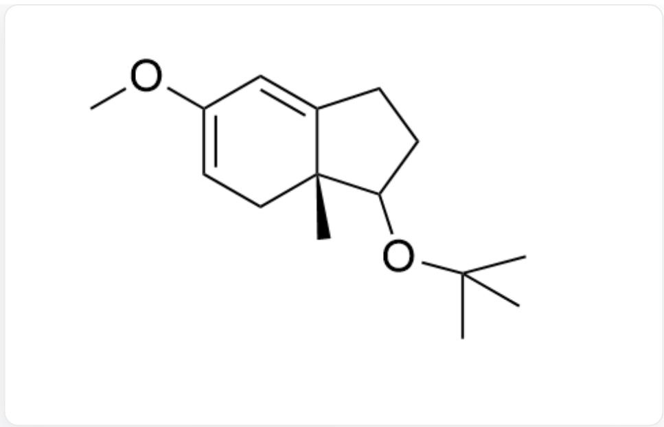

C[C@@]12CC=C(C=C1CCC2OC(C)(C)C)OC

D. The compound D is

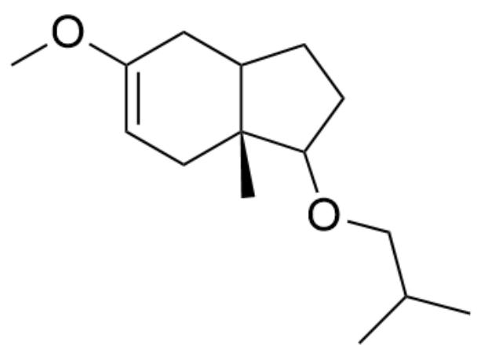

C[C@@]12CC=C(CC1CCC2OCC(C)C)OC

E. The compound E is

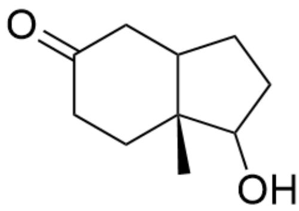

C[C@@]12CCC(CC1CCC2O)=O

F. The compound  $\mathbf{F}$  is

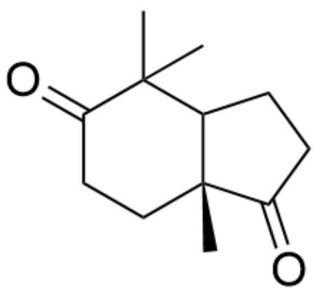

C[C@@]12CCC(C(C)(C)C1CCC2=O)=O

G. The compound G is

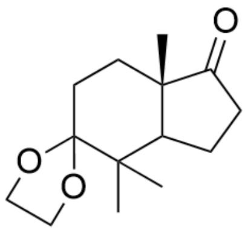

CC(C1CCC2=O)(C3(CC[C@]21C)OCC03)C

H. Compound H is

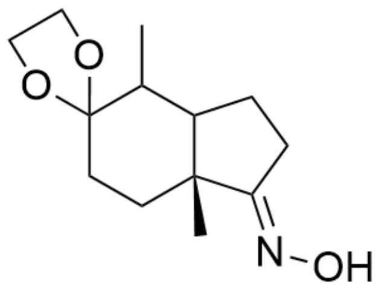

C[C@@]12CCC3(OCC03)C(C)C1CC/C2=N\O

# Answer

Correct Answer: F

# Detailed Explanation

Sodium borohydride first reduces the non-conjugated carbonyl group, and since there are still acidic hydrogens at the  $\alpha$ -position of the ketone in the system, only the non-conjugated carbonyl group should be reduced at this stage. Compound A is

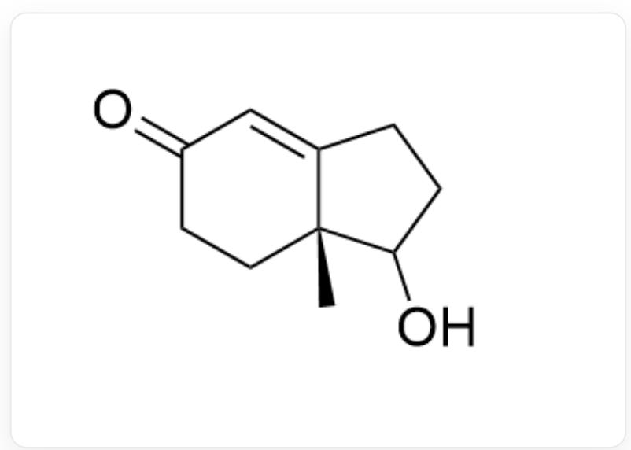

C[C@@]12CCC(C=C1CCC2O)=O

CHECKPOINT

1 PTS

Compound A is C[C@@]12CCC(C=C1CCC2O)=O

Under acidic conditions, 2-methylpropene generates a tert-butyl cation, which then combines with the hydroxyl group. Thus, compound B is

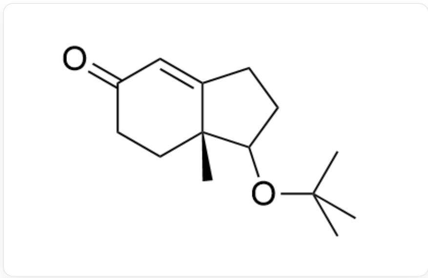

C[C@@]12CCC(C=C1CCC2OC(C)(C)C)=O

# CHECKPOINT

1 PTS

Compound B is C[C@@]12CCC(C=C1CCC2OC(C)(C)C)=O

Subsequently, under basic conditions, the most acidic hydrogen of the linear conjugated system is abstracted, followed by nucleophilic attack with excess methyl iodide twice. Thus, compound C is

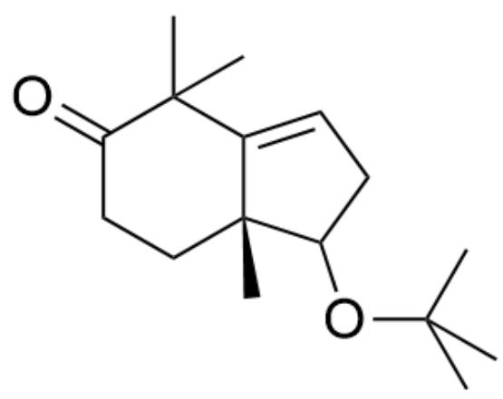

C[C@@]12CCC(C(C)(C)C1=CCC2OC(C)(C)C)=O

# CHECKPOINT

1 PTS

Compound C is C[C@@]12CCC(C(C)(C)C1=CCC2OC(C)(C)C)=O

Under palladium-on-carbon conditions, hydrogen gas can reduce the carbon-carbon double bond. Thus, compound D is

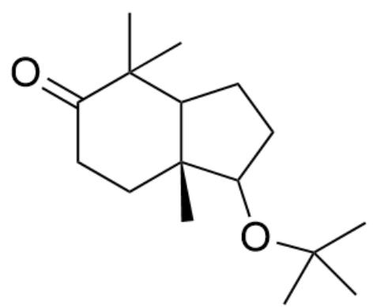

C[C@@]12CCC(C(C)(C)C1CCC2OC(C)(C)C)=O

# CHECKPOINT

1 PTS

Compound D is C[C@@]12CCC(C(C)(C)C1CCC2OC(C)(C)C)=O

Under acid treatment, the tert-butyl protecting group is removed. Thus, compound E is

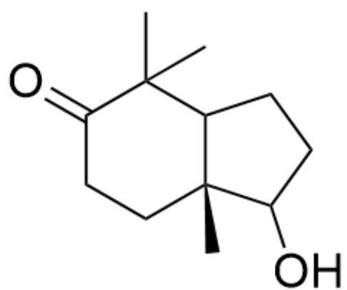

C[C@@]12CCC(C(C)(C)C1CCC2O)=O

# CHECKPOINT

1 PTS

Compound E is C[C@@]12CCC(C(C)(C)C1CCC2O)=O

Pyridinium chlorochromate can oxidize the hydroxyl group to a carbonyl group. Thus, compound  $\mathbf{F}$  is

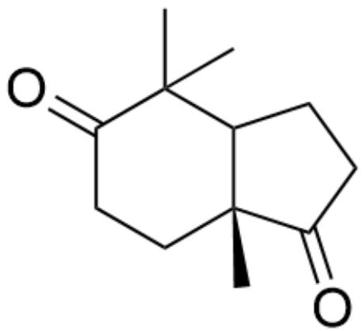

C[C@@]12CCC(C(C)(C)C1CCC2=O)=O

# CHECKPOINT

1 PTS

Compound F is C[C@@]12CCC(C(C)(C)C1CCC2=O)=O

Under acidic conditions, ethylene glycol can protect the carbonyl group, and further reactions involving the carbonyl group occur subsequently. At this stage, only one carbonyl group is protected, with the six-membered ring carbonyl being preferentially protected. Thus, compound  $\mathbf{G}$  is

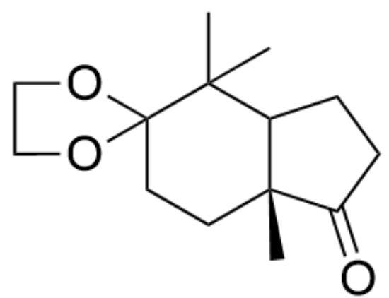

C[C@@]12CCC3(OCC03)C(C)(C)C1CCC2=O

CHECKPOINT

2 PTS

Compound G is C[C@@]12CCC3(OCC03)C(C)(C)C1CCC2=O

Finally, hydroxylamine can condense with the hydroxyl group, and considering steric hindrance, compound  $\mathbf{H}$  is

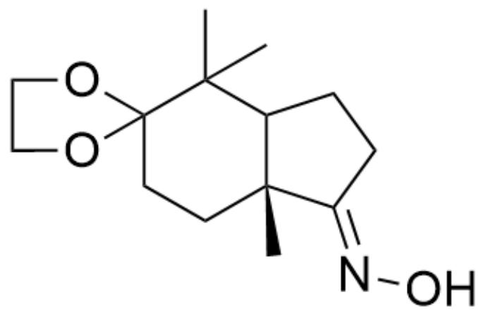

C[C@@]12CCC3(OCCO3)C(C)(C)C1CC/C2=N\0

# CHECKPOINT

2 PTS

Compound H is C[C@@]12CCC3(OCCO3)C(C)(C)C1CC/C2=N\O

Thus, option F is correct.