# 题目

现在有如下转化过程：

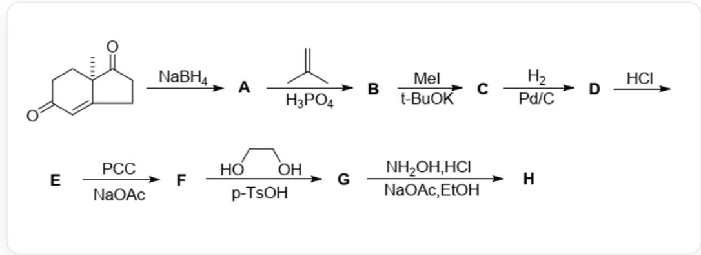

化合物{SMILES编码为C[C@]12CCC(=O)C=C2CCC1=O}通过NaBH4处理后得到化合物A。化合物A在H3PO4催化下和化合物{SMILES编码为C=C(C)C}反应，得到化合物B。化合物B在tBuOK催化下和过量CH3I反应得到化合物C。化合物C在Pt/C催化下与H2反应得到化合物D。化合物D在HCl处理后得到化合物E。化合物E在NaOAc存在条件下与PCC试剂反应得到化合物F。化合物F在p-TsOH催化下和化合物{SMILES编码为OCCO}反应得到化合物G。化合物G在NaOAc存在条件下和NH2OH·HCl在EtOH中反应得到化合物H。

请分析各个化合物结构，并选出正确选项。

A. 化合物A为

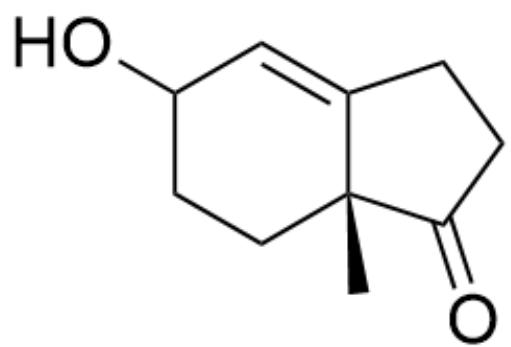

C[C@@]12CCC(C=C1CCC2=O)O

# B. 化合物B为

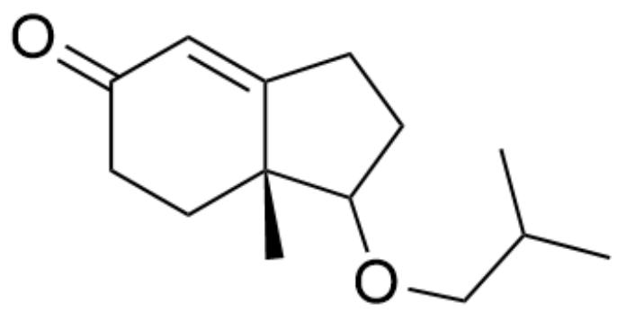

C[C@@]12CCC(C=C1CCC2OCC(C)C)=O

# C. 化合物C为

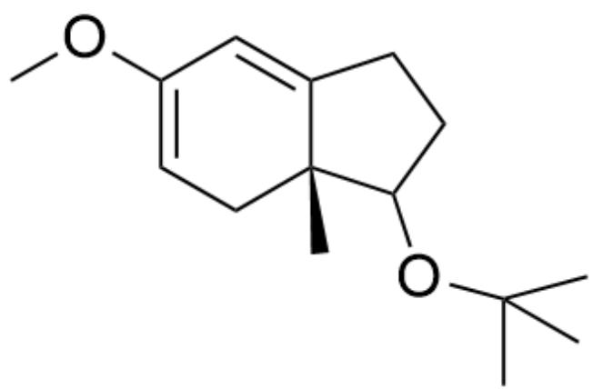

C[C@@]12CC=C(C=C1CCC2OC(C)(C)C)OC

# D. 化合物D为

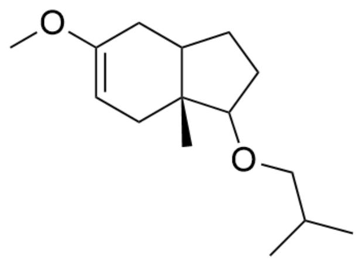

C[C@@]12CC=C(CC1CCC2OCC(C)C)OC

# E. 化合物E为

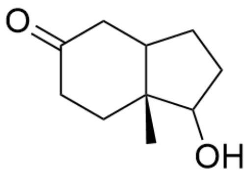

C[C@@]12CCC(CC1CCC2O)=O

# F. 化合物F为

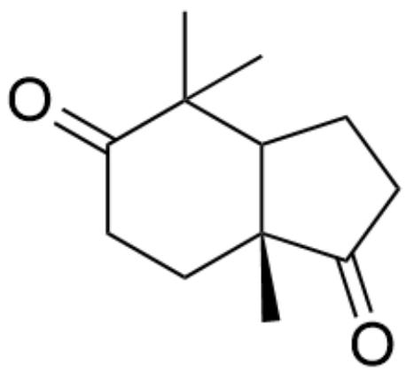

C[C@@]12CCC(C(C)(C)C1CCC2=O)=O

# G. 化合物G为

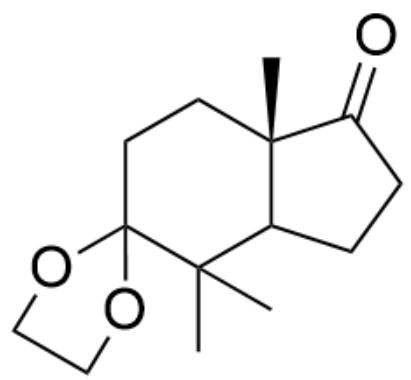

CC(C1CCC2=O)(C3(CC[C@]21C)OCCCO3)C

# H. 化合物H为

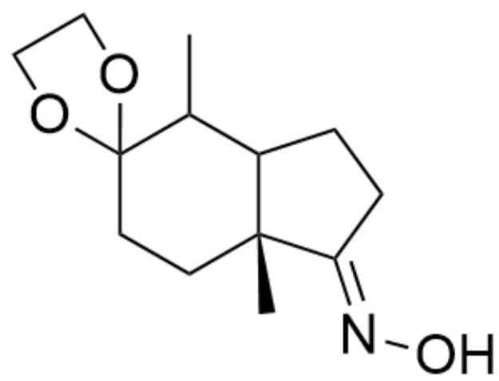

C[C@@]12CCC3(OCC03)C(C)C1CC/C2=N\O

# 答案

正确答案: F

# 详细解析

硼氢化钠先还原不共轭羰基，且体系中后续仍有酮α位酸性氢，故而此时应只还原不共轭羰基，化合物A为

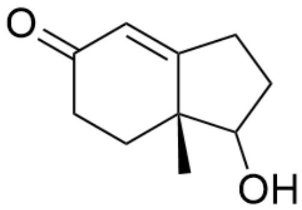

C[C@@]12CCC(C=C1CCC2O)=O

CHECKPOINT

1 PTS

化合物A为C[C@@]12CCC(C=C1CCC2O)=0

酸性条件下，2-甲基丙烯生成叔丁基正离子，进而与羟基结合，故化合物B为

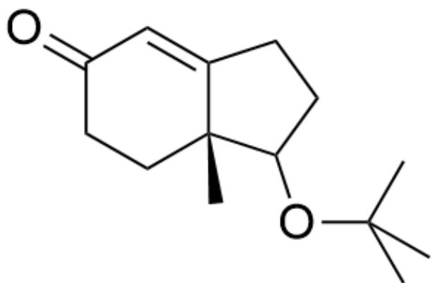

C[C@@]12CCC(C=C1CCC2OC(C)(C)C)=O

# CHECKPOINT

1 PTS

化合物B为C[C@@]12CCC(C=C1CCC2OC(C)(C)C)=O

接着碱性下拔出线性共轭的最强酸性的氢，对过量碘甲烷亲核进攻两次，进而化合物C为

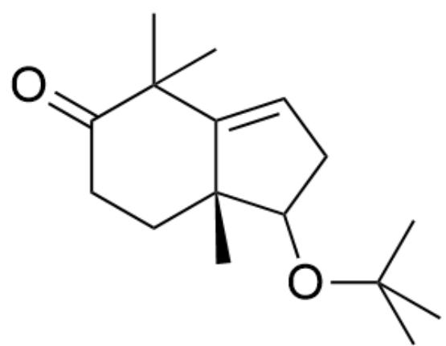

C[C@@]12CCCC(C(C)(C)C1=CCC2OC(C)(C)C)=O

# CHECKPOINT

1 PTS

化合物C为C[C@@]12CCC(C(C)(C)C1=CCC2OC(C)(C)C)=O

而钯碳条件下氢气能还原碳碳双键，进而化合物D为

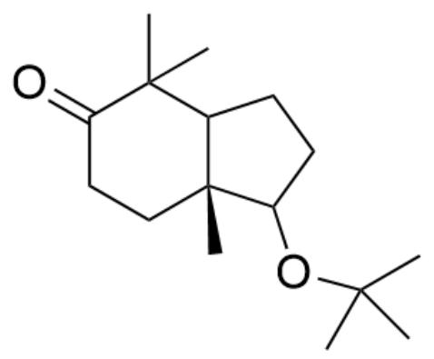

C[C@@]12CCC(C(C)(C)C1CCC2OC(C)(C)C)=O

# CHECKPOINT

1 PTS

化合物D为C[C@@]12CCC(C(C)(C)C1CCC2OC(C)(C)C)=O

酸处理下，叔丁基保护基会去保护，进而化合物E为

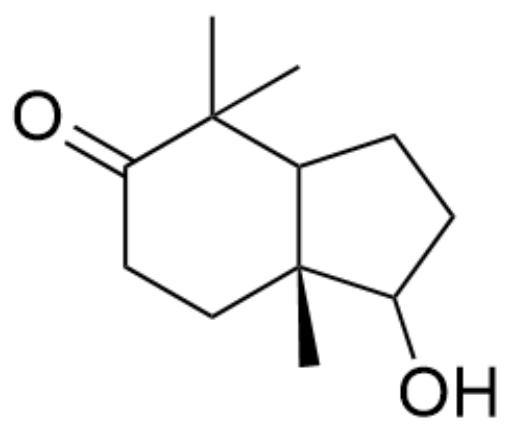

C[C@@]12CCC(C(C)(C)C1CCC2O)=O

# CHECKPOINT

1 PTS

化合物E为C[C@@]12CCC(C(C)(C)C1CCC2O)=0

吡啶氯铬酸盐可以将羟基氧化为羰基，故而化合物F为

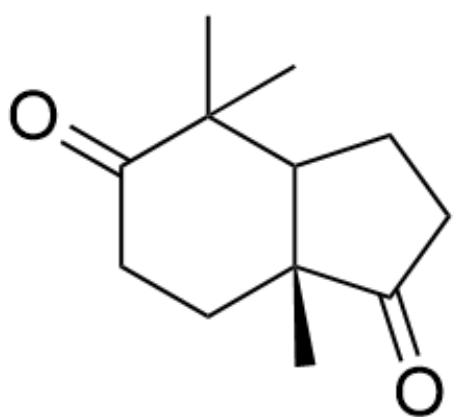

C[C@@]12CCC(C(C)(C)C1CCC2=O)=O

# CHECKPOINT

1 PTS

化合物F为C[C@@]12CCC(C(C)(C)C1CCC2=O)=O

而酸性下乙二醇能保护羰基，且后续还进一步发生了涉及羰基的反应。进而此时仅保护了一个羰基，而六元环上羰基会优先保护，进而化合物G为

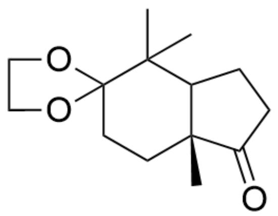

C[C@@]12CCC3(OCC03)C(C)(C)C1CCC2=O

# CHECKPOINT

2 PTS

化合物G为C[C@@]12CCC3(OCC03)C(C)(C)C1CCC2=O

最后羟胺能和羰基缩合，并考虑位阻，故而化合物H为

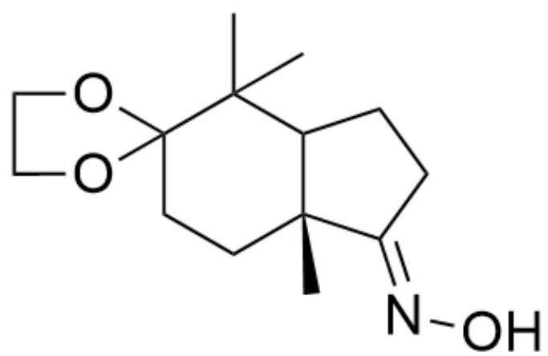

C[C@@]12CCC3(OCCO3)C(C)(C)C1CC/C2=N\0

# CHECKPOINT

2 PTS

化合物H为C[C@@]12CCC3(OCC03)C(C)(C)C1CC/C2=N\O

从而选项F正确。