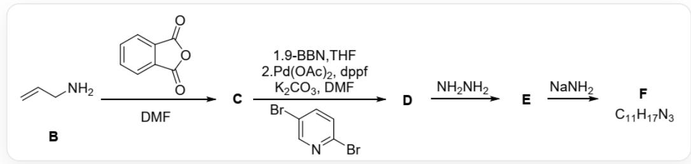
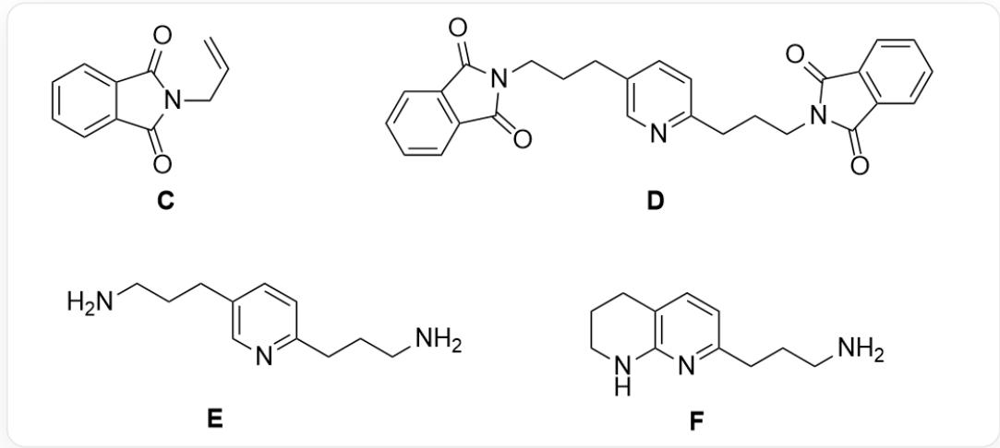

# Question

Pyridine is more prone to aromatic nucleophilic substitution reactions than benzene. The following is the synthetic route of a certain important compound  $\mathbf{X}$ :

The image describes an organic tandem reaction. The starting substrate  $\mathbf{B}$  is  $C = C C N$ , which reacts with  $O = C 1 O C (C 2 = C C = C C = C 2 1) = O$  and  $D M F$  to generate  $\mathbf{C}$ . The reaction conditions for  $\mathbf{C}$  to generate  $\mathbf{D}$  are in 2 steps: 1.  $9 - B B N$ ; 2.  $P d(O A c)_{2}$ ,  $d p p r$ ,  $K_{2} C O_{3}$ ,  $D M F$ , and  $\mathrm{BrC1 = NC = C(Br)C = C1}$ .  $\mathbf{D}$  reacts with  $N H_{2} N H_{2}$  to generate  $\mathbf{E}$ , and  $\mathbf{E}$  reacts with  $N a N H_{2}$  to generate  $\mathbf{F}$ . The molecular formula of  $\mathbf{F}$  is given in the figure as  $C_{11}H_{17}N_{3}$ .

The following statements are correct:

A. All other options are incorrect.  
B. The reaction generating  $\mathbf{E}$  is an aromatic nucleophilic substitution reaction.  
C.  $\mathbf{F}$  has three cycles  
D.  $\mathbf{F}$  exists a linkage relationship  $N - C - C - N$  
E.  $\mathbf{F}$  has a six-membered ring and a five-membered ring.  
F.  $\mathbf{F}$  does not possess an independent amino group

# Answer

Correct Answer: A

# Detailed Explanation

The first step of the reaction is relatively simple, which is the Gabriel amidation reaction of the substrate, generating N-substituted phthalimide, the structure of  $\mathbf{C}$  is  $O = C1N(CC = C)C(C2 = CC = CC = C21) = O$ .

# CHECKPOINT

1 PTS

The first step of the reaction is the Gabriel amidation of the substrate

# CHECKPOINT

1 PTS

The structure of  $\mathbf{C}$  is  $O = C1N(CC = C)C(C2 = CC = CC = C21) = O$

The second step is a typical Suzuki coupling reaction. First,  $9 - BBN$  is added to perform hydroboration on the allyl double bond, and then a  $Pd(II)$  catalyst is added to couple with the bromine of the substrate 2,5-dibromopyridine. Since the substrate has two bromines, a product in which both bromines are substituted may be obtained (this can also be seen from the chemical formula), and it is speculated that the structural formula of  $\mathbf{D}$  is  $\mathrm{O = C1C2 = C(C = CC = C2)C(N1CCCC3 = NC = C(CCCN4C(C = CC = C5) = C5C4 = O) = O)C = C3)} = 0$ .

# CHECKPOINT

1 PTS

The second step is a typical Suzuki coupling reaction

# CHECKPOINT

1 PTS

The substrate has two bromines, so a product in which both bromines are substituted may be obtained

# CHECKPOINT

1 PTS

It

is

speculated

that

the

structural

formula

of

D

is

$$
O = C 1 C 2 = C (C = C C = C 2) C (N 1 C C C C 3 = N C = C (C C C N 4 C (C (C = C C = C 5) = C 5 C 4 = O) = O) C = C 3) = O
$$

The reaction of  $\mathbf{D}$  with  $N_{2}H_{4}$  is the standard method for removing the phthalimide protecting group in Gabriel synthesis, producing an amine. Thus, the structure of  $\mathbf{E}$  is NCCCC1=NC=C(CCCN)C=C1.

# CHECKPOINT

1 PTS

The structure of  $\mathbf{E}$  is NCCCC1=NC=C(CCCN)C=C1

When  $\mathbf{E}$  is added to sodium amide, sodium amide as a strong base can abstract the proton on the amine group of the substrate; Since the 2/6 positions of pyridine are electron-deficient, the amino anion on the allyl substituent at the 5 position of pyridine can undergo aromatic nucleophilic substitution reaction, and the amino anion attacks the 6 position of pyridine to form a six-membered ring;

# CHECKPOINT

1 PTS

The 2/6 positions of pyridine are electron-deficient, and the amino anion can undergo aromatic nucleophilic substitution reaction

However, after the formation of the six-membered ring, due to the addition of the substituent at the 6 position, the electron deficiency of pyridine is alleviated, and also because the 3 position is not the most electron-deficient position of pyridine; Therefore, the amino group of the substituent at the 2 position can no longer attack the 3 position to undergo a nucleophilic substitution reaction, so the product  $\mathbf{F}$  only has two six-membered rings; the structure is NCCCCC1=NC2=C(CCCN2)C=C1, which just matches the chemical formula.

# CHECKPOINT

1 PTS

Due to the addition of the substituent at the 6 position, the electron deficiency of pyridine is alleviated, and also because the 3 position is not the most electron-deficient position of pyridine; Therefore, the amino group of the substituent at the 2 position can no longer attack the 3 position to undergo a nucleophilic substitution reaction

# CHECKPOINT

1 PTS

F only has two six-membered rings; the structure is NCCCC1=NC2=C(CCCN2)C=C1

# CHECKPOINT

1 PTS

$\mathbf{F}$  matches the chemical formula, the structure of  $\mathbf{D}$  is speculated to be correct

Therefore, options B, C, E, and F are all incorrect; the structure of  $\mathbf{F}$  does not have a N-C-C-N linkage, and option D is incorrect.

In summary, options B-F are all incorrect, and option A is correct.

  
本图片描述了本题涉及未知化合物的结构式，C结构为O=C1N(CC=C)C(C2=CC=CC=C21)=O，D的结构式为 O=C1C2=C(C=CC=C2)C(N1CCCC3=NC=C(CCCN4C(C=CC=C5)=C5C4=O)=O)C=C3)=O，E结构为 NCCCC1=NC=C(CCCN)C=C1，F结构为NCCCC1=NC2=C(CCCN2)C=C1