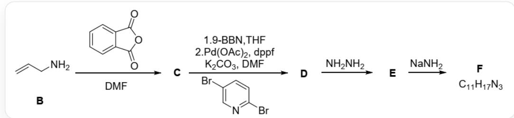
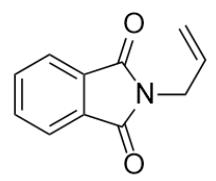
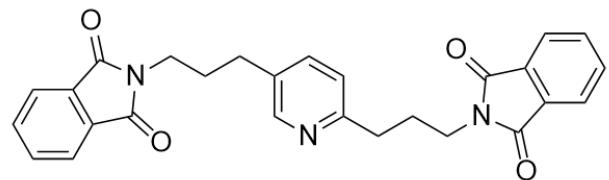
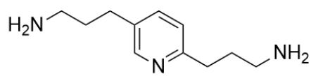
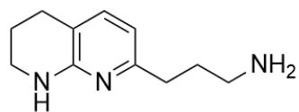

# 题目

吡啶相对于苯环更加容易发生芳香亲核取代反应。下面是某种重要化合物X的合成路线：

该图片描述了一条有机串联反应。最开始底物B为C=CCN，与O=C1OC(C2=CC=CC=C21)=O和DMF反应生成C。C生成D的反应条件分2步：1.9-BBN;2.Pd(OAc)2,dppr,K2CO3,DMF,和BrC1=NC=C(Br)C=C1。D与NH2NH2反应生成E，E与NaNH2反应生成F，图中给出F的分子式为 $C_{11}H_{17}N_{3}$ 。

下列说法正确的是：

A. 其他选项均不正确  
B. 生成  $\mathbf{E}$  的反应为芳香亲核取代反应  
C. F 具有三个环  
D.  $\mathbf{F}$  存在键联关系  $N - C - C - N$  
E. F 具有一个六元环和一个五元环  
F. F不具有独立的氨基

# 答案

正确答案: A

# 详细解析

反应第一步比较简单，是底物的 Gabriel 酰胺化反应，生成N-取代的邻苯二甲酰亚胺，C结构为  $\mathrm{O = C1N(CC = C)C(C2 = CC = CC = C21) = O}$ 。

CHECKPOINT

1 PTS

反应第一步是底物的 Gabriel 酰胺化

CHECKPOINT

1 PTS

C结构为  $O = C1N(CC = C)C(C2 = CC = CC = C21) = O$

第二步反应是典型的Suzuki偶联反应。首先加入  $9 - BBN$  ，对烯丙基双键进行硼氢化反应，之后加入 $Pd(II)$  催化剂，与底物2,5-二溴吡啶的溴进行偶联。由于底物有两个溴，从而可能得到两个溴均被取代的产物（这一点也可以从化学式中看出），推测D的结构式为 $\mathrm{O = C1C2 = C(C = CC = C2)C(N1CCCC3 = NC = C(CCCN4C(C(C = CC = C5) = C5C4 = O) = O)C = C3) = O.}$

CHECKPOINT

1 PTS

第二步反应是典型的Suzuki偶联反应

# CHECKPOINT

1 PTS

底物有两个溴，从而可能得到两个溴均被取代的产物

# CHECKPOINT

1 PTS

推测D 的 结构 式 为

$$
O = C 1 C 2 = C (C = C C = C 2) C (N 1 C C C C 3 = N C = C (C C C N 4 C (C (C = C C = C 5) = C 5 C 4 = O) = O) C = C 3) = O
$$

D 与  $N_{2}H_{4}$  反应，是 Gabriel 合成中脱去邻苯二甲酰亚胺保护基的标准方法，产生氨基。从而  $\mathbf{E}$  结构为 NCCCC1=NC=C(CCCN)C=C1。

# CHECKPOINT

1 PTS

E结构为NCCCC1=NC=C(CCCN)C=C1

E加入氨基钠，氨基钠作为强碱可以拔去底物氨基上的质子；由于吡啶的2/6号位缺电子，此时位于吡啶5号位的烯丙基取代基上的氨基负离子就可以发生芳香亲核取代反应，氨基负离子进攻吡啶的6号位形成六元环；

# CHECKPOINT

1 PTS

吡啶的2/6号位缺电子，氨基负离子可以发生芳香亲核取代反应

但是形成六元环后，由于6号位取代基的加入，吡啶缺电子性缓解，也同时因为3号位并非吡啶最缺电子的位置；因此2号位取代基的氨基不再能够进攻3号位发生亲核取代反应，因此产物  $\mathbf{F}$  只有两个六元环；结构为NCCCC1=NC2=C(CCCN2)C=C1，刚好符合化学式。

# CHECKPOINT

1 PTS

由于6号位取代基的加入，吡啶缺电子性缓解，也同时因为3号位并非吡啶最缺电子的位置；因此2号位取代基的氨基不再能够进攻3号位发生亲核取代反应

# CHECKPOINT

1 PTS

F 只有两个六元环；结构为NCCCC1=NC2=C(CCCN2)C=C1

# CHECKPOINT

1 PTS

F符合化学式，D结构推测正确

由此，选项B,C,E,F均错误；F的结构没有N-C-C-N的键联关系，选项D错误。

综上，选项B-F均错误，选项A正确。

  
c

  
D

  
E

  
F

本图片描述了本题涉及未知化合物的结构式，C结构为O=C1N(CC=C)C(C2=CC=CC=C21)=O，D的结构式为 O=C1C2=C(C=CC=C2)C(N1CCCC3=NC=C(CCCN4C(C=C5=C5C4=O)=O)C=C3)=O，E结构为 NCCCC1=NC=C(CCCN)C=C1，F结构为NCCCC1=NC2=C(CCCN2)C=C1