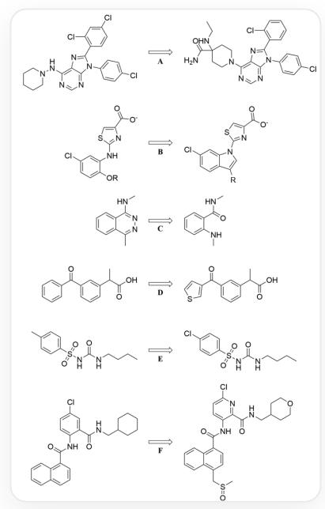

# Question

The following presents the structure optimization process of some lead compounds or drugs  $\mathrm{A}\sim \mathrm{F}$ :



This image contains the optimization process of six drugs, namely: A.

```javascript
`CIC(C=C1)=CC=C1N2C3=NC=NC(NN4CCCCC4)=C3N=C2C5=C(Cl)C=C(Cl)C=C5` optimized to `CIC(C=C1)=CC=C1N2C(C3=C(Cl)C=CC=C3)=NC4=C(N=CN=C42)N5CCC(NCC)(C(N)=O)CC5`;B. `CIC1=CC=C(O[R])C(NC2=NC(C([O-])=O)=CS2)=C1` optimized to `CIC1=CC=C(C([R])=CN2C3=NC(C([O-])=O)=CS3)C2=C1`;C. `CNC1=NN=C(C)C2=CC=CC=C21` optimized to `CNC(C1=CC=CC=C1NC)=O`;D. `OC(C(C)C1=CC(C2=CC=C2)=O)=CC=C1)=O`;E. `CCCCNC(NS=O) (C1=CC=C(C=C1)C)=O`optimized to `CCCNC(NS=O)(C1=CC=C(C=C1)Cl)=O`;F. `O=C(NC1=CC=C(Cl)C=C1C(NCC2CCCCC2)=O)C3=C4C=CC=CC4=CC=C3`optimized to `O=C(NC1=CC=C(Cl)N=C1C(NCC2CCCOCC2)=O)C3=C4C=CC=CC4=C(CS(C)=O)C=C3`
```

It is known that the above optimization involves the following main purposes:

1. Reducing compound lipophilicity  
2. Bioisostere replacement  
3. Fixing the molecular conformation to the active conformation  
4. Improving drug-likeness without changing the conformation

# 5. Improving drug metabolic stability

Please determine the main purpose corresponding to each optimization process (there may be multiple optimization purposes, please select the most important purpose from all possible optimization purposes), and calculate the value of  $z$ :

$$
z = \frac {\mathrm {P r o d u c t o f t h e s e r i a l n u m b e r s o f t h e o p t i m i z a t i o n p r o c e s s e s c o r r e s p o n d i n g t o A , C , a n d E}}{\mathrm {S u m o f t h e s e r i a l n u m b e r s o f t h e o p t i m i z a t i o n p r o c e s s e s c o r r e s p o n d i n g t o B , D , a n d F}}
$$

Please select the correct option, requiring the option to be within  $1\%$  of your calculated result, otherwise select option A: All other options are incorrect.

A. All other options are incorrect  
B. 0.455  
C. 0.500  
D. 0.667  
E. 0.900  
F. 0.917  
G. 1.00  
H. 1.75

1. 1.86  
J. 2.00  
K. 3.00  
L. 3.33  
M. 4.33

# Answer

Correct Answer: L

# Detailed Explanation

Solving this problem requires determining the structure changed in each optimization process, and then judging the purpose of the optimization process based on the structural change.

- For optimization process A:

Optimizing  $\mathrm{^{\prime}CIC(C = C1) = CC = C1N2C3 = NC = NC(NN4CCCCC4) = C3N = C2C5 = C(Cl)C = C(Cl)C = C5}$

`CIC(C=C1)=CC=C1N2C(C3=C(Cl)C=CC=C3)=NC4=C(N=CN=C42)N5CCC(NCC)(C(N)=O)CC5`. Replacing

`[]NN1CCCCC1` in `the original structure with `O=C(N)C1(NCC)CCN([])CC1`; replacing

`C1C1=C([])C=CC(Cl)=C1` with `[]C1=C(C=C1C1Cl`

For such structural changes, connecting a hydrophilic amide group and an amino group to the lipophilic piperidine ring, such an optimization process can improve the hydrophilicity of the compound. Therefore, the main purpose corresponding to optimization process A is 1. Reduce the lipophilicity of the compound.

# CHECKPOINT

Optimization process A connects a hydrophilic amide group and an amino group to the lipophilic piperidine ring.

# CHECKPOINT

The main purpose corresponding to optimization process A is 1. Reduce the lipophilicity of the compound.

# 1 PTS

- For optimization process B:

Optimizing

$$
\mathrm {C l C 1} = \mathrm {C C} = \mathrm {C} (\mathrm {O} [ \mathrm {R} ]) \mathrm {C} (\mathrm {N C 2} = \mathrm {N C} (\mathrm {C} ([ \mathrm {O} - ]) = \mathrm {O}) = \mathrm {C S 2}) = \mathrm {C 1}
$$

to

`ClC1=CC=C(C([R])=CN2C3=NC(C([O-])=O)=CS3)C2=C1`, where the two adjacent substituents `ClC1=CC=C(O[R])C(N[])=C1` of the benzene ring are replaced with an  $N$ -substituted indole ring `ClC1=CC=C(C([R])=CN2[])C2=C1`.

Observing the original structure, it can be found that there is a five-membered intramolecular hydrogen bond between the two adjacent substituents  $\left[\right][N H]\left[\right]$  and  $\left[\ast\right]O[R]$  of the benzene ring, which fixes the conformation of the molecule, which may be the active conformation of the molecule. Therefore, the optimization process replaces the relatively unstable five-membered ring hydrogen bond with an indole ring, fixing such an active conformation. Therefore, the main purpose corresponding to optimization process B is 3. Fix the molecular conformation as the active conformation.

# CHECKPOINT

1 PTS

In optimization process B, the original structure can form a hydrogen bond to fix the conformation.

# CHECKPOINT

1 PTS

The main purpose corresponding to optimization process B is 3. Fix the molecular conformation as the active conformation.

- For optimization process C:

Optimizing `CNC1=NN=C(C)C2=CC=CC=C21` to `CNC(C1=CC=CC=C1NC)=O`, where the phthalazine heterocycle `[JC1=NN=C(/)]C2=CC=CC=C21` is replaced with an ortho-disubstituted benzene ring `O=C(/)C1=CC=CC=C1N]`

Observing the two substituents after optimization: the carbonyl group  $\mathrm{[JC(=O)[]}$  and the amine group  $\mathrm{[J[NH][]}$ , it can be found that an intramolecular six-membered ring hydrogen bond can be formed, so that the conformation of phthalazine in the original structure can be maintained. At the same time, phthalazine is a non-drug-like structure, and replacing it with carbonyl and amine groups, which are more common in drugs, can enhance the drug-likeness. Therefore, the main purpose corresponding to optimization process C is 4. Maintain the conformation and improve drug-likeness.

# CHECKPOINT

1 PTS

The carbonyl and amino groups in the new structure can form hydrogen bonds, so that the conformation of phthalazine in the original structure can be maintained.

# CHECKPOINT

1 PTS

The main purpose corresponding to optimization process C is 4. Maintain the conformation and improve drug-likeness.

- For optimization process D:

Optimizing

$$
^ {\backprime} \mathrm {O C} (\mathrm {C} (\mathrm {C}) \mathrm {C} 1 = \mathrm {C C} (\mathrm {C} (\mathrm {C} 2 = \mathrm {C C} = \mathrm {C C} = \mathrm {C} 2) = \mathrm {O}) = \mathrm {C C} = \mathrm {C} 1) = \mathrm {O} ^ {\backprime}
$$

to

`OC(C(C)C1=CC(C(C2=CSC=C2)=O)=CC=C1)=O`, where the benzene ring `[]C1=CC=CC=C1` is replaced with a thiophene ring `[]C1=CSC=C1`.

The benzene ring and the thiophene ring are a pair of classic bioisosteres, and this replacement has no other obvious purpose. Therefore, the main purpose corresponding to optimization process D is 2. Bioisostere replacement.

# CHECKPOINT

1 PTS

The benzene ring and the thiophene ring are a pair of classic bioisosteres, and this replacement has no other obvious purpose.

# CHECKPOINT

1 PTS

The main purpose corresponding to optimization process D is 2. Bioisostere replacement.

- For optimization process E:

Optimizing `CCCCNC(NS(=O)(C1=CC=C(C=C1)C)=O)=O` to `CCCCNC(NS(=O)(C1=CC=C(C=C1)Cl)=O)=O`, where the p-toluenesulfonyl group `O=S(C1=CC=C(C=C1)C)[J]=O` is replaced with a  $p$ -chlorobenzenesulfonyl group `O=S(C1=CC=C(C=C1)Cl)[J]=O`

The benzylic methyl group is easily oxidized and metabolized. Replacing the easily oxidized benzylic methyl group with chlorine can enhance the metabolic stability of the drug. Therefore, the main purpose corresponding to optimization process E is 5. Improve the metabolic stability of the drug.

# CHECKPOINT

1 PTS

The benzylic methyl group is easily oxidized and metabolized.

# CHECKPOINT

1 PTS

The main purpose corresponding to optimization process E is 5. Improve the metabolic stability of the drug.

- For optimization process F:

Optimizing

$$
\mathrm {^ {\prime} O = C (N C 1 = C C = C (C l) C = C 1 C (N C C 2 C C C C C 2) = O) C 3 = C 4 C = C C = C C 4 = C C = C 3 ^ {\prime}}
$$

to

`O=C(NC1=CC=C(Cl)N=C1C(NCC2CCOCC2)=O)C3=C4C=CC=CC4=C(CS(C)=O)C=C3`, where the substituent `O=S(C)C[J]` is added, the benzene ring in `O=C([])NC1=CC=C(Cl)C=C1C(N[J)=O` is replaced with a pyridine ring `O=C([])NC1=CC=C(Cl)N=C1C(N[J)=O`, and the cyclohexyl group `[]C1CCCCC1` is replaced with a tetrahydropyranyl group `[*]C1CCOCC1`.

The above three changes will enhance the hydrophilicity of the molecule and reduce the lipophilicity of the compound. Therefore, the main purpose corresponding to optimization process F is 1. Reduce the lipophilicity of the compound.

# CHECKPOINT

1 PTS

The structural changes are 1. replacing the benzene ring with a pyridine ring, 2. replacing the cyclohexyl group with a tetrahydropyranyl group, 3. adding a sulfinyl group.

# CHECKPOINT

1 PTS

The main purpose corresponding to optimization process F is 1. Reduce the lipophilicity of the compound.

Calculate the final value of  $z$ :

$$
z = \frac {1 \times 4 \times 5}{3 + 2 + 1} = \frac {2 0}{6} = 3. 3 3
$$

# CHECKPOINT

1 PTS

$$
z = 3. 3 3
$$