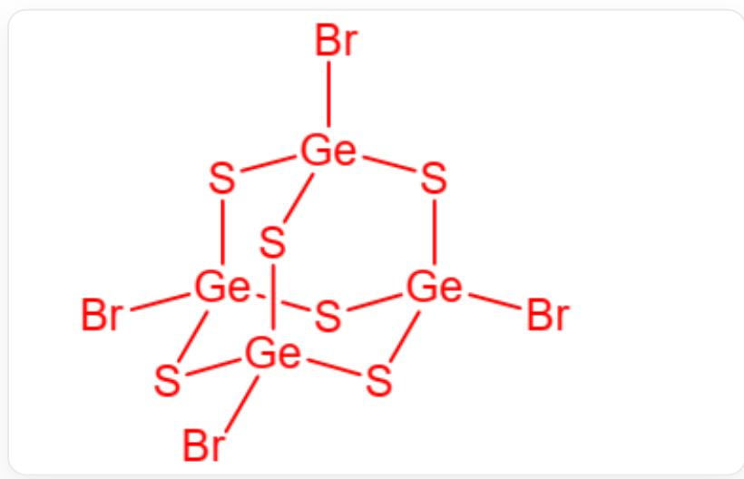
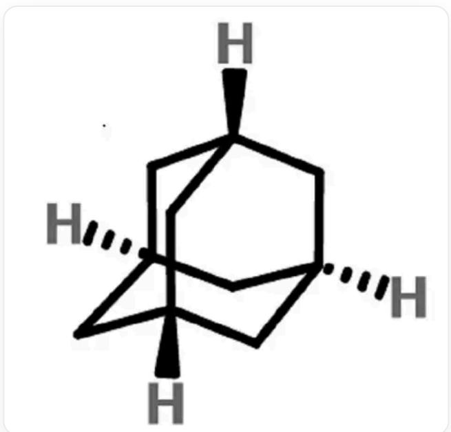
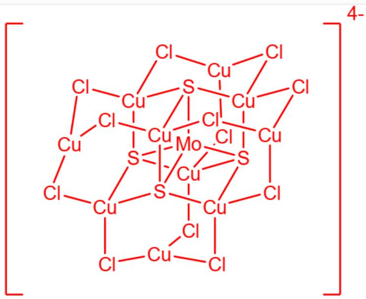

# Question

Adamantane frameworks are not only found in organic compounds, but also commonly seen in inorganic clusters, of which  $\mathrm{P_4O_{10}}$  is a typical representative.

1. Dissolve  $\mathrm{GeBr}_4$  in  $\mathrm{CS}_2$  containing  $\mathrm{Al}_2\mathrm{Br}_6$ , and then introduce  $\mathrm{H}_2\mathrm{S}$  gas into it to obtain a similar compound A, containing  $\omega_{\mathrm{Ge}} = 0.3620$ .  
2. The structure of  $\mathrm{P_4O_{10}}$  can be described as  $\mathrm{P_4\cdot O_6@O_4}$ , that is, a set of interpenetrating  $\mathrm{P_4}$  polyhedra and  $\mathrm{O_6}$  polyhedra encapsulated in  $\mathrm{O_4}$  polyhedra. Try to describe the structure of adamantane (substance B) in this way, and give the corresponding polyhedra for each layer.  
3. Adding more atoms to the periphery of the adamantane framework can result in more complex cluster structures. There is a highly symmetrical anion  $\left[\mathrm{Mo}_{m}\mathrm{S}_{x}\mathrm{Cu}_{n}\mathrm{Cl}_{y}\right]^{4-}$  (substance C), containing  $\omega_{\mathrm{Cu}} = 0.4945$ ,  $\omega_{\mathrm{Mo}} = 0.0747$ , and each element has a common valence state. Where Cl is 2-coordinate and has only one chemical environment, and S is 4-coordinate.

Which of the following statements is correct?

A. The structure of A is  $\mathrm{Ge}_4\mathrm{S}_4\mathrm{Br}_6$  
B. A contains the element Al  
C. In A, a Ge atom connects to two S atoms and a Br atom.  
D. Following the notation of  $\mathrm{P}_4\cdot \mathrm{O}_6@\mathrm{O}_4$ , substance B can be written as  $\mathrm{C}_4\cdot \mathrm{C}_6@\mathrm{H}_8\mathrm{H}_8$ , and the polyhedra from left to right are a regular tetrahedron, a regular octahedron, a regular hexahedron, and a regular hexahedron.  
E. Following the notation of  $\mathrm{P}_4\cdot \mathrm{O}_6@\mathrm{O}_4$ , the substance  $\mathbf{B}$  can be written as  $\mathrm{C}_4\cdot \mathrm{C}_6@\mathrm{H}_{12}\mathrm{H}_4$ , the polyhedra from left to right are regular tetrahedron, regular octahedron, regular icosahedron, regular tetrahedron.

F. In substance  $\mathbf{C}$ ,  $m = 1, n = 10, x = 2, y = 14$  
G. Substance C with  $m = 1, n = 10, x = 3, y = 13$  
H. In substance  $\mathbf{C}$ ,  $m = 1, n = 10$ ,  $x = 6$ ,  $y = 10$ .  
I. Each Cu atom in substance C is connected to S.  
J. Substance  $\mathbf{C}$  is divided into core and periphery, the core being  $\mathrm{Mo@S_4\cdot Cu_6}$ , and the periphery being  $\mathrm{Cu_4\cdot Cl_{12}}$  
K. All of the above options are incorrect.

# Answer

Correct Answer: J

# Detailed Explanation

First question

  
Structure diagram of substance A, composed of Ge4S6Br4, where Ge is connected to 3 S and 1 Br

According to the question, the structure of substance  $\mathbf{A}$  is consistent with that of  $\mathrm{P_4O_{10}}$ . The possible constituent elements of this substance are Ge  $\cdot$ S  $\cdot$ Br, where Ge is most likely to replace the position of P, S should be 2-coordinated and located on the bridge, and Br is more suitable as a terminal group. The resulting substance has the composition  $\mathrm{Ge}_4\mathrm{S}_6\mathrm{Br}_4$ .

Verification of  $\omega_{\mathrm{Ge}}$  : The relative molecular mass of the chemical formula is

$$
4 \times 7 2. 6 3 + 6 \times 3 2. 0 7 + 4 \times 7 9. 9 0 = 2 9 0. 5 2 + 1 9 2. 4 2 + 3 1 9. 6 0 = 8 0 2. 5 4
$$

Then  $\omega_{\mathrm{Ge}} = (4\times 72.63) / 802.54 = 290.52 / 802.54\approx 0.3620$  , which meets the requirements of the question.

Therefore, the composition of substance  $\mathbf{A}$  is  $\mathrm{Ge}_4\mathrm{S}_6\mathrm{Br}_4$ , where  $\mathrm{Ge}$  is connected to 3 S and 1 Br, ABC are incorrect.

# CHECKPOINT

1 PTS

The composition of substance  $\mathbf{A}$  is  $\mathrm{Ge}_4\mathrm{S}_6\mathrm{Br}_4$  , where Ge is connected to 3 S and 1 Br, ABC are incorrect

Second question

Structure diagram of adamantane, which can be described as C4·C6@H12·H4, from left to right are regular tetrahedron, regular octahedron, truncated regular tetrahedron, regular tetrahedron

According to the writing method of  $\mathrm{P_4\cdot O_6@O_4}$ , substance B can be written as  $\mathrm{C_4\cdot C_6@H_{12}H_4}$ . The polyhedra from left to right are regular tetrahedron, regular octahedron, truncated regular tetrahedron, regular tetrahedron, DE are incorrect.

# CHECKPOINT

1 PTS

According to the writing method of  $\mathrm{P_4\cdot O_6@O_4}$ , substance B can be written as  $\mathrm{C_4\cdot C_6@H_{12}H_4}$ . The polyhedra from left to right are regular tetrahedron, regular octahedron, truncated regular tetrahedron, regular tetrahedron, DE are incorrect

Third question

$$
\mathrm {C u}: \mathrm {M o} = (0. 4 9 4 5 / 6 3. 5 5): (0. 0 7 4 7 / 9 5. 9 6) = 1 0: 1
$$

# CHECKPOINT

1 PTS

$$
\mathrm {C u}: \mathrm {M o} = 1 0: 1
$$

Assuming that it contains only 1 Mo, i.e.,  $m = 1$ , then the sum of the molar masses of S and Cl in this ion is:

$$
1 0 \times 6 3. 5 5 \times (1 - 0. 4 9 4 5) / 0. 4 9 4 5 - 9 5. 9 6 = 5 5 3. 7
$$

# CHECKPOINT

1 PTS

The sum of the molar masses of S and Cl is 553.7

$$
3 2. 0 7 x + 3 5. 4 5 y = 5 5 3. 7
$$

The integer solution can be obtained by listing:  $x = 4, y = 12$

At this time, Cl is  $-1$  valence, S is  $-2$  valence, Cu is  $+1$  valence, and Mo is  $+6$  valence, which are in line with common valence states.

If  $m > 1$ , then 0 valence Cu or non-  $+6$  valence Mo will appear, so it is discarded.

Therefore,  $m = 1$ ,  $n = 10$ ,  $x = 4$ ,  $y = 12$ , FGH are incorrect.

# CHECKPOINT

1 PTS

$m = 1$  ，  $n = 10$  ，  $x = 4$  ，  $y = 12$  ，FGHareincorrect

  
Structure diagram of MoCu10S4Cl12, where the core is Mo@S4·Cu6, and the periphery is Cu4·Cl12

Substance C is  $\mathrm{MoCu_{10}S_4Cl_{12}}$ , where the core is  $\mathrm{Mo@S_4\cdot Cu_6}$ , and the periphery is  $\mathrm{Cu_4\cdot Cl_{12}}$ . The peripheral  $\mathrm{Cu}$  is only connected to  $\mathrm{Cl}$ , I is incorrect, and J is correct.

# CHECKPOINT

1 PTS

Substance C is  $\mathrm{MoCu_{10}S_4Cl_{12}}$ , where the core is  $\mathrm{Mo@S_4\cdot Cu_6}$ , and the periphery is  $\mathrm{Cu_4\cdot Cl_{12}}$ , I is incorrect, and J is correct