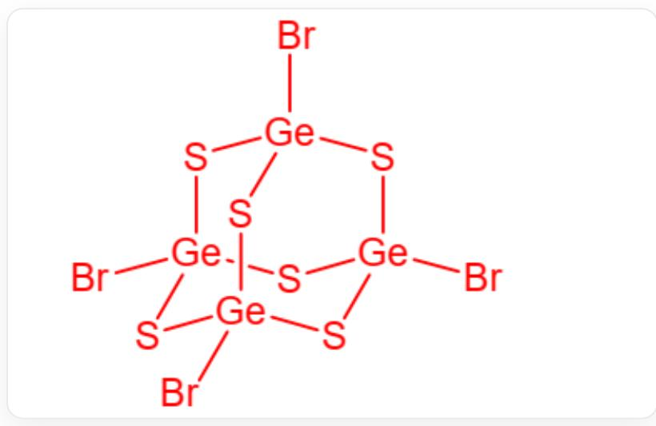
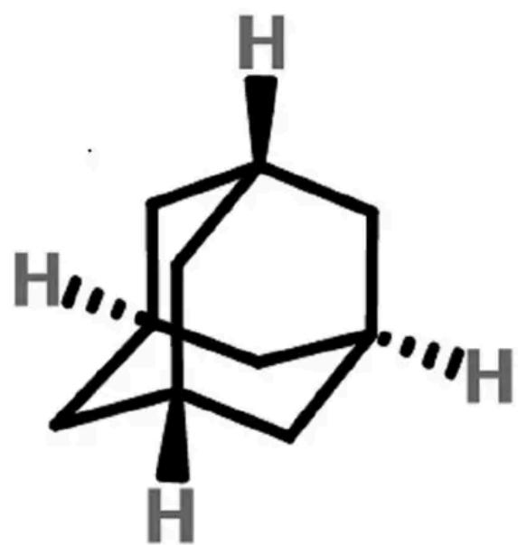
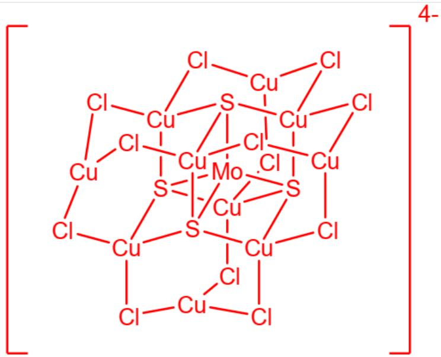

# 题目

金刚烷骨架不仅存在于有机化合物中，在无机簇合物里也常见到这样的骨架，其中  $\mathrm{P_4O_{10}}$  是此类化合物的一个典型代表。

1. 将  $\mathrm{GeBr}_{4}$  溶于含  $\mathrm{Al}_{2} \mathrm{Br}_{6}$  的  $\mathrm{CS}_{2}$ , 再向其中通入  $\mathrm{H}_{2} \mathrm{~S}$  气体, 得到了一种相似的化合物  $\mathbf{A}$ , 其中含  $\omega_{\mathrm{Ge}} = 0.3620$  。  
2.  $\mathrm{P}_{4} \mathrm{O}_{10}$  的结构可描述为  $\mathrm{P}_{4} \cdot \mathrm{O}_{6} @ \mathrm{O}_{4}$ , 即一组互相穿插的  $\mathrm{P}_{4}$  多面体和  $\mathrm{O}_{6}$  多面体包裹于  $\mathrm{O}_{4}$  多面体中。试以此方法描述金刚烷（物质  $\mathbf{B}$  ）的结构, 给出每一层对应的多面体。  
3.向金刚烷骨架外围增加更多原子，可以得到更加复杂的簇结构。有一种高对称性的阴离子 $\left[\mathrm{Mo}_{m}\mathrm{S}_{x}\mathrm{Cu}_{n}\mathrm{Cl}_{y}\right]^{4-}$ （物质C），含  $\omega_{\mathrm{Cu}} = 0.4945$ ， $\omega_{\mathrm{Mo}} = 0.0747$ ，各元素均为常见价态。其中Cl均为2配位且只有一种化学环境，S为4配位。

以下说法正确的是

A. A的结构为  $\mathrm{Ge}_{4} \mathrm{~S}_{4} \mathrm{Br}_{6}$  
B. A中含有Al元素  
C. A 中一个Ge原子连接两个S原子和Br原子  
D. 按照  $\mathrm{P}_{4} \cdot \mathrm{O}_{6}@\mathrm{O}_{4}$  的写法, 物质  $\mathrm{B}$  可以写为  $\mathrm{C}_{4} \cdot \mathrm{C}_{6}@\mathrm{H}_{8} \mathrm{H}_{8}$ , 多面体从左至右为正四面体、正八面体、正六方体、正六方体  
E. 按照  $\mathrm{P}_{4} \cdot \mathrm{O}_{6}@\mathrm{O}_{4}$  的写法, 物质  $\mathbf{B}$  可以写为  $\mathrm{C}_{4} \cdot \mathrm{C}_{6}@\mathrm{H}_{12} \mathrm{H}_{4}$ , 多面体从左至右为正四面体、正八面体、正二十面体、正四面体  
F. 物质  $\mathbf{C}$  中  $m = 1, n = 10, x = 2, y = 14$

G. 物质  $\mathbf{C}$  中  $m = 1, n = 10, x = 3, y = 13$  
H. 物质  $\mathbf{C}$  中  $m = 1, n = 10, x = 6, y = 10$  
I. 物质 C 中每个 Cu 原子都和 S 相连  
J. 物质 C 分为核心和外围, 核心为  $\mathrm{Mo}@\mathrm{S}_{4} \cdot \mathrm{Cu}_{6}$ , 外围为  $\mathrm{Cu}_{4} \cdot \mathrm{Cl}_{12}$  
K. 以上选项均不正确

# 答案

正确答案: J

# 详细解析

第一题

  
物质A的结构图，组成为Ge4S6Br4，其中Ge和3个S和1个Br相连

按照题目所说，物质A的结构和  $\mathrm{P_4O_{10}}$  一致，该物质可能的组成元素为Ge、S、Br，其中Ge最可能替代P的位置，S应该2配位，处于桥上，Br更适合作为端基，这样得到的物质组成为  $\mathrm{Ge_4S_6Br_4}$

验算  $\omega_{\mathrm{Ge}}$  : 化学式相对分子质量为  $4 \times 72.63 + 6 \times 32.07 + 4 \times 79.90 = 290.52 + 192.42 + 319.60 = 802.54$

那么  $\omega_{\mathrm{Ge}} = (4\times 72.63) / 802.54 = 290.52 / 802.54\approx 0.3620$  ，符合题目要求

所以物质 A 的组成为  $\mathrm{Ge}_{4} \mathrm{~S}_{6} \mathrm{Br}_{4}$ , 其中 Ge 和 3 个 S 和 1 个 Br 相连, ABC 错误

# CHECKPOINT

1 PTS

物质A的组成为  $\mathrm{Ge}_4\mathrm{S}_6\mathrm{Br}_4$  ，其中Ge和3个S和1个Br相连，ABC错误

# 第二题

金刚烷的结构图，可以描述为C4·C6@H12·H4，从左至右分别为正四面体、正八面体、截角正四面体、正四面体

按照  $\mathrm{P}_{4} \cdot \mathrm{O}_{6} @ \mathrm{O}_{4}$  的写法, 物质  $\mathbf{B}$  可以写为  $\mathrm{C}_{4} \cdot \mathrm{C}_{6} @ \mathrm{H}_{12} \mathrm{H}_{4}$ , 多面体从左至右为正四面体、正八面体、截角正四面体、正四面体, DE错误

# CHECKPOINT

1 PTS

按照  $\mathrm{P}_{4} \cdot \mathrm{O}_{6}@\mathrm{O}_{4}$  的写法，物质  $\mathbf{B}$  可以写为  $\mathrm{C}_{4} \cdot \mathrm{C}_{6}@\mathrm{H}_{12} \mathrm{H}_{4}$ ，多面体从左至右为正四面体、正八面体、截角正四面体、正四面体，DE错误

# 第三题

$$
\mathrm {C u}: \mathrm {M o} = (0. 4 9 4 5 / 6 3. 5 5): (0. 0 7 4 7 / 9 5. 9 6) = 1 0: 1
$$

# CHECKPOINT

1 PTS

$\mathrm{Cu}:\mathrm{Mo} = 10:1$

假设只含1个Mo，即  $m = 1$  ，则该离子中S与Cl摩尔质量和为：

$$
1 0 \times 6 3. 5 5 \times (1 - 0. 4 9 4 5) / 0. 4 9 4 5 - 9 5. 9 6 = 5 5 3. 7
$$

# CHECKPOINT

1 PTS

S与C1摩尔质量和为553.7

$$
3 2. 0 7 x + 3 5. 4 5 y = 5 5 3. 7
$$

列表可解得整数解：  $x = 4,y = 12$

此时  $\mathrm{Cl}$  为-1价，S为-2价，  $\mathrm{Cu}$  为  $+1$  价，Mo为  $+6$  价，符合常见价态。

若  $m > 1$  ，则会出现0价  $\mathrm{Cu}$  或非  $+6$  价Mo，故舍去。

因此，  $m = 1$  ，  $n = 10$  ，  $x = 4$  ，  $y = 12$  ,FGH错误

# CHECKPOINT

1 PTS

$m = 1$  ，  $n = 10$  ，  $x = 4$  ，  $y = 12$  ，FGH错误

  
MoCu10S4Cl12的结构图，其中核心为Mo@S4·Cu6，外围为Cu4·Cl12

物质C为MoCu10S4Cl12,其中核心为Mo@S4·Cu6，外围为Cu4·Cl12，外围Cu只和Cl相连，I错误，J正确

# CHECKPOINT

1 PTS

物质  $\mathbf{C}$  为  $\mathrm{MoCu_{10}S_4Cl_{12}}$  ，其中核心为  $\mathrm{Mo@S_4\cdot Cu_6}$  ，外围为  $\mathrm{Cu_4\cdot Cl_{12}}$  ，I错误，J正确