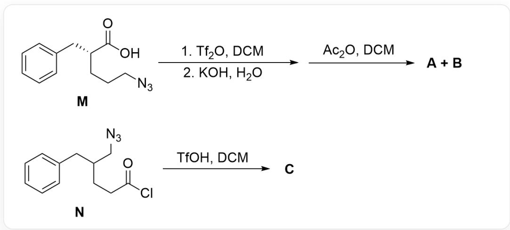
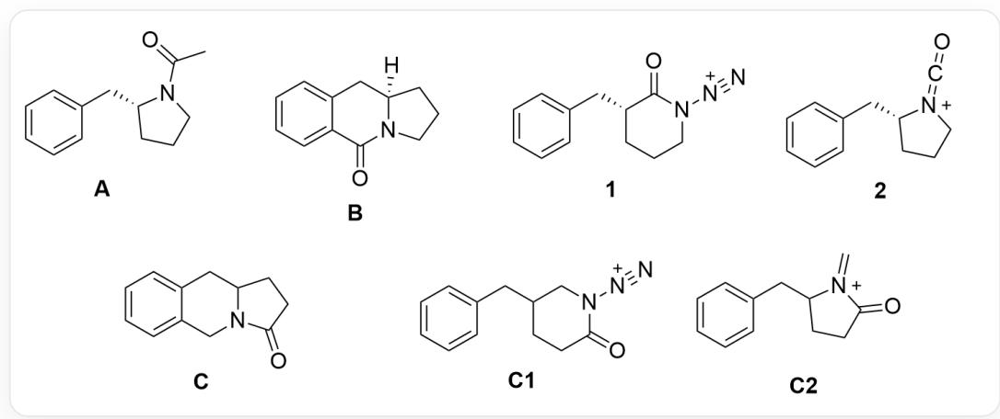

# Question

This figure describes two organic reactions. The first reaction: the substrate  $\mathbf{M}$  is  $O = C(O)[C@H](CCCN = [N+] = [N-])$  CC1=CC=CC=C1, which reacts under the conditions of 1.Tf2O, DCM; 2.KOH, H2O, and then reacts with Ac2O, DCM to obtain two products A, B. The second reaction: the substrate N is O=C(Cl)CCC(CN=[N+]=[N-])CC1=CC=CC=C1, yielding product C under the conditions of TfOH, DCM.

For the reaction in the above figure, it is known that:

1. Products A, B, C are all rearrangement products.  
2. A, B, C contain 13, 12, and 12 carbon atoms, respectively, and the number of oxygen atoms is the same.  
3. In the reaction mechanism for the formation of  $\mathbf{C}$ , the migrating group is different from the migrating group for the formation of  $\mathbf{A}$ .  
4. The process of generating  $\mathbf{A},\mathbf{B}$  from  $\mathbf{M}$  goes through two key charged intermediates 1,2, and the process of generating  $\mathbf{C}$  from  $\mathbf{N}$  goes through two key charged intermediates C1,C2.

This question requires stereochemistry.

The following statement that is correct is:

A. All other options are incorrect

B. A,B both contain two rings.  
C. The stereochemical configuration of the chiral center of  $\mathbf{B}$  is the S configuration.  
D. 1 and 2 contain the same types of rings  
E. C and B have inconsistent chemical formulas.  
F. Explaining the transfer selective unavailable steric hindrance effect of generating C

# Answer

Correct Answer: A

# Detailed Explanation

  
clipboard_image_1755075420805

First, trifluoromethanesulfonic anhydride  $\mathrm{Tf}_2\mathrm{O}$  is added to react with the carboxylate to generate a strongly leaving OTf group, thus activating the carboxyl group.

# CHECKPOINT

1 PTS

Carboxyl group is activated by  $\mathrm{Tf}_2\mathrm{O}$  to generate OTf group

Observing the structure of the substrate M, it can be seen that the azide group in the substrate has strong nucleophilicity and can undergo intramolecular nucleophilic carboxyl group, generating a six-membered ring amide structure; this intramolecular cyclization does not change the configuration of the chiral center, so the structure of the charged intermediate 1 is O=C1N([N+]#N)CCC[C@@H]1CC2=CC=CC=C2.

# CHECKPOINT

1 PTS

Intramolecular nucleophilic carboxyl group of azide generates amide

# CHECKPOINT

1 PTS

Structure of 1 is  $\mathrm{O = C1N([N + ]\#N)CCC[C@@H]1CC2 = CC = CC = C2}$

Then observe that this structure has a nitrogen group attached to the nitrogen atom of the six-membered ring amide, which can undergo a Curtius rearrangement reaction to generate an isocyanate; therefore, the structure of the charged intermediate 2 is  $\mathrm{O = C = [N + ]1CCC[C@@H]1CC2 = CC = CC = C2}$ . 1 and 2 contain different types of rings, option D is incorrect.

# CHECKPOINT

1 PTS

Curtius rearrangement reaction occurs to generate isocyanate

# CHECKPOINT

1 PTS

Structure of 2 is  $\mathrm{O} = \mathrm{C} = [\mathrm{N} + ]1\mathrm{{CCC}}[\mathrm{C}@\mathrm{H}]1\mathrm{{CC}}2 = \mathrm{{CC}} = \mathrm{{CC}} = \mathrm{C}2$

The isocyanate is attacked by a hydroxyl group under basic conditions to generate an N-carboxylic acid, which easily decarboxylates to form a secondary amine; then acetic anhydride  $\mathrm{Ac}_2\mathrm{O}$  is added to acylate the amine, so the final product is  $\mathrm{O = C(C)N1CCC[C@@H]1CC2 = CC = CC = C2}$ . Since acetic anhydride participates in the reaction, there is one more carbon atom, so this structure is product A.

# CHECKPOINT

1 PTS

Acetic anhydride  $\mathrm{Ac}_2\mathrm{O}$  acylates the amine

# CHECKPOINT

1 PTS

A structure is O=C(C)N1CCC[C@@H]1CC2=CC=CC=C2

B has the same number of carbon atoms as intermediate 2, so it can only be an intramolecular reaction; observing the substrate, it can be seen that the substrate can undergo an aromatic electrophilic reaction, and the benzene ring nucleophilic isocyanate generates a six-membered ring; therefore, the structure of B is O=C1C2=CC=CC=C2C[C@]3([H])N1CCC3. This step also does not change the chiral center, the configuration of the chiral site is R, option C is incorrect. B has three rings, option B is incorrect.

# CHECKPOINT

1 PTS

Generation of  $\mathbf{B}$  is an intramolecular reaction

# CHECKPOINT

1 PTS

Benzene ring nucleophilic isocyanate generates a six-membered ring

# CHECKPOINT

1 PTS

B structure is O=C1C2=CC=CC=C2C[C@]3([H])N1CCC3

The structure of  $\mathbf{N}$  is similar. At the beginning of the reaction, TfOH replaces the acyl chloride, and then the azide group nucleophilically attacks the ring, and the resulting intermediate C1 is O=C1CCC(CN1[N+#N)CC2=CC=CC=C2.

# CHECKPOINT

1 PTS

Intermediate C1 is O=C1CCC(CN1[N+]#N)CC2=CC=CC=C2

Since the migrating group that produces C is different, the C-C bond on the carbonyl side migrates in the Curtius rearrangement, so the carbonyl side does not migrate here, but the alkyl group on the other side migrates to obtain the imine cation structure; this intermediate C2 is  $\mathrm{C} = [\mathrm{N} + ](\mathrm{C}(\mathrm{CC1})\mathrm{CC2} = \mathrm{CC} = \mathrm{CC} = \mathrm{C2})\mathrm{C1} = \mathrm{O}$ .

# CHECKPOINT

1 PTS

Alkyl group on the other side migrates to obtain the imine cation structure

# CHECKPOINT

1 PTS

C2 is  $\mathrm{C} = [\mathrm{N} + ](\mathrm{C}(\mathrm{CC1})\mathrm{CC2} = \mathrm{CC} = \mathrm{CC} = \mathrm{C2})\mathrm{C}1 = 0$

Observing the number of carbon atoms, it can be seen that the reaction to generate C is still an intramolecular reaction, so it can only be that the aromatic ring nucleophilic imine cation obtains a six-membered ring, and the final product C structure is O=C1N2CC3=CC=CC=C3CC2CC1. C and B have the same chemical formula, option E is incorrect.

# CHECKPOINT

1 PTS

Reaction to generate  $\mathbf{C}$  is an intramolecular reaction

# CHECKPOINT

1 PTS

C structure is O=C1N2CC3=CC=CC=C3CC2CC1

After the substrate rearranges, it may generate two kinds of intermediates, isocyanate cation or imine cation, but the isocyanate cation here cannot form a stable reaction conformation with the benzene ring, so the corresponding product cannot be obtained, while the imine cation is very easy to react with the benzene ring, so the final equilibrium shifts to the direction of generating the imine cation. Option F is correct.

# CHECKPOINT

1 PTS

Isocyanate cation cannot form a stable reaction conformation with the benzene ring

# CHECKPOINT

1 PTS

Imine cation is very easy to react with the benzene ring, and the equilibrium shifts to the direction of generating the imine cation

Therefore, options B-F are all incorrect, and option A is correct.