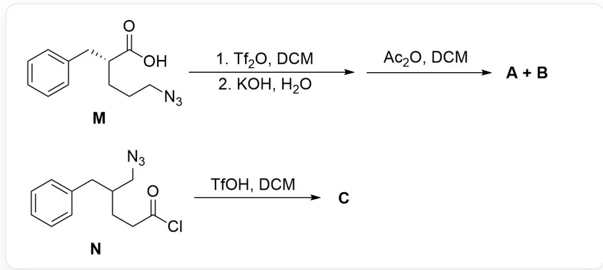
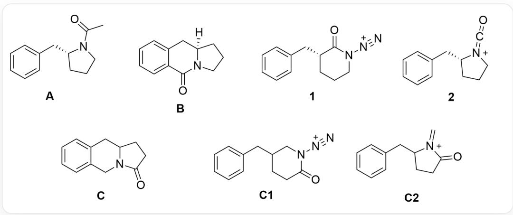

# 题目

本图描述了两个有机反应。第一个反应：底物M为O=C(O)[C@H](CCCN=[N+]=[N-])CC1=CC=CC=C1，其在1.Tf2O, DCM; 2.KOH, H2O条件下反应，再与Ac2O, DCM反应得到两种产物A, B。第二个反应：底物N为O=C(Cl)CCC(CN=[N+]=[N-])CC1=CC=CC=C1，在TfOH, DCM条件下生成产物C。

对于上图的反应，已知：

1. 产物A，B，C均为重排产物。  
2. A, B, C 分别含有 13, 12, 12 个碳原子, 且氧原子数目一致。  
3. 生成  $\mathbf{C}$  的反应机理中，迁移的基团与生成  $\mathbf{A}$  的迁移基团不同。  
4. 由M生成A，B的过程经历了两个关键带电中间体1,2，由N生成C的过程经历了两个关键带电中间体C1,C2。

本题要求立体化学。

下列说法正确的是：

A. 其他选项均不正确  
B. A, B 均含有两个环

C. B 的手性中心构型为S构型  
D. 1 和 2 含有的环种类相同  
E. C与B化学式不一致  
F. 产生 C 的迁移选择性不可利用空间位阻效应解释

# 答案

正确答案: A

# 详细解析

  
clipboard_image_1755075420805

首先加入三氟甲磺酸酐  $\mathrm{Tf}_2\mathrm{O}$  与羧酸根反应生成强离去性的OTf基团，因此羧基被活化。

# CHECKPOINT

1 PTS

羧基被  $\mathrm{Tf}_2\mathrm{O}$  活化生成OTf基团

观察底物M的结构可知，底物中叠氮基团具有强亲核性，可以发生分子内亲核羧基，生成六元环酰胺结构；该分子内成环不改变手性中心构型，因此带电中间体1的结构为O=C1N([N+]#N)CCC[C@@H]1CC2=CC=CC=C2。

# CHECKPOINT

1 PTS

叠氮基分子内亲核羧基生成酰胺

# CHECKPOINT

1 PTS

1的结构为O=C1N([N+]#N)CCC[C@@H]1CC2=CC=CC=C2

之后观察该结构为六元环酰胺的氮原子上连有氮气基团，可以发生Curtius重排反应生成异氰酸酯；故带电中间体2的结构为  $O = C = [N + ]1CC$  [C@@H]1CC2=CC=CC=C2。1与2含有环种类不同，选项D错误。

# CHECKPOINT

1 PTS

发生Curtius重排反应生成异氰酸酯

# CHECKPOINT

1 PTS

2的结构为  $\mathrm{O = C = [N + ]1CCC[C@@H]1CC2 = CC = CC = C2}$

异氰酸酯在碱性条件下被羟基进攻生成N-羧酸，该结构容易脱羧生成二级胺；之后加入乙酸酐  $\mathrm{Ac}_2\mathrm{O}$  将胺进行酰基化，因此最终产物为  $\mathrm{O} = \mathrm{C}(\mathrm{C})\mathrm{N}1\mathrm{CCC}[\mathrm{C}@\mathrm{@H}]1\mathrm{CC}2 = \mathrm{CC} = \mathrm{CC} = \mathrm{C}2$  ，由于乙酸酐参与反应多出一个碳原子，因此该结构为产物A。

# CHECKPOINT

1 PTS

乙酸酐  $\mathrm{Ac}_{2} \mathrm{O}$  将胺进行酰基化

# CHECKPOINT

1 PTS

A 结构为O=C(C)N1CCC[C@@H]1CC2=CC=CC=C2

B的碳原子数与中间体2相同，因此只能为分子内反应；观察底物可知底物可以发生芳香亲电反应，苯环亲核异氰酸酯生成六元环；因此B结构为O=C1C2=CC=CC=C2C[C@]3([H])N1CCC3。该步骤同样对手性中心无改变，手性位点构型为R，选项C错误。B有三个环，选项B错误。

# CHECKPOINT

1 PTS

生成B为分子内反应

# CHECKPOINT

1 PTS

苯环亲核异氰酸酯生成六元环

# CHECKPOINT

1 PTS

B结构为O=C1C2=CC=CC=C2C[C@]3([H])N1CCC3

N的结构类似，反应刚开始为TfOH对酰氯进行取代后被叠氮基亲核进攻成环，产生的中间体C1为O=C1CCC(CN1[N+#N)CC2=CC=CC=C2。

# CHECKPOINT

1 PTS

中间体C1为  $0 = C1CC$  (CN1[N+]#N)CC2=CC=CC=C2

由于产生C的迁移基团不同，Curtius重排中迁移羰基一侧的C-C键，因此此处不迁移羰基一侧，而是迁移另一侧的烷基，得到亚胺正离子结构；该中间体C2为  $\mathrm{C = [N + ](C(CC1)CC2 = CC = CC = C2)C1 = O}$

# CHECKPOINT

1 PTS

迁移另一侧的烷基，得到亚胺正离子结构

# CHECKPOINT

1 PTS

C2为  $\mathrm{C = [N + ](C(CC1)CC2 = CC = CC = C2)C1 = O}$

观察碳原子数可知生成C的反应仍旧为分子内反应，因此只能是芳环亲核亚胺正离子得到六元环，最终产物C结构为O=C1N2CC3=CC=CC=C3CC2CC1。C与B化学式一致，选项E错误。

# CHECKPOINT

1 PTS

生成  $\mathbf{C}$  的反应为分子内反应

# CHECKPOINT

1 PTS

C结构为O=C1N2CC3=CC=CC=C3CC2CC1

底物重排后可能生成异氰酸酯正离子或亚胺正离子两种中间体，但此处的异氰酸酯正离子与苯环间并不能形成稳定的反应构象从而得不到相应的产物，而亚胺正离子则很容易与苯环发生反应，因此最后平衡向生成亚胺正离子的方向移动。选项F正确。

# CHECKPOINT

1 PTS

异氰酸酯正离子与苯环间并不能形成稳定的反应构象

# CHECKPOINT

1 PTS

亚胺正离子则很容易与苯环发生反应，平衡向生成亚胺正离子的方向移动

因此选项B-F均错误，选项A正确。