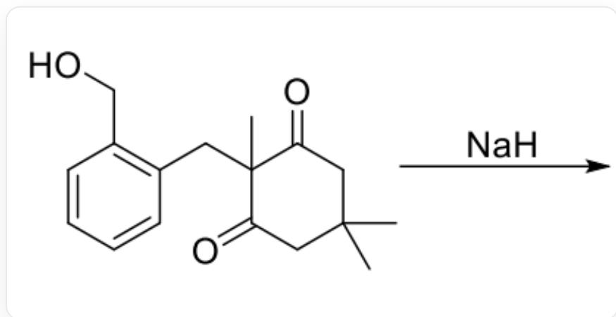
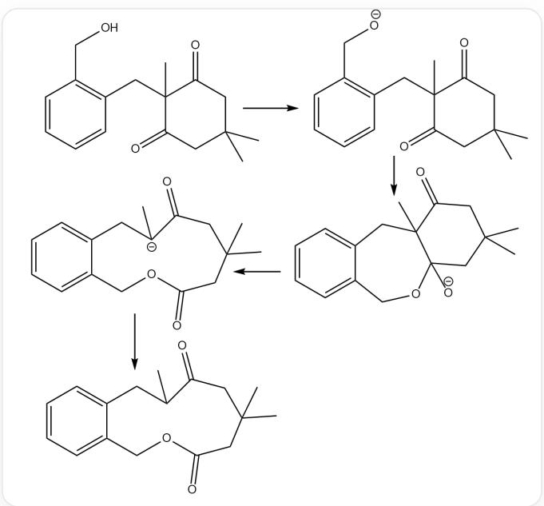

# Question

  
The figure shows an organic reaction, the reactant is OCC1=C(CC2(C)C(CC(C)(C)CC2=O)=O)C=CC=C1, the condition is adding NaH, the product is unknown

For the reaction shown in the figure, which of the following statements is correct:

A. The first step of this reaction generates an enolate intermediate.  
B. The first step of this reaction is the nucleophilic attack of a hydride ion on the carbonyl group.  
C. The product has three six-membered rings.  
D. The reaction process involves a six-membered ring carbanion intermediate.  
E. The product is a sodium salt.  
F. The product contains a six-membered ring lactone.  
G. The product contains an eight-membered ring ether.

H. The product can react with metallic sodium.  
1. None of the above options are correct.

# Answer

Correct Answer: I

# Detailed Explanation

The reaction intermediates and products are shown in the figure:

  
Reaction intermediates and products

\

Sodium hydride is a strong base but has weak nucleophilicity, so the first step reacts with the most active proton, namely the hydroxyl hydrogen, to generate the oxyanion  $[O-]CC1=CC=CC=C1CC2(C)C(CC(C)(C)CC2=O)=O$ , options A and B are incorrect.

\

# CHECKPOINT

1 PTS

Generation of oxyanion [O-]CC1=CC=CC=C1CC2(C)C(CC(C)(C)CC2=O)=O

Subsequently, the oxyanion attacks the carbonyl group, generating the tetrahedral intermediate  $\mathrm{O = C1[C@]2(C)CC3 = CC = CC = C3CO[C@@][[O - ]]2CC(C)(C)C1}$ .

# CHECKPOINT

1 PTS

Generation of tetrahedral intermediate  $\mathrm{O} = \mathrm{C}1[\mathrm{C}@\mathrm{]}2(\mathrm{C})\mathrm{CC}3 = \mathrm{CC} = \mathrm{CC} = \mathrm{C}3\mathrm{CO}[\mathrm{C}@\mathrm{]}([\mathrm{O} - ])2\mathrm{CC}(\mathrm{C})(\mathrm{C})\mathrm{C}1$

The next reaction of the tetrahedral intermediate is carbon-carbon bond cleavage. The cleaved carbon-carbon bond should generate the most stable carbanion. Option D is correct. The carbon-carbon bond connecting the carbonyl group and the quaternary carbon atom cleaves, and the generated carbanion is relatively stable due to the electron-withdrawing effect of another adjacent carbonyl group. The carbanion is  $\mathrm{O = C(CC(C)(C)C1)[C - ]}$  (C)CC2=CC=CC=C2COC1=O.

# CHECKPOINT

1 PTS

Generation of carbanion  $\mathrm{O} = \mathrm{C}\left( {\mathrm{{CC}}\left( \mathrm{C}\right) \left( \mathrm{C}\right) \mathrm{C}1}\right) \left\lbrack  {\mathrm{C} - }\right\rbrack  \left( \mathrm{C}\right) \mathrm{{CC}}2 = \mathrm{{CC}} = \mathrm{{CC}} = \mathrm{C}2\mathrm{{COC}}1 = \mathrm{O}$

In the workup process, the carbanion abstracts a proton to obtain the product. The product structure is  $\mathrm{O = C(CC(C)}$  (C)C1)C(C)CC2=CC=CC=C2COC1=O, which is an electrically neutral product with only one six-membered ring,

a 11-membered ring lactone and an ether bond, so all options are incorrect.

# CHECKPOINT

1 PTS

Product structure is  $\mathrm{O = C(CC(C)(C)C1)C(C)CC2 = CC = CC = C2COC1 = O}$

# CHECKPOINT

1 PTS

The product molecule has an 11-membered ring structure, which contains an ester group and an ether bond