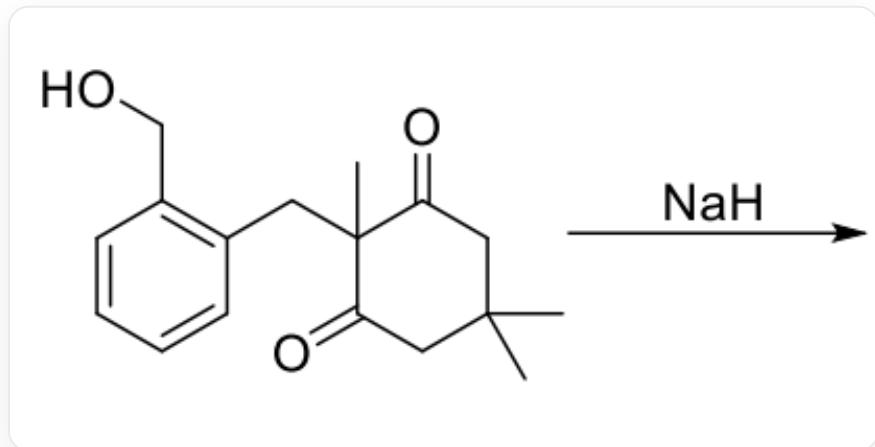
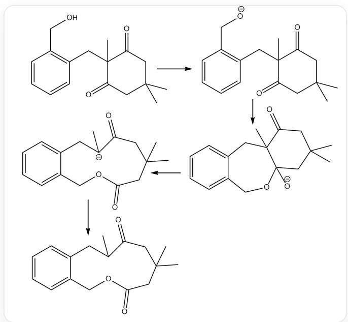

# 题目

  
图为一个有机反应，反应物为OCC1=C(CC2(C)C(CC(C)(C)CC2=O)=O)C=CC=C1，条件为加入NaH，生成物未知

对于图示反应，下列说法正确的是：

A. 该反应第一步生成烯醇负离子中间体  
B. 该反应第一步氢负离子对羰基亲核进攻  
C. 产物有三个六元环  
D. 反应过程中存在六元环碳负离子中间体  
E. 产物为一种钠盐  
F. 产物中含有一个六元环的内酯  
G. 产物中含有一个八元环的醚

H. 产物能与金属钠发生反应  
I. 以上选项都不对

# 答案

正确答案: I

# 详细解析

反应的中间体和产物如图：

  
反应的中间体和产物

\

氢化钠是强碱但亲和性弱，因此第一步与最活泼的质子即羟基氢反应，生成氧负离子  $\mathrm{[O - ]CC1 = CC = CC = C1CC2(C)C(CC(C)(C)CC2 = O) = O}$ ，选项A，B错误。\

1

CHECKPOINT

1 PTS

生成氧负离子[O-]CC1=CC=CC=C1CC2(C)C(CC(C)(C)CC2=O)=O

1

随后氧负离子进攻羰基，生成四面体中间体  $\mathrm{O = C1[C@]2(C)CC3 = CC = CC = C3CO[C@@][[O-]]2CC(C)}$  (C)C1。\

\

# CHECKPOINT

1 PTS

生成四面体中间体  $\mathrm{O} = \mathrm{C}1[\mathrm{C}@\mathrm{]}2(\mathrm{C})\mathrm{CC}3 = \mathrm{CC} = \mathrm{CC} = \mathrm{C}3\mathrm{CO}[\mathrm{C}@\mathrm{]}([\mathrm{O}-])2\mathrm{CC}(\mathrm{C})(\mathrm{C})\mathrm{C}1$

\

1

四面体中间体的下一步反应是碳碳键断裂，断裂的碳碳键应当生成最稳定的碳负离子，选项D正确。连接羰基与季碳原子的碳碳键断裂，生成的碳负离子由于邻近另一个羰基的吸电子而较为稳定。碳负离子为  $\mathrm{O = C(CC(C)(C)C1)[C - ](C)CC2 = CC = CC = C2COC1 = O}$  。\

\

# CHECKPOINT

1 PTS

生成碳负离子  $\mathrm{O} = \mathrm{C}(\mathrm{CC}(\mathrm{C})(\mathrm{C})\mathrm{C}1)[\mathrm{C}-](\mathrm{C})\mathrm{CC}2 = \mathrm{CC} = \mathrm{CC} = \mathrm{C}2\mathrm{CO}1 = 0$

1

\

在后处理过程中碳负离子攫取质子，得到产物。产物结构为O=C(CCC1)C(C)CC2=CC=CC=C2COC1=O，是电中性产物，只有一个六元环，含11元环的内酯与醚键，所以所有选项都是错误的。\n\n

1

# CHECKPOINT

1 PTS

产物结构为  $\mathrm{O = C(CC(C)(C)C1)C(C)CC2 = CC = CC = C2COC1 = O}$

# CHECKPOINT

1 PTS

产物分子有一个有11元环结构，其中包含酯基与醚键