# Question

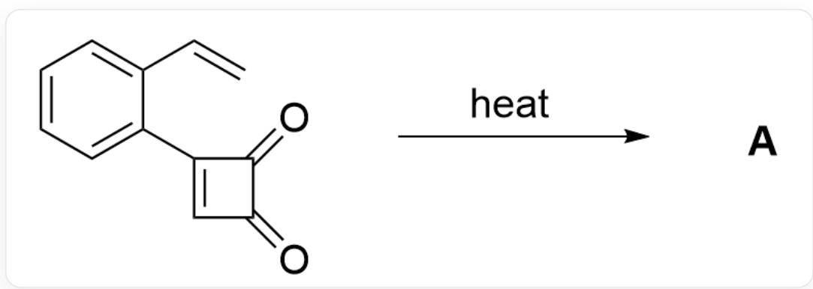  
C=CC1=CC=CC=C1C2=CC(C2=O)=O>heat>[A],A is the product

The substrate undergoes rearrangement at high temperature to yield product  $\mathbf{A}$ . Given that the molecular formula of  $\mathbf{A}$  is  $\mathrm{C_{12}H_8O_2}$ , provide the structural formula of  $\mathbf{A}$ .

A. All other options are incorrect

B.

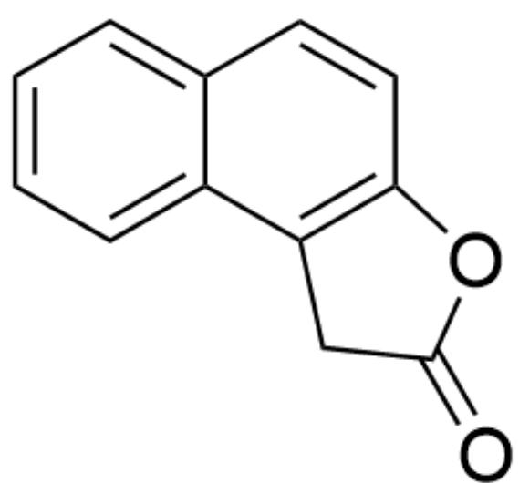  
$\mathrm{O = C(O1)CC2 = C1C = CC3 = CC = CC = C32}$

C.

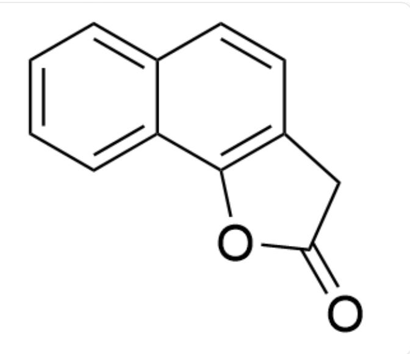  
D.

$\mathrm{O = C(C1)OC2 = C1C = CC3 = CC = CC = C32}$

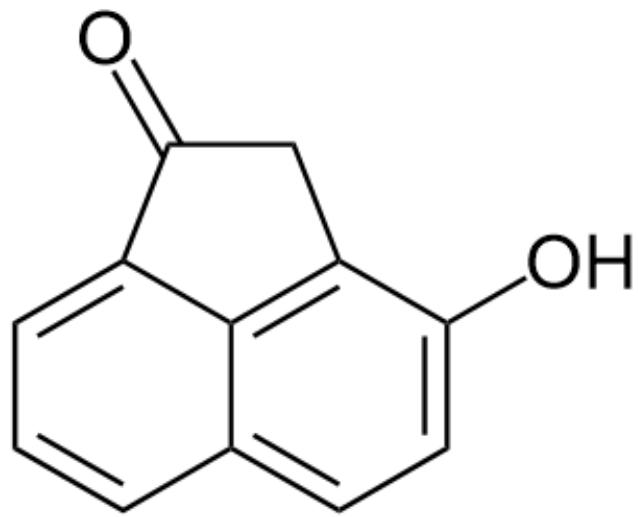  
E.

OC1=CC=C2C(C3=CC=C2)=C1CC3=O

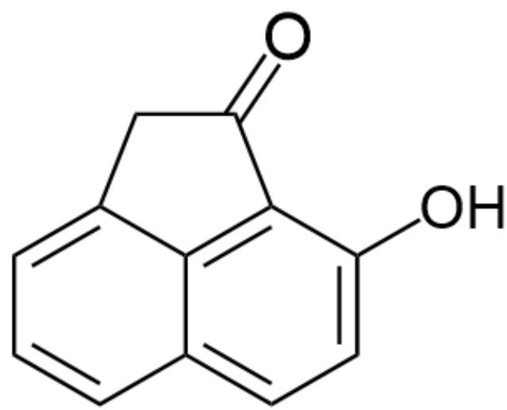  
F.

OC1=CC=C2C(C3=CC=C2)=C1C(C3)=O

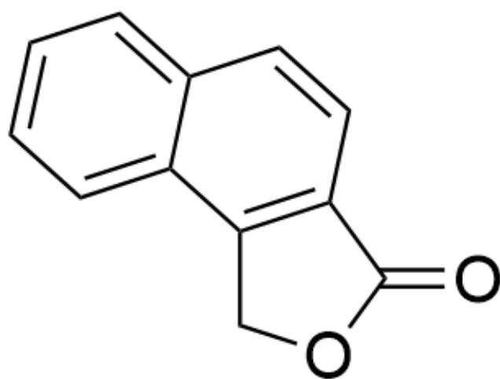  
G.

$\mathrm{O = C1C2 = C(C01)C3 = CC = CC = C3C = C2}$

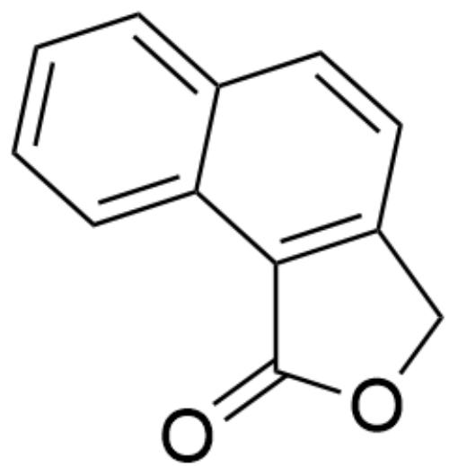

$\mathrm{O = C1C(C2 = CC = CC = C2C = C3) = C3CO1}$

# Answer

Correct Answer: B

# Detailed Explanation

First, under the action of high temperature, the reaction substrate undergoes a 4-membered ring-opening reaction to obtain intermediate 1

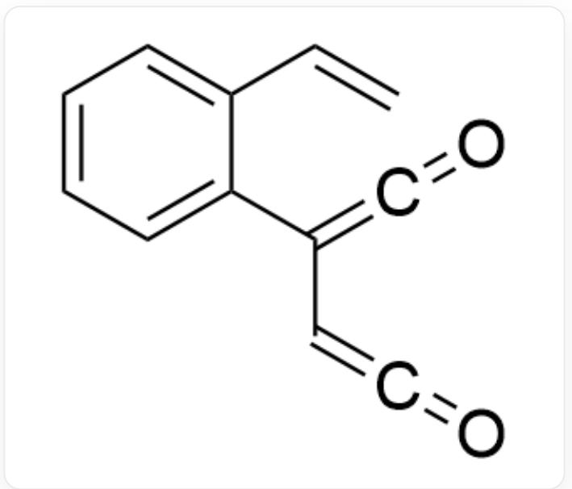

intermediate1: C=CC1=CC=CC=C1C(C=C=O)=C=O

CHECKPOINT

1 PTS

intermediate1：  $\mathrm{C = CC1 = CC = CC = C1C(C = C = O) = C = O}$

Next, intermediate 1 undergoes an intramolecular  $6\pi$  -electron electrocyclic reaction to obtain intermediate 2

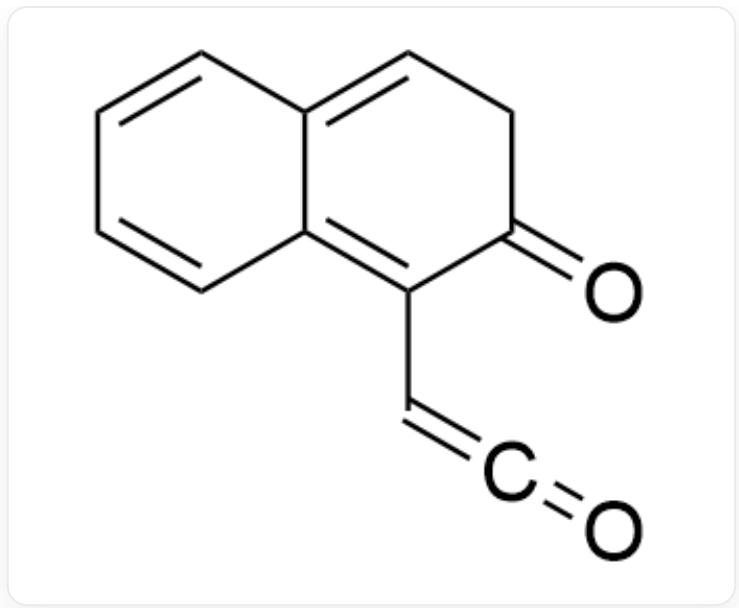

intermediate2：O=C1C(C=C=O)=C2C=CC=CC2=CC1

# CHECKPOINT

1 PTS

intermediate 2 :  $\mathrm{O} = \mathrm{C}1\mathrm{C}\left( {\mathrm{C} = \mathrm{C} = \mathrm{O}}\right)  = \mathrm{C}2\mathrm{C} = \mathrm{{CC}} = \mathrm{{CC}}2 = \mathrm{{CC}}1$

Intermediate 2 undergoes tautomerization to obtain the aromatic intermediate 3

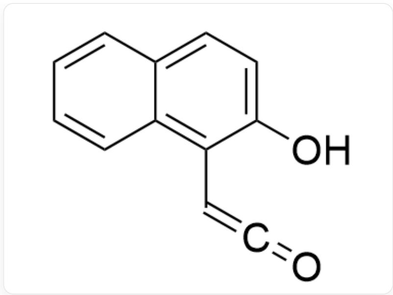

intermediate3:OC1=CC=C2C(C=CC=C2)=C1C=C=O

CHECKPOINT

1 PTS

intermediate3：OC1=CC=C2C(C=CC=C2)=C1C=C=O

Intermediate 3 still contains an unstable ketene structure, so the hydroxyl group further undergoes nucleophilic cyclization to obtain intermediate 4

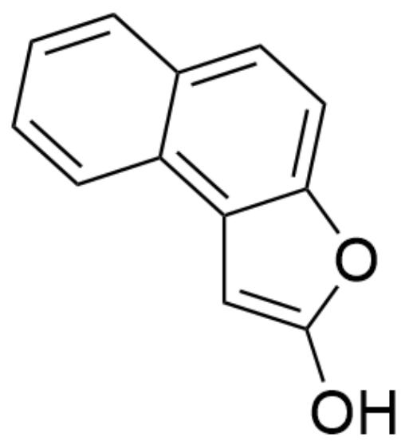

intermediate4:OC1=CC2=C3C=CC=CC3=CC=C2O1

# CHECKPOINT

1 PTS

intermediate4：OC1=CC2=C3C=CC=CC3=CC=C2O1

Intermediate 4 undergoes tautomerization to obtain the final product A

productA:O=C(O1)CC2=C1C=CC3=CC=CC=C32