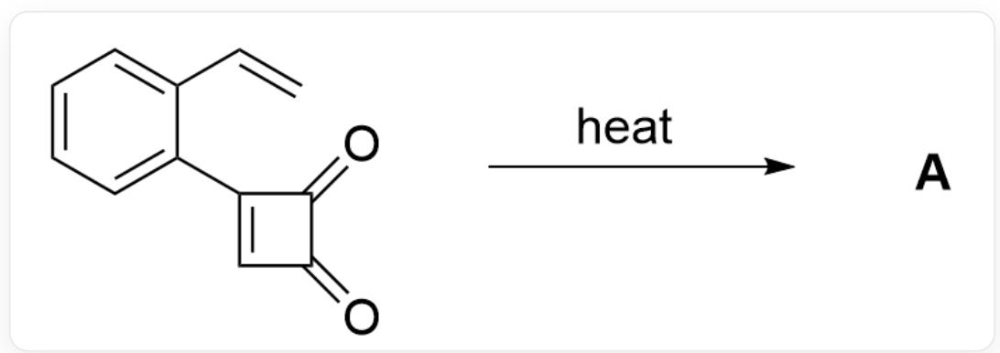
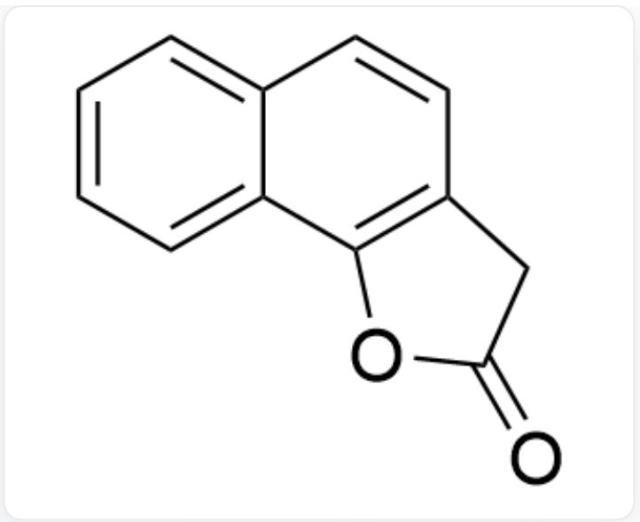
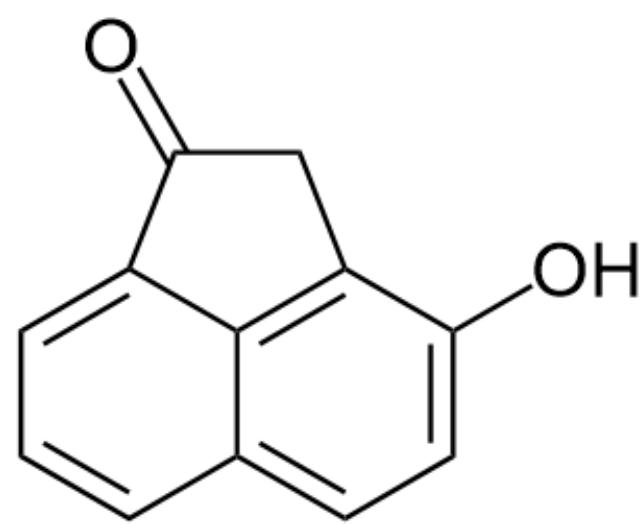
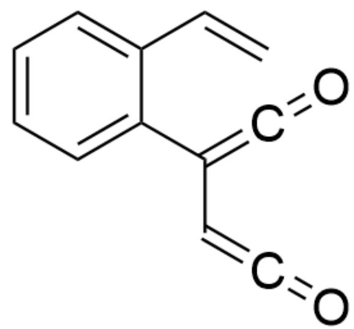
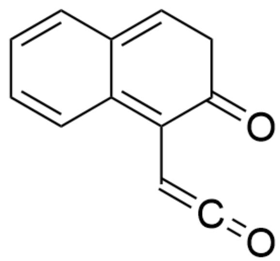
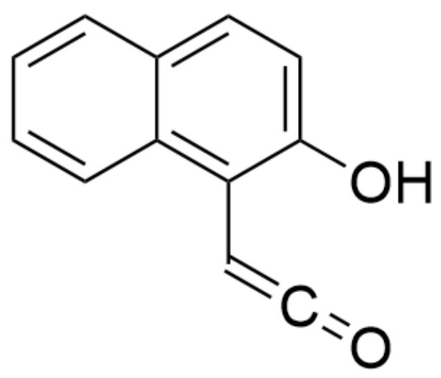
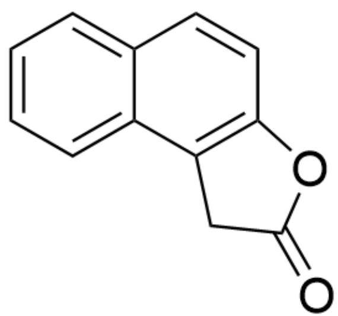

# 题目

C=CC1=CC=CC=C1C2=CC(C2=O)=O>heat>[A],A是产物

底物在高温下发生重排得到产物  $\mathbf{A}$ , 已知  $\mathbf{A}$  的分子式为  $\mathrm{C}_{12} \mathrm{H}_{8} \mathrm{O}_{2}$ , 试给出  $\mathbf{A}$  的结构式

A. 其他选项均不正确  
B.

$\mathrm{O = C(O1)CC2 = C1C = CC3 = CC = CC = C32}$

C.

  
$\mathrm{O = C(C1)OC2 = C1C = CC3 = CC = CC = C32}$

  
D.  
OC1=CC=C2C(C3=CC=C2)=C1CC3=O  
E.

  
F.

OC1=CC=C2C(C3=CC=C2)=C1C(C3)=O

  
G.

$\mathrm{O = C1C2 = C(C01)C3 = CC = CC = C3C = C2}$

$\mathrm{O = C1C(C2 = CC = CC = C2C = C3) = C3CO1}$

# 答案

正确答案: B

# 详细解析

首先在高温作用下，反应底物发生4元环开环反应得到中间体1

  
中间体1：C=CC1=CC=CC=C1C(C=C=O)=C=O

CHECKPOINT

1 PTS

中间体1：  $\mathrm{C = CC1 = CC = CC = C1C(C = C = O) = C = O}$

接着，中间体1发生分子内6电子关环反应得到中间体2

中间体2：  $O = C1C(C = C = O) = C2C = CC = CC2 = CC1$

# CHECKPOINT

1 PTS

中间体2：  $0 = \mathrm{C1C}(\mathrm{C} = \mathrm{C} = 0) = \mathrm{C2C} = \mathrm{CC} = \mathrm{CC2} = \mathrm{CC1}$

中间体2发生互变异构得到有芳香性的中间体3

中间体3：OC1=CC=C2C(C=CC=C2)=C1C=C=O

# CHECKPOINT

1 PTS

中间体3：OC1=CC=C2C(C=CC=C2)=C1C=C=O

中间体3中仍含有不稳定的烯酮结构，因此羟基进一步亲核成环得到中间体4

中间体4：OC1=CC2=C3C=CC=CC3=CC=C2O1

# CHECKPOINT

1 PTS

中间体4：OC1=CC2=C3C=CC=CC3=CC=C2O1

中间体4发生互变异构得到最终产物A

产物A：  $O = C(O1)CC2 = C1C = CC3 = CC = CC = C32$