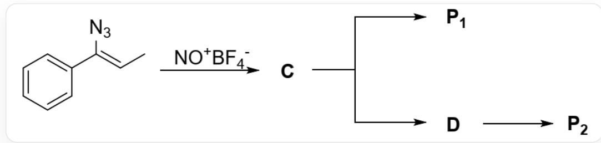
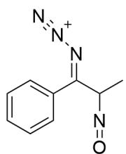
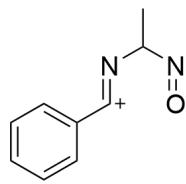
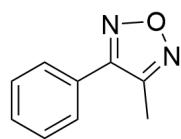
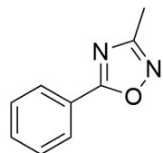

# Question

There is the following reaction:

This image describes several steps of an organic cascade reaction. The starting substrate is C/C=C(N=[N+]=[N-])/C1=CC=CC=C1, which reacts with  $\mathrm{NO}^{+}\mathrm{BF}_{4}^{-}$  to obtain C. C has two transformation processes: C can directly yield P 1 , and C can also first transform into D, and D then transforms into P 2 .

# Known:

1. C, D are both intermediates with a single positive charge and each contains only one ring.  
2.  $\mathbf{P}_1, \mathbf{P}_2$  both contain a five-membered ring.

Which of the following statements is correct:

A. All other options are incorrect  
B.  $\mathbf{P}_{1}$  possesses the linkage  $\mathrm{N} - \mathrm{C} - \mathrm{N}$  
C.  $\mathbf{P}_{1}$  exhibits a bonded relationship  $\mathrm{N} - \mathrm{C} - \mathrm{O} - \mathrm{N}$  
D.  $\mathbf{P}_{1}$  possesses a linkage relationship  $\mathrm{O} - \mathrm{C} - \mathrm{CH}_{3}$  
E.  $\mathbf{P}_{2}$  possesses a linkage relationship  $\mathrm{O} - \mathrm{C} - \mathrm{N} - \mathrm{CH}_{3}$

F.  $\mathbf{P_2}$  possesses a connectivity relationship  $\mathrm{N - O - N - C}$  
G.  $\mathbf{P_2}$  has a linked relationship  $\mathrm{N - O - C - N}$

# Answer

Correct Answer: A

# Detailed Explanation

The  $\mathrm{NO}^{+}$  in  $\mathrm{NO}^{+}\mathrm{BF}_{4}^{-}$  is a strong electrophile. The substrate contains an enamine structure, so the carbon atom of the enamine nucleophilically attacks the positively charged nitrogen atom of  $\mathrm{NO}^{+}$ , resulting in a nitroso substituent and forming intermediate C, with the structure CC(N=O)/C(C1=CC=CC=C1)=N/[N+]#N.

# CHECKPOINT

1 PTS

The carbon atom of the enamine nucleophilically attacks the positively charged nitrogen atom of  $\mathrm{NO}^{+}$

# CHECKPOINT

1 PTS

The structure of C is CC(N=O)/C(C1=CC=CC=C1)=N/[N+#N

C readily loses a nitrogen molecule to become a six-electron nitrogen cation; therefore, the nitrogen atom of the enamine now has electrophilic properties. Observing the structure of C, the departure of nitrogen can be assisted by neighboring group participation;

# CHECKPOINT

1 PTS

C readily loses a nitrogen molecule, and the nitrogen atom of the enamine now has electrophilic properties

# CHECKPOINT

1 PTS

The departure of nitrogen can be assisted by neighboring group participation

The oxygen atom of the nitroso group in the substrate has nucleophilic properties and can attack the nitrogen atom of the enamine to assist in the departure of nitrogen. At this time, a five-membered ring product will be directly generated without going through other intermediates. Therefore, the product generated through this route is  $\mathbf{P}_1$ , with the structure CC1=NON=C1C2=CC=CC=C2.

# CHECKPOINT

1 PTS

The oxygen atom of the nitroso group attacks the nitrogen atom of the enamine to assist in the departure of nitrogen, without going through other intermediates

# CHECKPOINT

2 PTS

The structure of  $\mathbf{P_1}$  is CC1=NON=C1C2=CC=CC=C2

In the substrate, the two groups connected to the carbon atom of the enamine can undergo a 1,2-migration reaction to assist in the departure of nitrogen;

# CHECKPOINT

1 PTS

The two groups connected to the carbon atom of the enamine can undergo a 1,2-migration reaction to assist in the departure of nitrogen

If the phenyl group migrates, a five-membered ring product cannot be obtained, so this possibility is not considered;

# CHECKPOINT

1 PTS

If the phenyl group migrates, a five-membered ring product cannot be obtained

If the secondary carbon atom connected to the nitroso group migrates, then nitrogen departs, resulting in an  $\mathfrak{sp}^2$  carbocation intermediate D, with the structure CC(N=O)/N=[C+]/C1=CC=CC=C1.

# CHECKPOINT

1 PTS

The secondary carbon atom connected to the nitroso group migrates, resulting in an  $\mathfrak{sp}^2$  carbocation intermediate

# CHECKPOINT

1 PTS

The structure of  $\mathbf{D}$  is  $\mathrm{CC}(\mathrm{N} = \mathrm{O}) / \mathrm{N} = [\mathrm{C} + ] / \mathrm{C}1 = \mathrm{CC} = \mathrm{CC} = \mathrm{C}1$

The carbocation of this intermediate is attacked by the oxygen atom of the nitroso group, forming a five-membered ring product  $\mathbf{P_2}$ , with the structure CC1=NOC(C2=CC=CC=C2)=N1.

# CHECKPOINT

2 PTS

The structure of  $\mathbf{P}_2$  is CC1=NOC(C2=CC=CC=C2)=N1

Based on the structures of  $\mathbf{P}_2$  and  $\mathbf{P}_1$ , options B-G are all incorrect, and option A is correct.

  
c

  
D

  
P1

  
P2

This figure shows the structures of the unknown species involved in this problem, intermediate  $\mathbf{C}$  has the structure CC(N=O)/C(C1=CC=CC=C1)=N/[N+]#N; intermediate  $\mathbf{D}$  has the structure CC(N=O)/N=[C+]/C1=CC=CC=C1; product  $\mathbf{P}_{\mathbf{1}}$  has the structure CC1=NON=C1C2=CC=CC=C2;  $\mathbf{P}_{\mathbf{2}}$  has the structure CC1=NOC(C2=CC=CC=C2)=N1