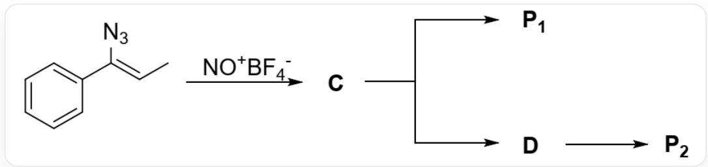
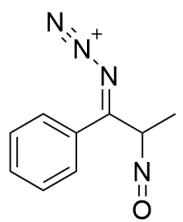
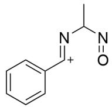
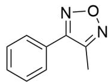
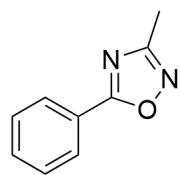

# 题目

有如下反应：

本图描述了几步有机串联反应。最开始的底物为C/C=C(N=[N+]=[N-])/C1=CC=CC=C1，与  $\mathrm{NO}^{+}\mathrm{BF}_{4}^{-}$  反应得到C，C有两个转化过程：C可以直接得到P1，C也可以首先转化为D，D再转化为P2。

已知：

1. C, D均为带一个正电荷的中间体且均只含一个环。  
2.  $\mathbf{P}_1, \mathbf{P}_2$  均含有五元环。

下列说法正确的是：

A. 其他选项均不正确  
B.  $\mathbf{P}_{1}$  存在键联关系  $\mathrm{N} - \mathrm{C} - \mathrm{N}$  
C.  $\mathbf{P}_{1}$  存在键联关系  $\mathrm{N} - \mathrm{C} - \mathrm{O} - \mathrm{N}$  
D.  $\mathbf{P}_{1}$  存在键联关系  $\mathrm{O} - \mathrm{C} - \mathrm{CH}_{3}$  
E.  $\mathbf{P}_{2}$  存在键联关系  $\mathrm{O} - \mathrm{C} - \mathrm{N} - \mathrm{CH}_{3}$

F.  $\mathbf{P}_{2}$  存在键联关系  $\mathrm{N} - \mathrm{O} - \mathrm{N} - \mathrm{C}$  
G.  $\mathbf{P}_{2}$  存在键联关系  $\mathrm{N} - \mathrm{O} - \mathrm{N}$

# 答案

正确答案: A

# 详细解析

$\mathrm{NO}^{+}\mathrm{BF}_{4}^{-}$ 中的  $\mathrm{NO}^{+}$ 是强亲电试剂，底物中存在烯胺结构，从而烯胺的碳原子亲核  $\mathrm{NO}^{+}$ 的正电性氮原子，得到亚硝基取代基，生成中间体C，结构为CC(N=O)/C(C1=CC=CC=C1)=N/[N+#N。

# CHECKPOINT

1 PTS

烯胺的碳原子亲核  $\mathrm{NO}^{+}$  的正电性氮原子

# CHECKPOINT

1 PTS

C结构为CC(N=O)/C(C1=CC=CC=C1)=N/[N+]#N

C极易离去一个氮气变成六电子氮正离子；故烯胺的氮原子此时具有亲电性。观察C的结构，氮气的离去可以由邻近基团参与帮助离去；

# CHECKPOINT

1 PTS

C极易离去一个氮气，烯胺的氮原子此时具有亲电性

# CHECKPOINT

1 PTS

氮气的离去可以由邻近基团参与帮助离去

底物中的亚硝基的氧原子具有亲核性，可以进攻烯胺的氮原子帮助氮气离去，此时会直接生成五元环产物，不经过其他中间体，故通过该途径生成的产物为  $\mathbf{P}_{1}$ ，结构为CC1=NON=C1C2=CC=CC=C2。

# CHECKPOINT

1 PTS

亚硝基的氧原子进攻烯胺的氮原子帮助氮气离去，不经过其他中间体

# CHECKPOINT

2 PTS

$\mathbf{P_1}$  结构为CC1=NON=C1C2=CC=CC=C2

底物中, 烯胺的碳原子连接的两个基团可以发生1, 2迁移反应协助氮气离去;

# CHECKPOINT

1 PTS

烯胺的碳原子连接的两个基团可以发生1，2迁移反应协助氮气离去

如果苯基进行迁移，得不到五元环产物，不考虑该可能性；

# CHECKPOINT

1 PTS

苯基进行迁移，得不到五元环产物

如果连有亚硝基的二级碳原子发生迁移，此时氮气离去，得到  $\mathbf{sp}^2$  的碳正离子中间体D，结构为 $\mathrm{CC(N = O) / N = [C + ] / C1 = CC = CC = C1}$ 。

# CHECKPOINT

1 PTS

连有亚硝基的二级碳原子发生迁移，得到  $\mathrm{sp}^2$  的碳正离子中间体

# CHECKPOINT

1 PTS

D结构为  $\mathrm{CC}(\mathrm{N} = 0) / \mathrm{N} = [\mathrm{C} + ] / \mathrm{C}1 = \mathrm{CC} = \mathrm{CC} = \mathrm{C}1$

该中间体的碳正离子被亚硝基的氧原子进攻，形成五元环产物  $\mathbf{P}_2$  ，结构为CC1=NOC(C2=CC=CC=C2)=N1。

# CHECKPOINT

2 PTS

$\mathbf{P}_2$  结构为CC1=NOC(C2=CC=CC=C2)=N1

根据  $\mathbf{P}_2$  和  $\mathbf{P}_1$  的结构判断，选项B-G均不正确，选项A正确。

  
C

  
D

  
P1

  
P2

该图给出了本题涉及到的未知物种结构，中间体C结构为CC(N=O)/C(C1=CC=CC=C1)=N/[N+]#N；中间体D结构为CC(N=O)/N=[C+]/C1=CC=CC=C1；产物P1结构为CC1=NON=C1C2=CC=CC=C2；P2结构为

$$
C C 1 = N O C (C 2 = C C = C C = C 2) = N 1
$$