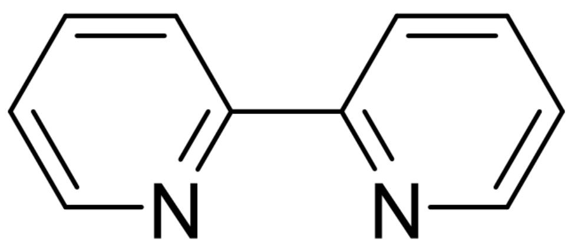
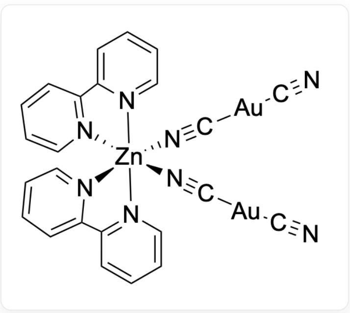

# Question

$\mathbf{X}$  is a common  $\mathbf{M}$ -containing compound, which can be obtained by treating an anhydrous ether solution of  $\mathrm{MCl}_3$  with hydrogen sulfide at low temperature (reaction 1).  $\mathbf{X}$  is readily soluble in potassium cyanide solution, and the products contain two different sulfur-containing anions (reaction 2).

$\mathbf{Y}$  is a neutral complex containing low-valent  $\mathbf{M}$ . Refluxing  $\mathbf{Z}$  (containing  $\mathbf{M} 68 \%$ ),  $\mathrm{Zn(NO_3)_2 \cdot 6H_2O}$ , and  $\mathbf{L}$  in anhydrous acetonitrile solvent for  $5\mathrm{min}$ , followed by crystallization of the resulting solution under an inert atmosphere, yields the complex  $\mathbf{Y}$  (reaction 3). The structure of  $\mathbf{L}$  is known as:

  
C1=CC(=NC=C1)C2=NC=CC=C2, i.e., the structure of [L]

In  $\mathbf{Y}$ , both  $\mathbf{Zn}$  and  $\mathbf{M}$  exhibit only one coordination number, and no mirror plane is present. Elemental analysis of  $\mathbf{Y}$  yields: N 12.8; C 32.9; Zn 7.46 (all in mass fraction, %).

Which of the following statements are correct?

1. Reaction 1 is a redox reaction, and the oxidation state of M remains unchanged in reaction 2.  
2. In the simplest balanced equation for reaction 1, the sum of all coefficients on the reactant side and the product side is 14.  
3. In reaction 2, the mass fraction ratio of sulfur in the two anions is 1: 0.55.

4. In the simplest balanced equation for reaction 2, the sum of all coefficients on the reactant side and the product side is 12.  
5. In the simplest balanced equation for reaction 3, the sum of all coefficients on the reactant side and the product side is 13.  
6.  $\mathbf{Y}$  is chiral.  
7.  $\mathbf{Y}$  has a total of 4 reasonable stereoisomers.

A. 0  
B. 1  
C. 2  
D. 3  
E. 4  
F. 5  
G. 6  
H. 7

# Answer

Correct Answer: D

# Detailed Explanation

Analysis of the mass fractions of  $\mathbf{Y}$ :

$$
n (\mathrm {N}): n (\mathrm {Z n}) = \frac {1 2 . 8}{1 4 . 0 1}: \frac {7 . 4 6}{6 5 . 4 1} = 8: 1
$$

$$
n (\mathrm {C}): n (\mathrm {Z n}) = \frac {3 2 . 9}{1 2 . 0 1}: \frac {7 . 4 6}{6 5 . 4 1} = 2 4: 1
$$

# CHECKPOINT

1 PTS

In  $\mathbf{M}$ ,  $n(\mathrm{C}): n(\mathrm{N}): n(\mathrm{Zn}) = 24:8:1$

The chemical formula of  $\mathbf{L}$  is  $\mathrm{C_{10}H_8N_2}$ , containing  $10\mathrm{C}$  and  $2\mathrm{N}$ . Assuming only one  $\mathrm{Zn}$ , there should be  $2\mathbf{L}$  molecules, leaving  $4\mathrm{C}$  and  $4\mathrm{N}$ . Considering  $\mathrm{CN^{-}}$ , the molecular weight of  $\mathbf{Y}$  can be calculated:

$$
M r (\mathbf {Y}) = \frac {65.41}{7.46 \%} = 876.8
$$

After subtracting one  $\mathrm{Zn}$  and two  $\mathbf{L}$  ( $M_r = 156.184$ ), 499.022 remains. Assuming the remainder is  $4\mathrm{CN}^{-}$ , 394.942 is left, corresponding to two  $\mathrm{Au}$ . Examining the oxidation states:  $\mathrm{Zn}$  is  $+2$ , so  $\mathrm{Au}$  is  $+1$ , which aligns with chemical principles. Therefore,  $\mathbf{M}$  is  $\mathrm{Au}$ , and the chemical formula of  $\mathbf{Y}$  is  $\mathrm{ZnL}_2[\mathrm{Au}(\mathrm{CN})_2]_2$ .

# CHECKPOINT

1 PTS

M is Au

# CHECKPOINT

1 PTS

The chemical formula of  $\mathbf{Y}$  is  $\mathrm{ZnL}_2[\mathrm{Au}(\mathrm{CN})_2]_2$

Knowing  $\mathbf{M}$  is Au and  $\mathbf{Y}$  contains  $\mathrm{CN}^{-}$ , the chemical formula of  $\mathbf{Z}$  (containing  $\mathbf{M} 68\%$ ) can be deduced as  $\mathrm{KAu(CN)}_{2}$ .

# CHECKPOINT

1 PTS

The chemical formula of  $\mathbf{Z}$  is  $\mathrm{KAu(CN)_2}$

Thus, reaction 3 is:

$$
2 \mathrm {K} [ \mathrm {A u} (\mathrm {C N}) _ {2} ] + \mathrm {Z n} (\mathrm {N O} _ {3}) _ {2} \cdot 6 \mathrm {H} _ {2} \mathrm {O} + 2 \mathrm {L} \rightarrow \mathrm {Z n L} _ {2} [ \mathrm {A u} (\mathrm {C N}) _ {2} ] _ {2} + 2 \mathrm {K N O} _ {3} + 6 \mathrm {H} _ {2} \mathrm {O}
$$

# CHECKPOINT

1 PTS

Reaction 3:  $2\mathrm{K}[\mathrm{Au}(\mathrm{CN})_2] + \mathrm{Zn}(\mathrm{NO}_3)_2 \cdot 6\mathrm{H}_2\mathrm{O} + 2\mathrm{L} \rightarrow \mathrm{ZnL}_2[\mathrm{Au}(\mathrm{CN})_2]_2 + 2\mathrm{KNO}_3 + 6\mathrm{H}_2\mathrm{O}$

The total coefficient sum is 14, so option 5 is incorrect.

For reaction 1:

$$
2 \mathrm {A u C l} _ {3} + 3 \mathrm {H} _ {2} \mathrm {S} \rightarrow \mathrm {A u} _ {2} \mathrm {S} _ {3} + 6 \mathrm {H C l}
$$

# CHECKPOINT

1 PTS

Reaction 1:  $2\mathrm{AuCl}_3 + 3\mathrm{H}_2\mathrm{S} \rightarrow \mathrm{Au}_2\mathrm{S}_3 + 6\mathrm{HCl}$

Thus,  $\mathbf{X}$  is  $\mathrm{Au}_2\mathrm{S}_3$ . The sum of all coefficients on the reactant and product sides in the simplest integer equation for reaction 1 is 12, so option 2 is incorrect.

X readily dissolves in potassium cyanide solution, producing two different sulfur-containing anions (reaction 2):  $\mathrm{S}^{2-}$  and  $\mathrm{SCN}^{-}$ . The mass fraction of sulfur in  $\mathrm{S}^{2-}$  is  $100\%$ , while in  $\mathrm{SCN}^{-}$ it is  $55\%$ , so option 3 is correct.

# CHECKPOINT

1 PTS

The two anions produced in reaction 2 are  $\mathrm{S}^{2-}$  and  $\mathrm{SCN}^{-}$

Since the oxidation state of sulfur changes, the oxidation state of  $\mathbf{M}$  must also change in reaction 2, whereas it remains unchanged in reaction 1. Thus, option 1 is incorrect.

# CHECKPOINT

1 PTS

The oxidation state of  $\mathbf{M}$  does not change in reaction 1 but changes in reaction 2

The equation for reaction 2 can be written as:

$$
\mathrm {A u} _ {2} \mathrm {S} _ {3} + 6 \mathrm {K C N} \rightarrow 2 \mathrm {K} [ \mathrm {A u} (\mathrm {C N}) _ {2} ] + \mathrm {K} _ {2} \mathrm {S} + 2 \mathrm {K S C N}
$$

The sum of all coefficients on the reactant and product sides in the simplest integer equation for reaction 2 is 12, so option 4 is correct.

From  $\mathbf{Y}$ , where  $\mathbf{Zn}$  and  $\mathbf{M}$  each have only one coordination number and no mirror plane, the structure of  $\mathbf{Y}$  is:

N#C[Au]C#[N][Zn]1([N]2=C3C=CC=C2)([N]#C[Au]C#[N]([N]4=CC=CC=C43)[N]5=CC=CC=C5C6=[N]1C=CC=C6

# CHECKPOINT

2 PTS

The structure of Y is N#C[Au]C#[N][Zn]1([N]2=C3C=CC=C2) ([N]#C[Au]C#N) ([N]4=CC=CC=C43) [N]5=CC=CC=C5C6=[N]1C=CC=C6

Clearly,  $\mathbf{Y}$  is chiral and has 3 reasonable stereoisomers. Option 6 is correct, and option 7 is incorrect.

# CHECKPOINT

1 PTS

$\mathbf{Y}$  is chiral

# CHECKPOINT

1 PTS

$\mathbf{Y}$  has 3 reasonable stereoisomers

In summary, 3 options are correct (3, 4, 6), so the answer is D.