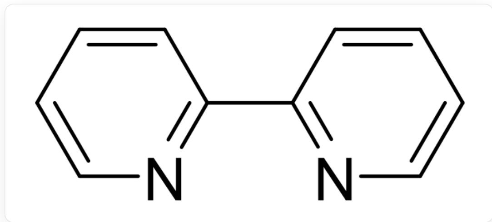
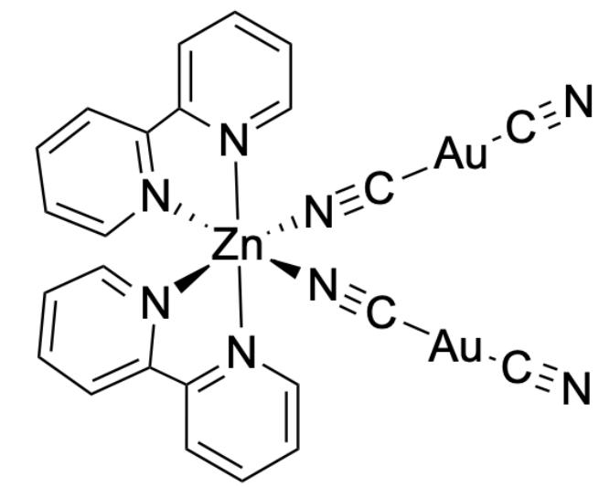

# 题目

X是一种常见的含M化合物，低温下用硫化氢处理  $\mathrm{MCl}_3$  的无水乙醚溶液即可得到X(反应1)。X易溶于氰化钾溶液，产物中包含两种不同的含硫阴离子(反应2)。

Y是一种含低价M的电中性配合物。将Z（含M68%）、 $\mathrm{Zn(NO_3)_2 \cdot 6H_2O}$ 和L在无水乙腈溶剂中回流5min，所得溶液在惰性气氛下结晶即可得到配合物Y(反应3)。已知L的结构为：

  
C1=CC(=NC=C1)C2=NC=CC=C2，即[L]的结构

Y中Zn和M均只有一种配位数，不含镜面；对Y元素分析可得：N12.8;C32.9;Zn7.46(均为质量分数， $\%$ ）。

则下列说法正确的有几个？

1. 反应 1 是氧化还原反应, 反应 2 中  $\mathbf{M}$  的价态不改变  
2. 反应1的最简整系数方程式中反应物一侧与产物一侧的所有系数之和为14  
3. 反应2中两种阴离子的硫元素质量分数之比为1: 0.55  
4. 反应 2 的最简整系数方程式中反应物一侧与产物一侧的所有系数之和为 12  
5. 反应 3 的最简整系数方程式中反应物一侧与产物一侧的所有系数之和为 13  
6. Y具有手性

# 7. Y 总计有 4 种合理的立体异构体

A. 0  
B. 1  
C. 2  
D. 3  
E. 4  
F. 5  
G. 6  
H. 7

# 答案

正确答案: D

# 详细解析

对  $\mathbf{Y}$  的质量分数进行分析：

$$
n (\mathrm {N}): n (\mathrm {Z n}) = \frac {1 2 . 8}{1 4 . 0 1}: \frac {7 . 4 6}{6 5 . 4 1} = 8: 1
$$

$$
n (\mathrm {C}): n (\mathrm {Z n}) = \frac {3 2 . 9}{1 2 . 0 1}: \frac {7 . 4 6}{6 5 . 4 1} = 2 4: 1
$$

# CHECKPOINT

M中  $n(\mathrm{C}):n(\mathrm{N}):n(\mathrm{Zn}) = 24:8:1$

# 1 PTS

$\mathbf{L}$  化学式为  $\mathrm{C_{10}H_8N_2}$  中有10个C和2个N，假设只有一个Zn，则应该有2个L，除此之外还剩4个C和4个N，考虑  $\mathrm{CN^{-}}$  ，且可由此求得Y的分子量：

$$
M r (\mathbf {Y}) = \frac {65.41}{7.46 \%} = 876.8
$$

除去一个  $\mathrm{Zn}$  和两个  $\mathbf{L}$  （ $M_r = 156.184$ ）后还剩499.022，假设剩下是4个  $\mathrm{CN}^-$ ，则剩余394.942，正好对应于两个  $\mathrm{Au}$ ，考察一下价态， $\mathrm{Zn}$  为  $+2$  价，则  $\mathrm{Au}$  为  $+1$  价，符合化学常识。因此  $\mathbf{M}$  为  $\mathrm{Au}$ ， $\mathbf{Y}$  的化学式为  $\mathrm{ZnL}_2[\mathrm{Au}(\mathrm{CN})_2]_2$ 。

# CHECKPOINT

M为Au

# 1 PTS

# CHECKPOINT

1 PTS

$\mathbf{Y}$  的化学式为  $\mathrm{ZnL_2[Au(CN)_2]_2}$

知道  $\mathbf{M}$  为  $\mathrm{Au}$ ，且  $\mathbf{Y}$  中含有  $\mathrm{CN}^{-}$ 后便可以推得  $\mathbf{Z}$ （含  $\mathrm{M}68\%$ ）的化学式为  $\mathrm{KAu(CN)}_{2}$ 。

# CHECKPOINT

1 PTS

$\mathbf{Z}$  的化学式为  $\mathrm{KAu(CN)_2}$

则反应3为：

$$
2 \mathrm {K} [ \mathrm {A u} (\mathrm {C N}) _ {2} ] + \mathrm {Z n} (\mathrm {N O} _ {3}) _ {2} \cdot 6 \mathrm {H} _ {2} \mathrm {O} + 2 \mathrm {L} \rightarrow \mathrm {Z n L} _ {2} [ \mathrm {A u} (\mathrm {C N}) _ {2} ] _ {2} + 2 \mathrm {K N O} _ {3} + 6 \mathrm {H} _ {2} \mathrm {O}
$$

# CHECKPOINT

1 PTS

反应3：  $2\mathrm{K}[\mathrm{Au}(\mathrm{CN})_2] + \mathrm{Zn}(\mathrm{NO}_3)_2\cdot 6\mathrm{H}_2\mathrm{O} + 2\mathbf{L}\rightarrow \mathrm{ZnL}_2[\mathrm{Au}(\mathrm{CN})_2]_2 + 2\mathrm{KNO}_3 + 6\mathrm{H}_2\mathrm{O}$

总系数和为14，选项5错误。

由此，反应1：

$$
2 \mathrm {A u C l} _ {3} + 3 \mathrm {H} _ {2} \mathrm {S} \rightarrow \mathrm {A u} _ {2} \mathrm {S} _ {3} + 6 \mathrm {H C l}
$$

# CHECKPOINT

1 PTS

反应1：  $2\mathrm{AuCl}_3 + 3\mathrm{H}_2\mathrm{S}\rightarrow \mathrm{Au}_2\mathrm{S}_3 + 6\mathrm{HCl}$

因此  $\mathbf{X}$  为  $\mathrm{Au}_2\mathrm{S}_3$  ，反应1的最简整系数方程式中反应物一侧与产物一侧的所有系数之和为12，选项2错误。

X易溶于氰化钾溶液，产物中包含两种不同的含硫阴离子(反应2)，只能为  $\mathrm{S}^{2-}$  和  $\mathrm{SCN}^{-}$ ， $\mathrm{S}^{2-}$  硫的质量分数为  $100\%$ ， $\mathrm{SCN}^{-}$  为  $55\%$ ，选项3正确。

# CHECKPOINT

1 PTS

反应2中产生的两种阴离子为  $\mathrm{S}^{2-}$  和  $\mathrm{SCN}^{-}$

由于硫的价态发生改变，因此反应2中M的价态一定会改变，而反应1中M的价态不改变，选项1错误。

# CHECKPOINT

1 PTS

反应1中M的价态不改变，而反应2中M的价态改变

可以写出反应2的方程式：

$$
\mathrm {A u} _ {2} \mathrm {S} _ {3} + 6 \mathrm {K C N} \rightarrow 2 \mathrm {K} [ \mathrm {A u} (\mathrm {C N}) _ {2} ] + \mathrm {K} _ {2} \mathrm {S} + 2 \mathrm {K S C N}
$$

反应2最简整系数方程式中反应物一侧与产物一侧的所有系数之和为12，选项4正确。

由  $\mathbf{Y}$  中  $\mathrm{Zn}$  和  $\mathbf{M}$  均只有一种配位数，不含镜面，可以得到  $\mathbf{Y}$  ：

N#C[Au]C#[N][Zn]1([N]2=C3C=CC=C2)([N]#C[Au]C#[N]([N]4=CC=CC=C43)[N]5=CC=CC=C5C6=[N]1C=CC=C6

# CHECKPOINT

2 PTS

Y 的结构为 N#C[Au]C#[N][Zn]1([N]2=C3C=CC=C2) ([N]#C[Au]C#[N]([N]4=CC=CC=C43)[N]5=CC=CC=C5C6=[N]1C=CC=C6

显然  $\mathbf{Y}$  具有手性且拥有3种合理的立体异构体。6正确，7错误。

# CHECKPOINT

1 PTS

Y具有手性

# CHECKPOINT

1 PTS

Y拥有3种合理的立体异构体

综上，共3个选项正确（3，4，6），答案选D.