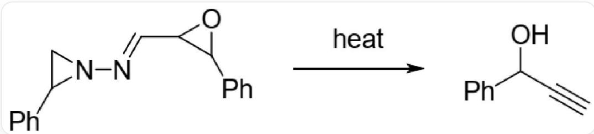

# 题目

1995年，Kim教授课题组报道了如下反应：

  
N1(CC1C2=CC=CC=C2)/N=C/C3C(C4=CC=CC=C4)O3在加热条件下得到C#CC(C1=CC=CC=C1)O

机理研究表明，在加热条件下，底物分子先发生分解得到A和B，A的分子量约为104，B发生开环得到C，C发生分子内质子转移得到D，D再放出一分子气体得到E，E发生1,2-H迁移即可得到产物。

有以下说法：

1. A 的不饱和度为 5  
2.B为1,3-偶极体  
3.C具有电荷分离的结构且正负形式电荷所在原子种类不同  
4. D放出的气体不是大气中常见气体  
5. E 中所有原子（除氢原子）均满足八隅律

以下选项中包含正确说法最多的一项是

A. 所有说法均错误  
B. 1,2,3

C. 2,3,4  
D. 3,4,5  
E. 4,5  
F. 2,3,4,5  
G. 1,2  
H. 1,3  
1,5  
J. 2,4  
K. 2,3,5  
L. 2,5  
M. 3,4  
N. 2,4,5  
O. 1,2,4  
P. 1,3,5

Q. 2,3,4

# 答案

正确答案: B

# 详细解析

底物中的2-苯基吖丙啶环很容易在加热时发生环开环反应，消除苯乙烯，苯乙烯的分子量恰好为104，因此A为苯乙烯。

# CHECKPOINT

1 PTS

2-苯基吖丙啶环消除产生A，A为苯乙烯，不饱和度为5，说法1正确

剩余B的结构为`[N-]=[N+]=CC1C(C2=CC=CC=C2)O1`，为1,3-偶极体

# CHECKPOINT

1 PTS

B 的结构为`[N-] = [N+] = CC1C(C2 = CC = CC = C2)O1`，为1,3-偶极体，说法2正确

B 发生开环，氮上负电荷进攻打开环氧环，得到 C：`[O-]C(C1=CC=CC=C1)/C=C\{N+\}#N`，形式电荷分别位于氮和氧上。

# CHECKPOINT

1 PTS

C 的结构为`[O-]C(C1=CC=CC=C1)/C=C\{N+\}#N`，形式电荷分别位于氮和氧上，说法3正确

C 发生分子内质子转移得到 D，氧负离子可以夺取重氮所连碳原子上的氢，得到  $\mathrm{OC}(\mathrm{C}1 = \mathrm{CC} = \mathrm{CC} = \mathrm{C}1) / \mathrm{C} =$ $[\mathrm{C}-]\backslash[\mathrm{N}^{+}]\# \mathrm{N}^{\prime}$ ，加热条件下重氮基团可以分解产生氮气，为 D 生成 E 一步产生的气体。

# CHECKPOINT

1 PTS

D生成E时释放氮气，为大气中常见气体，说法4错误

离去氮气后，原位产生卡宾E，结构为 $\mathrm{OC}(\mathrm{C}1 = \mathrm{CC} = \mathrm{CC} = \mathrm{C}1)\mathrm{C} = [\mathrm{C}]^{\prime}$ ，随后发生氢迁移，一个烯基氢迁移至卡宾处得到产物。

# CHECKPOINT

1 PTS

E中含有卡宾，卡宾碳原子不符合八隅律，说法5错误

故正确说法为1,2,3，选择选项B