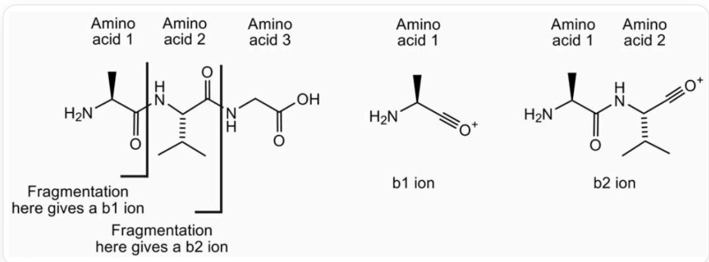
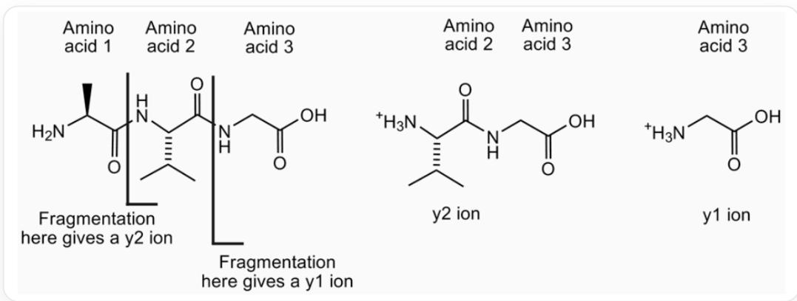
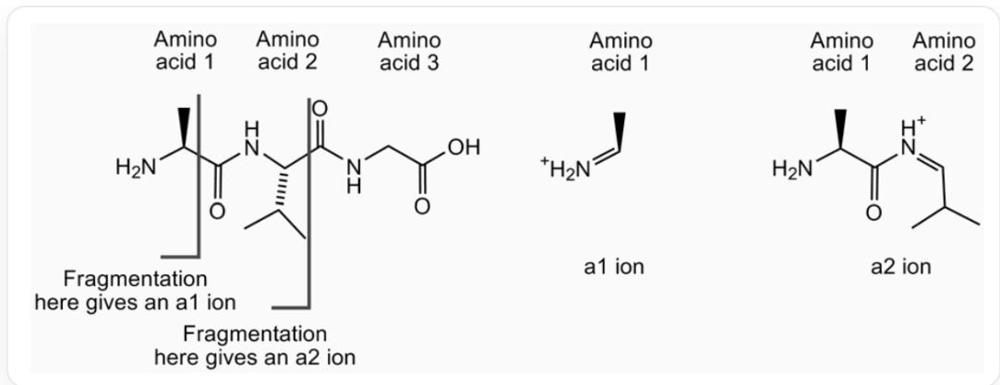
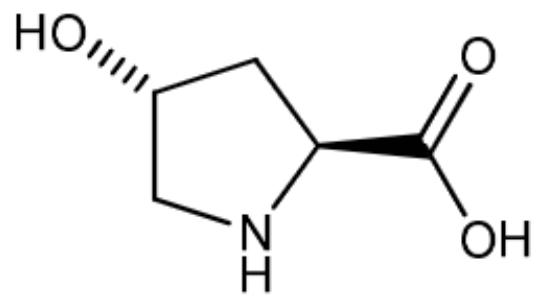

# 题目

串联质谱技术是多肽测序的快速方法，这项技术包括母离子的形成以及碎裂化成更小的离子。在多肽中，碎裂化经常在多肽骨架上发生。碎片离子的命名取决于碎裂化发生在哪个位点，还有哪个原子带正电荷。例如，丙氨酰-亮氨酰-甘氨酸形成的一些离子如下图所示：

对于三肽丙氨酰-亮氨酰-甘氨酸，从丙氨酰-亮氨酰之间的酰胺键断裂，多肽碎裂后的N端得到丙氨酰鎘离子记为  $b_{1}$  离子，从亮氨酰-甘氨酸之间的酰胺键断裂，多肽碎裂后的N端得到丙氨酰-亮氨酰鎘离子记为  $b_{2}$

离子

对于三肽丙氨酰-亮氨酰-甘氨酸，从丙氨酰-亮氨酰之间的酰胺键断裂，多肽碎裂后的C端得到质子化的亮氨酰-甘氨酸铵离子记为  $y_{2}$  离子，从亮氨酰-甘氨酸之间的酰胺键断裂，多肽碎裂后的C端得到质子化的甘

氨酸铵离子记为  $y_{1}$  离子

对于三肽丙氨酰-亮氨酰-甘氨酸，从丙氨酰内部的羰基碳与羰基  $\alpha-$  碳之间的碳碳键断裂，多肽碎裂后的N端得到质子化的亚铵离子记为  $a_{1}$  离子，从亮氨酰-甘氨酸内部的羰基碳与羰基  $\alpha-$  碳之间的碳碳键断裂，多肽碎裂后的N端得到质子化的丙氨酰亚铵离子记为  $a_{2}$  离子

科学家从一史前生物骨化石中，提取出了某蛋白质，其19肽的碎片质谱数据如下表所示：

<table><tr><td>ion</td><td>m/z</td><td>ion</td><td>m/z</td><td>ion</td><td>m/z</td><td>ion</td><td>m/z</td></tr><tr><td>y1</td><td>175.1</td><td>b5</td><td>715.3</td><td>y8</td><td>986.5</td><td>b12</td><td>1400.7</td></tr><tr><td>a2</td><td>249.1</td><td>y6</td><td>726.4</td><td>b9</td><td>1069.5</td><td>y14</td><td>1508.8</td></tr><tr><td>y2</td><td>272.2</td><td>a6</td><td>800.4</td><td>y9</td><td>1083.5</td><td>b14</td><td>1612.7</td></tr><tr><td>y3</td><td>401.2</td><td>y7</td><td>823.4</td><td>b10</td><td>1140.5</td><td>a15</td><td>1681.8</td></tr><tr><td>a4</td><td>501.2</td><td>b6</td><td>828.4</td><td>a11</td><td>1209.6</td><td>y15</td><td>1694.9</td></tr><tr><td>b4</td><td>529.2</td><td>b7</td><td>885.4</td><td>y11</td><td>1267.6</td><td>y16</td><td>1831.9</td></tr><tr><td>y5</td><td>611.4</td><td>a8</td><td>928.4</td><td>y12</td><td>1338.7</td><td>y17</td><td>1946.9</td></tr><tr><td>a5</td><td>687.3</td><td>b8</td><td>956.5</td><td>y13</td><td>1395.7</td><td>b17</td><td>1951.9</td></tr></table>

已知已知多肽的前两个氨基酸是Tyr-Leu，多肽序列中包括一种羟脯氨酸，表示为Hyp，质量数是131.1，结构如下：

  
C1[C@H](CN[C@@H]1C(=O)O)O

利用质谱离子质量表，确定尽可能准确的多肽序列。在多肽序列中，对于无法确定确切种类的氨基酸，根据计算与推理，考虑当一个位置存在的多种氨基酸的所有可能。

根据你推断的最可能的多肽序列，从如下的一些现代物种中得到的同源蛋白质序列的部分序列中（以下序列中羟脯氨酸和脯氨酸都缩写为P)，挑选出与之最为接近的一个现代物种。

<table><tr><td>物种</td><td>序列</td></tr><tr><td>鲤鱼</td><td>DLTVAQLESLKEVCEANLACEHMMDVSGIIAAYTAYYGPIPY</td></tr><tr><td>鸡</td><td>HYAQDSGVAGAPPNPLEAQREVCELSPDCDELADQIGFQEAYRRFYGPV</td></tr><tr><td>牛</td><td>YLDHWLGAPAPYPDPLEPKREVCELNPDCDELADHIGFQEAYRRFYGPV</td></tr><tr><td>马</td><td>YLDHWLGAPAPYPDPLEPRPREVCELNPDCDELADHIGFQEAYRRFYGPV</td></tr><tr><td>人类</td><td>YLYQWLGAPVPYPDPLEPRPREVCELNPDCDELADHIGFQEAYRRFYGPV</td></tr><tr><td>兔子</td><td>QLINGQGAPAPYPDPLEPKREVCELNPDCDELADQVGLQDAYQRFYGPV</td></tr><tr><td>羊</td><td>YLDPGLGAPAPYPDPLEPRPREVCELNPDCDELADHIGFQEAYRRFYGPV</td></tr><tr><td>蟾蜍</td><td>SYGNNVGQGAAVGSPLESQREVCELNPDCDELADHIGFQEAYRRFYGPV</td></tr></table>

A. 鲤鱼  
B. 鸡  
C. 牛  
D. 马  
E. 人类  
F. 兔子  
G. 羊  
H. 蝙蜍

# 答案

正确答案: D

# 详细解析

离子  $y_{1}$  的质量可用于确定多肽中最后一个氨基酸的身份。  $y_{1}$  离子的质量比相应的氨基酸大一个质量单位；因此最后一个氨基酸必定是精氨酸(Arg)。

# CHECKPOINT

1 PTS

指出  $y_{1}$  是精氨酸Arg

y系列离子是最完整的，通过比较连续y离子的质量可以确定序列：

<table><tr><td>离子</td><td>m/z</td><td>bn和bn-1之间的质量差</td><td>对应的氨基酸</td><td>氨基酸质量</td></tr><tr><td>y1</td><td>175.1</td><td></td><td></td><td></td></tr><tr><td>y2</td><td>272.2</td><td>97.1</td><td>18</td><td>115.1</td></tr><tr><td>y3</td><td>401.2</td><td>129.0</td><td>17</td><td>147.0</td></tr><tr><td>y4</td><td></td><td></td><td></td><td></td></tr><tr><td>y5</td><td>611.4</td><td></td><td></td><td></td></tr><tr><td>y6</td><td>726.4</td><td>115.0</td><td>14</td><td>133.0</td></tr><tr><td>y7</td><td>823.4</td><td>97.1</td><td>13</td><td>115.1</td></tr><tr><td>y8</td><td>986.5</td><td>163.1</td><td>12</td><td>181.1</td></tr><tr><td>y9</td><td>1083.5</td><td>97.1</td><td>11</td><td>115.1</td></tr><tr><td>y10</td><td></td><td></td><td></td><td></td></tr><tr><td>y11</td><td>1267.6</td><td></td><td></td><td></td></tr><tr><td>y12</td><td>1338.7</td><td>71.0</td><td>8</td><td>89.0</td></tr><tr><td>y13</td><td>1395.7</td><td>57.0</td><td>7</td><td>75.0</td></tr><tr><td>y14</td><td>1508.8</td><td>113.1</td><td>6</td><td>131.1</td></tr><tr><td>y15</td><td>1694.9</td><td>186.1</td><td>5</td><td>204.1</td></tr><tr><td>y16</td><td>1831.9</td><td>137.1</td><td>4</td><td>155.1</td></tr><tr><td>y17</td><td>1946.9</td><td>115.0</td><td>3</td><td>133.0</td></tr></table>

# CHECKPOINT

1 PTS

分析y系列离子的序列

根据y系列，序列为：

Tyr-Leu-Asp-His-Trp-Leu/Ile/Hyp-Gly-Ala-xxx-xxx-Pro-Tyr-Pro-Asp-xxx-xxx-Glu-Pro-Arg

# CHECKPOINT

5 PTS

根据y系列离子得到多肽序列为Tyr-Leu-Asp-His-Trp-Leu/Ile/Hyp-Gly-Ala-[未确定]-[未确定]-Pro-Tyr-Pro-Asp-[未确定]-[未确定]-Glu-Pro-Arg

序列中第15个氨基酸的身份可以通过  $b_{14}$  和  $a_{15}$  之间的质量差来确定：

$$
M _ {r} (\text {氨 基 酸} 1 5) = \text {质 量} (a _ {1 5}) - \text {质 量} (a _ {1 4}) + M _ {r} (\mathrm {C}) + 2 M _ {r} (\mathrm {O}) + 2 M _ {r} (\mathrm {H}) = 1 1 5. 0
$$

因此，氨基酸15必定是脯氨酸(Pro)。

# CHECKPOINT

1 PTS

确定第15号氨基酸为脯氨酸Pro

离子  $y_{3}$  和  $y_{5}$  之间的质量差给出了对应于氨基酸15和16的片段质量。

$$
M _ {r} (1 5 - 1 6 \text {二 肽}) = \text {质 量} (y _ {5}) - \text {质 量} (y _ {3}) + M _ {r} (H _ {2} O)
$$

$$
M _ {r} (\text {氨 基 酸} 1 6) = M _ {r} (1 5 - 1 6 \text {二 肽}) - M _ {r} (\text {氨 基 酸} 1 5) + M _ {r} (H _ {2} O) = 1 3 1. 1
$$

因此，氨基酸16必定是异亮氨酸(Ile)、亮氨酸(Leu)或羟脯氨酸(Hyp)。

# CHECKPOINT

1 PTS

确定第16号氨基酸为异亮氨酸Ile、亮氨酸Leu或羟脯氨酸Hyp

氨基酸10的质量可以通过  $b_{9}$  和  $b_{10}$  之间的质量差来确定：

$$
M _ {r} (\mathrm {氨 基 酸} 1 0) = \mathrm {质 量} (b _ {1 0}) - \mathrm {质 量} (b _ {9}) + M _ {r} (H _ {2} O)
$$

氨基酸10是丙氨酸(Ala)。

# CHECKPOINT

1 PTS

确定第10号氨基酸为丙氨酸Ala

离子  $y_{11}$  和  $y_{9}$  之间的质量差给出了对应于氨基酸9和10的片段质量。

$$
M _ {r} (9 - 1 0 \text {二 肽}) = \text {质 量} \left(y _ {1 1}\right) - \text {质 量} \left(y _ {9}\right) + M _ {r} \left(H _ {2} O\right)
$$

$$
M _ {r} (\text {氨 基 酸} 9) = M _ {r} (9 - 1 0 \text {二 肽}) - M _ {r} (\text {氨 基 酸} 1 0) + M _ {r} (H _ {2} O)
$$

氨基酸9的质量为131.1，因此必定是异亮氨酸(Ile)、亮氨酸(Leu)或羟脯氨酸(Hyp)。

# CHECKPOINT

1 PTS

确定第9号氨基酸为异亮氨酸Ile、亮氨酸Leu或羟脯氨酸Hyp

因此，该多肽的序列是：

$$
\begin{array}{l} \text {T y r - L e u - A s p - H i s - T r p - L e u / I l e / H y p - G l y - A l a - L e u / I l e / H y p - A l a - P r o - T y r - P r o - A s p - P r o - L e u / I l e / H y p - G l u - P r o - A r g} \end{array}
$$

为了验证史前生物蛋白质A与现代物种的亲缘关系，将推断出的19肽序列与给出的多种现代生物的同源蛋白质序列进行比对。比对的目的是找出匹配度最高的序列。

首先，表示出题目最终推断出的古代蛋白质序列。该序列包含三个不确定的氨基酸位点（位置6,9,16），可能是亮氨酸(L)、异亮氨酸(I)或羟脯氨酸(Hyp)。根据题目信息，在现代物种序列中，羟脯氨酸(Hyp)和脯氨酸(P)均用P表示。因此，在比对中，这三个模糊位点`X`可与L、I或P匹配。

古代19肽序列模式：

$$
^ {\prime} \mathrm {Y} - \mathrm {L} - \mathrm {D} - \mathrm {H} - \mathrm {W} - ^ {\prime \prime} \mathrm {X} ^ {\prime \prime} - \mathrm {G} - \mathrm {A} - ^ {\prime \prime} \mathrm {X} ^ {\prime \prime} - \mathrm {A} - \mathrm {P} - \mathrm {Y} - \mathrm {P} - \mathrm {D} - \mathrm {P} - ^ {\prime \prime} \mathrm {X} ^ {\prime \prime} - \mathrm {E} - \mathrm {P} - \mathrm {R} ^ {\prime}
$$

将上述古代序列模式与每个现代物种同源蛋白序列的前19个氨基酸进行逐一比对，并计算匹配的氨基酸数量。不匹配的氨基酸用粗体标出。

<table><tr><td>物种</td><td>比对序列(前19个氨基酸)</td><td>错配数量</td><td>相似度</td></tr><tr><td>古代序列模式</td><td>`YLDHWXGAXAPYPDPXEPR`</td><td>-</td><td>-</td></tr><tr><td>马(Horse)</td><td>`YLDHWLGAPAPYPDPLEPR`</td><td>0</td><td>19/19</td></tr><tr><td>牛(Cow)</td><td>`YLDHWLGAPAPYPDPLEP`K`</td><td>1</td><td>18/19</td></tr><tr><td>羊(Sheep)</td><td>`YLD``P`G`L`GAPAPYPDPLEPR`</td><td>2</td><td>17/19</td></tr><tr><td>人类(Human)</td><td>`YL``Y`Q`WLGAP`V`PYPDPLEPR`</td><td>3</td><td>16/19</td></tr><tr><td>兔子(Rabbit)</td><td>`Q``L``T``N``G``Q`GAPAPYPDPLEP`K`</td><td>6</td><td>13/19</td></tr><tr><td>鸡(Chicken)</td><td>`H``Y`A`Q`D`S`G`V`A`G`A`P`P`N`PLE`A`Q`</td><td>14</td><td>5/19</td></tr><tr><td>蟾蜍(Toad)</td><td>`S``Y`G`N`N`V`G`Q`G`A`A`V`G`S`PLE`S`Q`</td><td>15</td><td>4/19</td></tr><tr><td>鲤鱼(Carp)</td><td>`D``L``T`V`A`Q`L`E`S`L`K`E`V`C`E`A`N`L`A`</td><td>16</td><td>3/19</td></tr></table>

# CHECKPOINT

3 PTS

进行序列比对并得出正确结果，多肽序列相似性顺序为马>牛>羊>人类>兔子>鸡>蟾蜍>鲤鱼

从上表的比对结果可以看出，该序列与马的序列最为相似。

# CHECKPOINT

1 PTS

得出最相似序列为马的结论