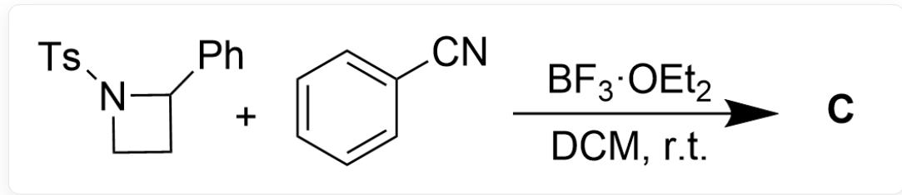
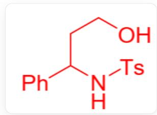
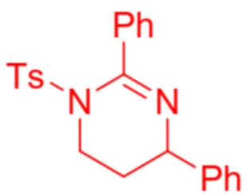

# Question

The construction of a nitrogen-containing four-membered ring can be achieved through the reaction route in Figure 1.

  
Fig. 1, the figure shows a three-step continuous reaction. The first step reaction is described by SMILES as: CC1=CC=C(S/(N=C/C2=CC=CC=C2)(=O)=O)C=C1 and C=C[Mg]Cl react to generate [[A]], where the reaction conditions are THF/Et $_2$ O, r.t. The second step is described by SMILES as: from [[A]] to generate [[B]], where the reaction conditions are BH $_3$ ·SMe $_2$ , then NaOH, H $_2$ O. The third step is described by SMILES as: [B] reacts with CC(OC/(N=N/C(OC(C)C)=O)=O)C to generate CC1=CC=C(S(N2CCC2C3=CC=C3)(=O)=O)C=C1, where the reaction conditions are PPh $_3$ , THF, r.t.

Propose the reaction mechanism and the structural formulas of intermediate products A and B.

The nitrogen-containing four-membered ring can also undergo the subsequent transformation shown in Figure 2:

  
Fig. 2, the reaction in the figure is described by SMILES as: CC1=CC=C(S(N2CCC2C3=CC=CC=C3)=(O)=O)C=C1 and N#CC4=CC=CC=C4 generate [[C]], where the reaction conditions are  $\mathrm{BF}_3\cdot \mathrm{OEt}_2$  , DCM, r. t.

Given

the

${}^{1}\mathbf{H}$

NMR

$\mathrm{(CDCl_3,400MHz)}$  7.52 (m, 4H), 7.43 (m, 1H), 7.34 - 7.24 (m, 7H), 7.13 (m, 2H), 4.59(dd,  $J = 8.56, 5.4 \mathrm{~Hz}, 1 \mathrm{H})$ , 3.95 (m, 1H), 3.87 (m, 1H), 2.43 (s, 3H)

(m,1H) of C. Propose the reaction mechanism and the structure of product C.

There are the following statements:

1. Intermediate product B contains a secondary hydroxyl group.  
2. The mechanism from intermediate product B to the nitrogen-containing four-membered ring structure is a free radical mechanism.  
3. Product C contains a total of three rings.  
4. A total of two new carbon-nitrogen bonds are formed in the process of the nitrogen-containing four-membered ring reacting with benzonitrile to obtain product C.

A. All other options are incorrect  
B. 1  
C. 2

D. 3  
E. 4  
F. 1,2  
G. 1,3  
H. 1,4  
1. 2,3  
J. 2,4  
K. 3,4  
L. 1,2,3  
M. 1,2,4  
N. 1,3,4  
O. 2,3,4  
P. 1,2,3,4

# Answer

Correct Answer: E

# Detailed Explanation

The first step is the addition of Grignard reagent to electrophilic imine, followed by work-up to obtain intermediate A, whose structure is shown in Figure 3.

  
Fig.3，图中分子以SMILES描述为：  $C = CC(C1 = CC = CC = C1)NS(C2 = CC = C(C)C = C2)(= 0) = 0$

# CHECKPOINT

1 PTS

Grignard reagent undergoes nucleophilic addition to imine, followed by work-up to obtain intermediate A, whose structure is described by SMILES as: C=CC(C1=CC=CC=C1)NS(C2=CC=C(C)C=C2)(=O)=O

In the second step, the intramolecular double bond undergoes hydroboration reaction with  $\mathrm{BH}_3\cdot \mathrm{SMe}_2$  to obtain a terminal borane compound.  $\mathrm{H}_2\mathrm{O}_2$  oxidizes the borane compound to obtain the terminal hydroxyl intermediate B, whose structure is shown in Figure 4.

  
Fig.4,图中分子以SMILES描述为：OCCC(C1=CC=CC=C1)NS(C2=CC=C(C)C=C2)=(O)=O

The hydroxyl group is a primary hydroxyl group, so statement 1 is incorrect.

# CHECKPOINT

1 PTS

Hydroboration reaction occurs, and hydrogen peroxide oxidation yields a terminal hydroxyl structure. Intermediate B is described by SMILES as: OCCC(C1=CC=CC=C1)NS(C2=CC=C(C)C=C2)(=O)=O

In the third step, observing the conditions, it can be found that the reaction is an ionic mechanism. In fact, it is a one-step Mitsunobu Reaction. Triphenylphosphine is activated by DIAD and combines with the hydroxyl group, promoting the departure of the hydroxyl group to form an azetidine ring.

# CHECKPOINT

1 PTS

Mitsunobu reaction activates the hydroxyl group to undergo intramolecular substitution reaction to obtain an azetidine ring

The mechanism is an ionic mechanism, so statement 2 is incorrect.

The azetidine product opens the large strained ring system under the action of the strong Lewis acid  $\mathrm{BF}_3\cdot \mathrm{OEt}_2$  , generating a carbocation at the benzylic position.

# CHECKPOINT

1 PTS

Under the action of Lewis acid, the four-membered ring opens, forming a carbocation at the benzylic position

Benzonitrile may undergo nucleophilic attack through the nitrogen atom or on the benzene ring. According to the NMR results, the number of aromatic hydrogen atoms is calculated to be 14, which can determine that the reaction is the former.

# CHECKPOINT

1 PTS

According to the NMR results, it can be determined that the reaction occurs on the nitrogen atom

After the nucleophilic attack of the benzonitrile nitrogen atom, the carbon atom connected to it becomes an electrophilic site, which happens to form a six-membered ring structure with another nitrogen atom in the molecule, undergoing a one-step addition reaction to obtain the product C structure shown in Figure 5.

  
Fig.5，图中分子以SMILES描述为：CC1=CC=C(S(N2CCC(C3=CC=CC=C3)N=C2C4=CC=CC=C4)(=O)=O)C=C1

# CHECKPOINT

1 PTS

Intramolecular nucleophilic addition of nitrogen atom to nitrilium ion to obtain a stable six-membered ring product C, whose structure is described by SMILES as: CC1=CC=C(S(N2CCC(C3=CC=CC=C3)N=C2C4=CC=CC=C4)(=O)=O)C=C1

Product C contains four rings, so statement 3 is incorrect.

A total of two new carbon-nitrogen bonds were formed in the reaction process to obtain product C, so statement 4 is correct.