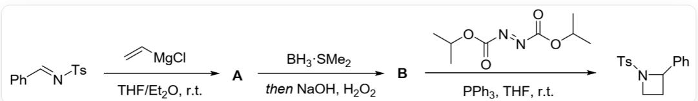
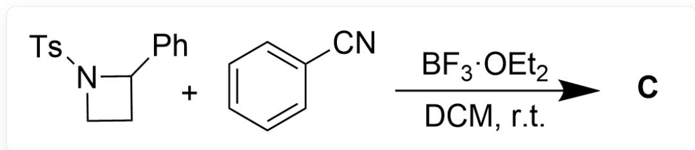
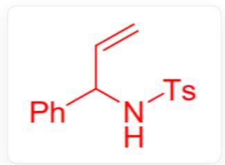
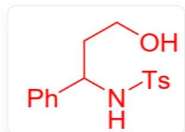
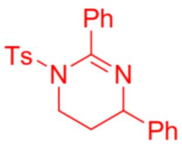

# 题目

通过图1反应路线，可以实现氮杂四元环的构筑

  
Fig.1，图中为三步连续反应。第一步反应以SMILES描述为：CC1=CC=C(S(/N=C/C2=CC=CC=C2)=(O)=O)C=C1和C=C[Mg]Cl反应生成[[A]]，其中反应条件为THF/Et2O,r.t.。第二步以SMILES描述为：从[[A]]生成[[B]]，其中反应条件为BH3·SMe2,thenNaOH,H2O2。第三步以SMILES描述为：[B]与CC(OC/N=N/C(OC(C)C)=O)=O)C反应生成CC1=CC=C(S(N2CCC2C3=CC=CC=C3)=(O)=O)C=C1，其中反应条件为PPh3,THF,r.t.。

推测反应机理和中间产物A和B的结构简式

该氮杂四元环还能继续发生图2后续转化：

  
Fig.2，图中反应以SMILES描述为：CC1=CC=C(S(N2CCC2C3=CC=CC=C3)(=O)=O)C=C1和N#CC4=CC=CC=C4生成[[C]]，其中反应条件为 $\mathrm{BF}_3\cdot \mathrm{OEt}_2,\mathrm{DCM},\mathrm{r.t.}$

已知 C 的  ${}^{1}\mathrm{H}$  NMR

$\mathrm{(CDCl_3,400MHz)}$  67.52 (m, 4H), 7.43 (m, 1H), 7.34 - 7.24 (m, 7H), 7.13 (m, 2H), 4.59(dd,  $J = 8.56, 5.4 \mathrm{~Hz}, 1 \mathrm{H})$ , 3.95 (m, 1H), 3.87 (m, 1H), 2.43 (s, 3H)

(m,1H)。推测反应机理和产物C的结构

有以下几种说法：

1. 中间产物 B 中含有一个二级羟基  
2. 中间产物 B 到氮杂四元环结构的机理为自由基机理  
3. 产物C总共含有三个环  
4. 氮杂四元环与苯腈反应得到产物C的过程中总共新形成了两根碳氮键

A. 其他选项均不正确  
B. 1  
C. 2

D. 3  
E. 4  
F. 1,2  
G. 1,3  
H. 1,4  
1. 2,3  
J. 2,4  
K. 3,4  
L. 1,2,3  
M. 1,2,4  
N. 1,3,4  
O. 2,3,4  
P. 1,2,3,4

# 答案

正确答案: E

# 详细解析

第一步格氏试剂与亲电亚胺加成，后处理得到中间体A结构如图3。

  
Fig.3，图中分子以SMILES描述为：  $C = CC(C1 = CC = CC = C1)NS(C2 = CC = C(C)C = C2)(= 0) = 0$

# CHECKPOINT

1 PTS

格氏试剂与亚胺亲核加成，后处理得到中间体A，结构以SMILES描述为：  $\mathrm{C = CC(C1 = CC = CC = C1)NS(C2 = CC = C(C)C = C2)(= O) = O}$

第二步分子内双键与  $\mathrm{BH}_3\cdot \mathrm{SMe}_2$  发生硼氢化反应，得到端基硼化合物。  $\mathrm{H}_2\mathrm{O}_2$  氧化硼化合物得到端基羟基中间体B，结构如图4。

  
Fig.4,图中分子以SMILES描述为：OCCC(C1=CC=CC=C1)NS(C2=CC=C(C)C=C2)=(O)=O

羟基为一级羟基，说法1错误。

# CHECKPOINT

1 PTS

发生硼氢化反应，过氧化氢氧化得到端基羟基结构，中间体B以SMILES描述为：OCCC(C1=CC=CC=C1)NS(C2=CC=C(C)C=C2)(=O)=O

第三步观察条件可以发现反应为离子机理，实际上是一步光延反应（Mitunobu Reaction），三苯基膦被DIAD活化后与羟基结合，促进羟基离去形成氮杂四元环。

# CHECKPOINT

1 PTS

光延反应活化羟基发生分子内取代反应得到氮杂四元环

机理为离子机理，说法2错误。

氮杂四元环产物在强路易斯酸  $\mathrm{BF}_3\cdot \mathrm{OEt}_2$  作用下打开大张力环系，在苄位生成碳正离子。

# CHECKPOINT

1 PTS

路易斯酸作用下四元环打开，在苄位形成碳正离子

苯腈可能通过氮原子发生亲核，或者在苯环上发生亲核，根据核磁结果计算芳环氢原子数量为14，即可判断反应为前者。

# CHECKPOINT

1 PTS

根据核磁结果可以判断反应发生在氮原子上

苯腈氮原子亲核进攻后，与其连接的碳原子成为亲电位点，与分子内的另一个氮原子恰好形成六元环结构，发生一步加成反应，得到图5的产物C结构。

  
Fig.5，图中分子以SMILES描述为：CC1=CC=C(S(N2CCC(C3=CC=CC=C3)N=C2C4=CC=CC=C4)(=O)=O)C=C1

# CHECKPOINT

1 PTS

分子内氮原子亲核加成睛鎘离子，得到稳定六元环产物C，结构以SMILES描述为：CC1=CC=C(S(N2CCC(C3=CC=CC=C3)N=C2C4=CC=CC=C4) $(= 0)=0)\mathrm{C}=\mathrm{C}1$

产物C含有四个环，说法3错误。

得到产物C的反应过程中总共新形成了两根碳氮键，说法4正确。