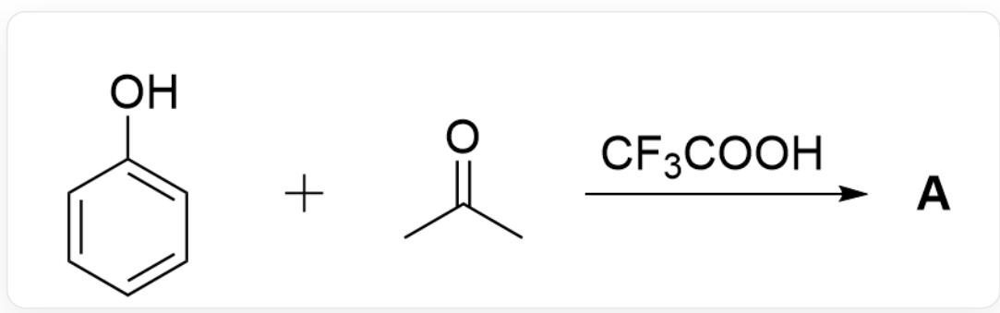
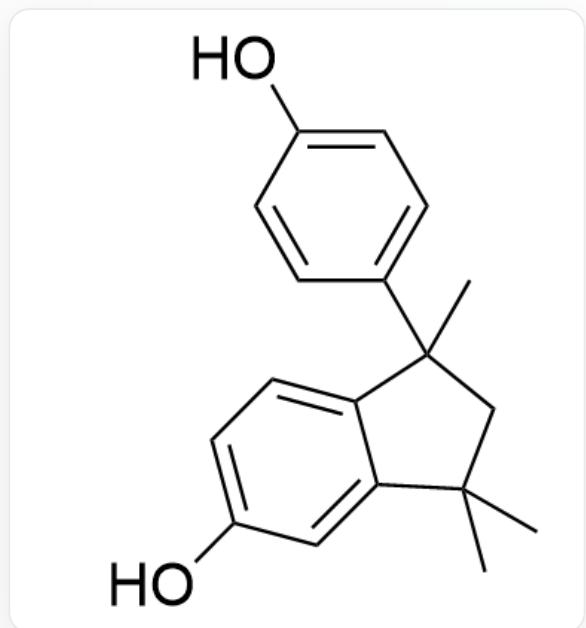
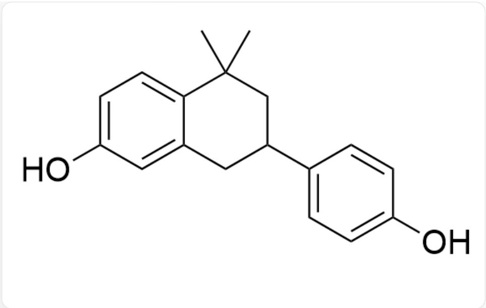
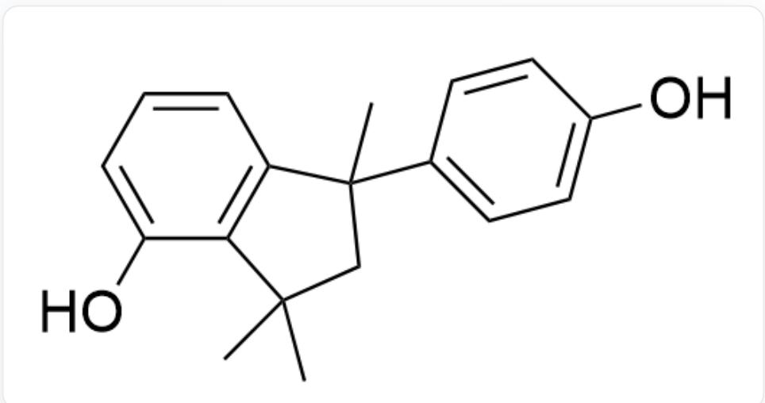
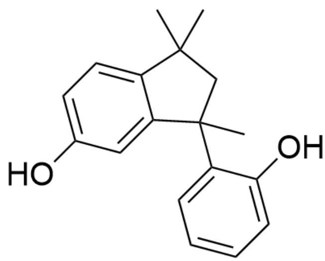
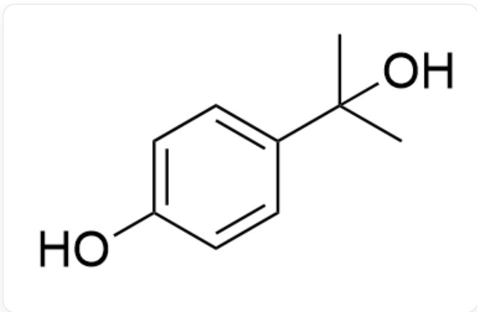
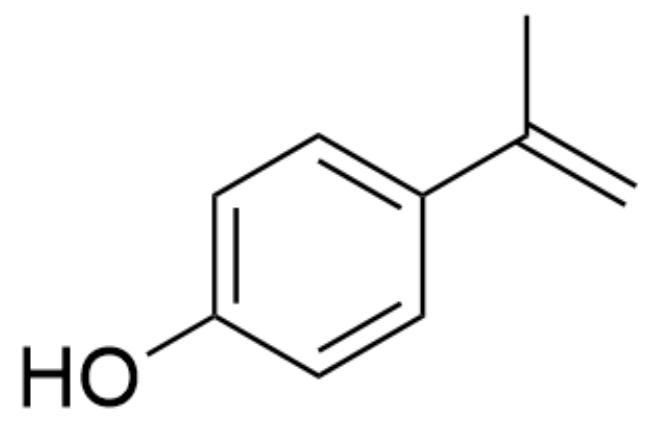
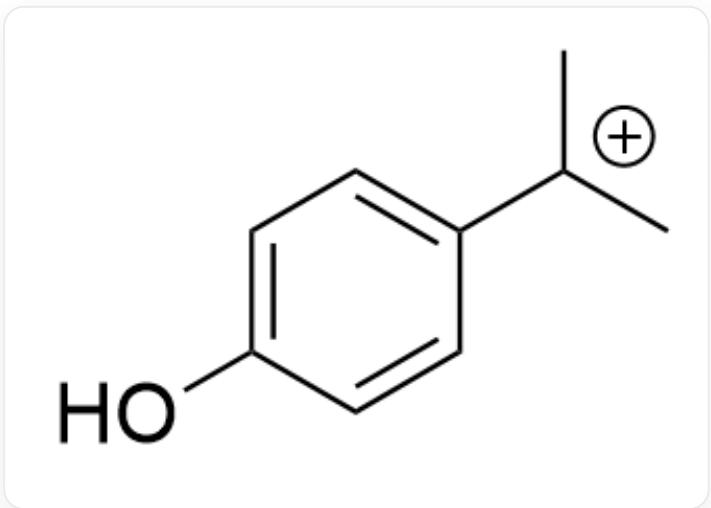
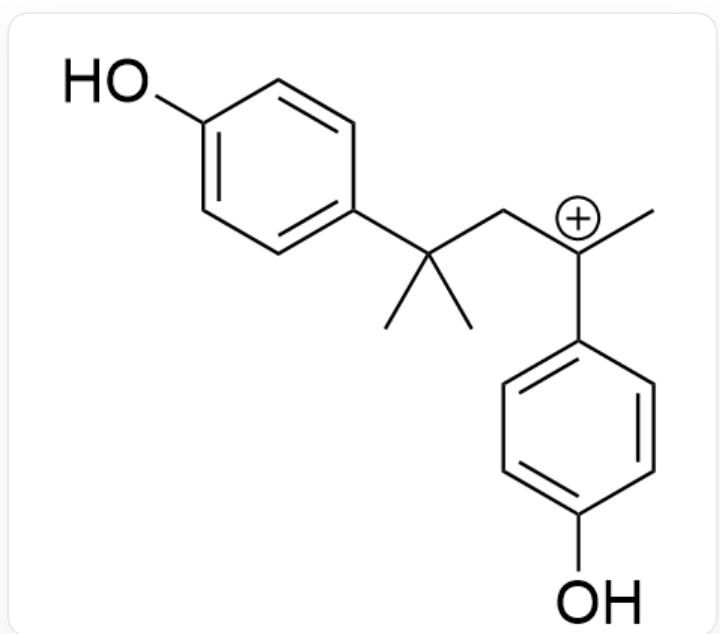
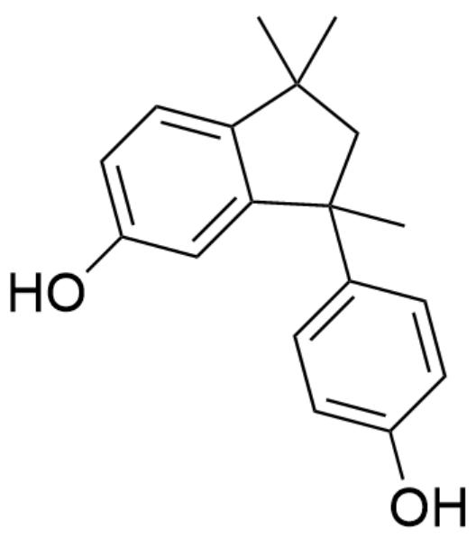

# Question

  
OC1=CC=CC=C1.CC(C)=O>FC(F)(C(O)=O)F>[A], A is the product

Given that the molecular formula of the reaction product  $\mathbf{A}$  is  $\mathrm{C_{18}H_{20}O_2}$  and  $\mathbf{A}$  contains 3 rings. Without considering enantiomers, provide the structural formula of the thermodynamic product  $\mathbf{A}$ .

A. All other options are incorrect  
B.

  
OC1=CC=C2C(C)(C)CC2(C)C3=CC=C(O)C=C3)=C1

C.

  
D.

CC1(C)CC(C2=CC=C(O)C=C2)CC3=CC(O)=CC=C31

  
E.

OC1=CC=CC2=C1C(C)(C)CC2(C3=CC=C(O)C=C3)C

OC1=CC=CC2=C1C(C)(C)CC2(C3=C(O)C=CC=C3)C

F.

OC1=CC=C2C(C(C)(C3=CC=CC=C3O)CC2(C)C)=C1

# Answer

Correct Answer: A

# Detailed Explanation

First, according to the molecular formula  $\mathrm{C_{18}H_{20}O_2}$  of the reaction product A, it can be deduced that the product is formed by the condensation of 2 molecules of phenol and 2 molecules of acetone, with the removal of 2 molecules of water during the reaction.

# CHECKPOINT

1 PTS

First, according to the molecular formula  $\mathrm{C_{18}H_{20}O_2}$  of the reaction product A, it can be deduced that the product is formed by the condensation of 2 molecules of phenol and 2 molecules of acetone, with the removal of 2 molecules of water during the reaction.

The question states that  $\mathbf{A}$  is the thermodynamic product, so the para position of phenol preferentially undergoes condensation reaction with acetone to obtain the intermediate

  
OC1=CC=C(C(C)(C)O)C=C1

# CHECKPOINT

1 PTS

The para position of phenol preferentially undergoes condensation reaction with acetone

# CHECKPOINT

1 PTS

Intermediate 1:  $\mathrm{OC1 = CC = C(C(C)(C)O)C = C1}$

Eliminate one molecule of water under acid catalysis to obtain the intermediate

$$
\mathrm {O C} 1 = \mathrm {C C} = \mathrm {C} (\mathrm {C} (\mathrm {C}) = \mathrm {C}) \mathrm {C} = \mathrm {C} 1
$$

# CHECKPOINT

1 PTS

Intermediate 2:  $\mathrm{OC1 = CC = C(C(C) = C)C = C1}$

Intermediate 2 can be protonated to obtain intermediate 3

$$
\mathrm {O C} 1 = \mathrm {C C} = \mathrm {C} ([ \mathrm {C} + ] (\mathrm {C}) \mathrm {C}) \mathrm {C} = \mathrm {C} 1
$$

# CHECKPOINT

1 PTS

Intermediate 3: OC1=CC=C([C+](C)C)C=C1

Intermediate 3 can be captured by intermediate 2 to obtain the intermediate

$$
\mathrm {O C} 1 = \mathrm {C C} = \mathrm {C} (\mathrm {C} (\mathrm {C}) (\mathrm {C}) \mathrm {C} [ \mathrm {C} + ] (\mathrm {C} 2 = \mathrm {C C} = \mathrm {C} (\mathrm {O}) \mathrm {C} = \mathrm {C} 2) \mathrm {C}) \mathrm {C} = \mathrm {C} 1
$$

# CHECKPOINT

1 PTS

Intermediate 4: OC1=CC=C(C(C)(C)C[C+](C2=CC=C(O)C=C2)C)C=C1

Based on the hint in the question that another ring needs to be formed, it is easy to think that the carbocation can be captured by the benzene ring to form a five-membered ring.

OC1=CC=C2C(C(C)(C3=CC=C(O)C=C3)CC2(C)C)=C1

# CHECKPOINT

1 PTS

Reaction product A: OC1=CC=C2C(C(C)(C3=CC=C(O)C=C3)CC2(C)C)=C1