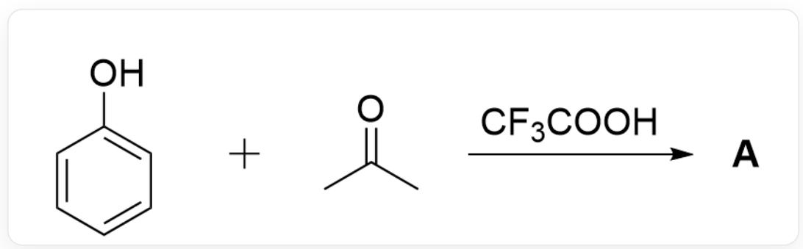
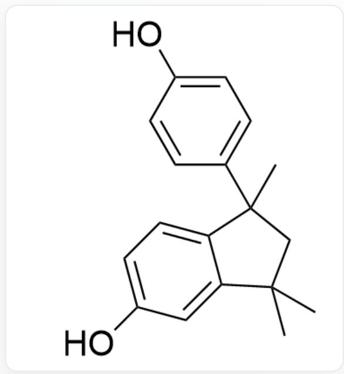
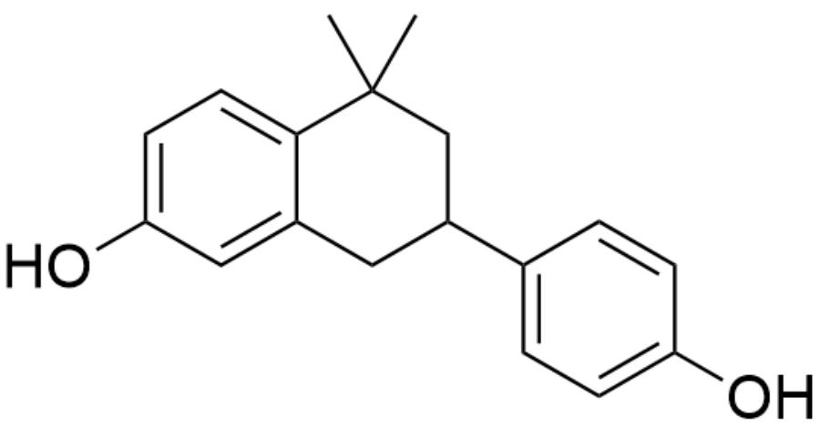
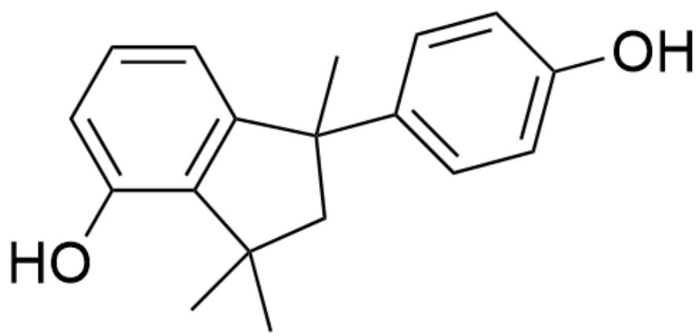
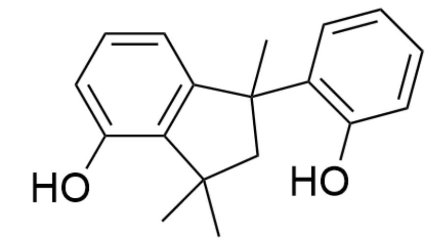
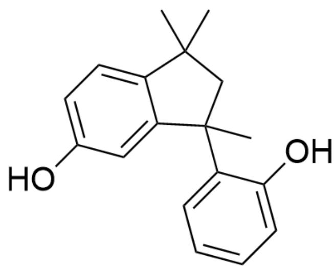
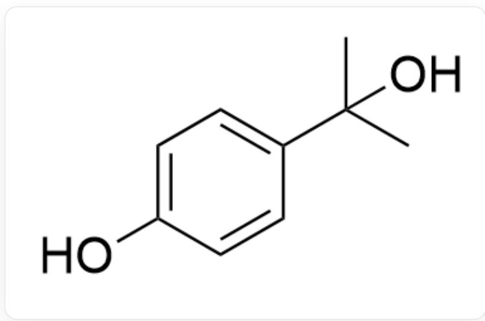
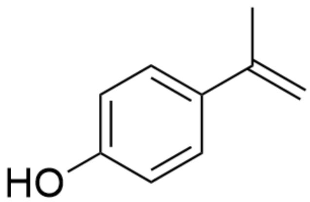
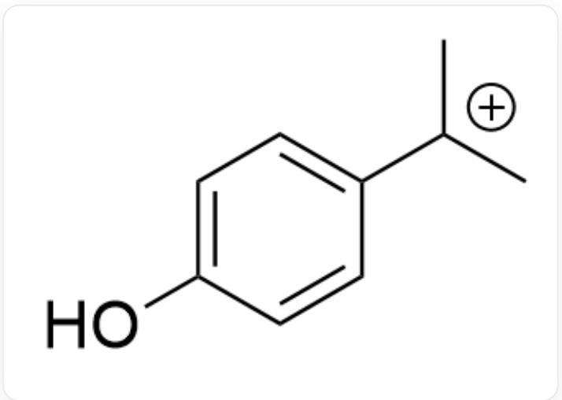
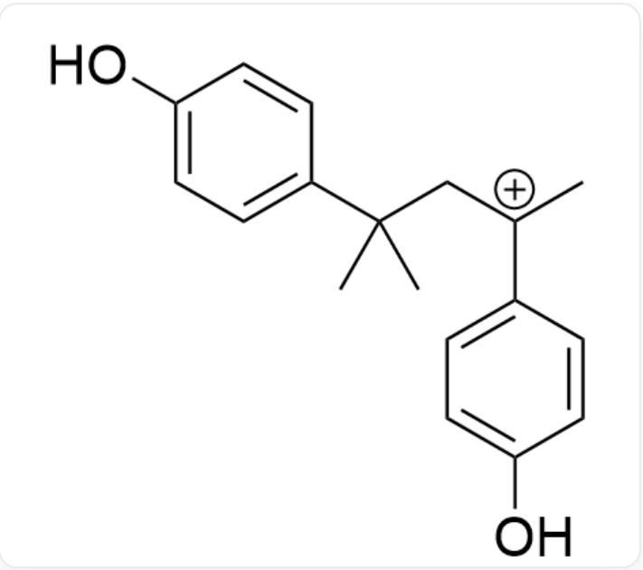

# 题目

  
OC1=CC=CC=C1.CC(C)=O>FC(F)(C(O)=O)F>[A],A是产物

已知反应产物  $\mathrm{A}$  的分子式为  $\mathrm{C}_{18} \mathrm{H}_{20} \mathrm{O}_{2}$  且  $\mathrm{A}$  中含有3个环。不考虑对映异构的情况下，试给出热力学产物  $\mathrm{A}$  的结构式

A. 其他选项均不正确  
B.

  
OC1=CC=C2C(C)(C)CC2(C)C3=CC=C(O)C=C3)=C1

C.

  
D.

CC1(C)CC(C2=CC=C(O)C=C2)CC3=CC(O)=CC=C31

  
E.

OC1=CC=CC2=C1C(C)(C)CC2(C3=CC=C(O)C=C3)C

OC1=CC=CC2=C1C(C)(C)CC2(C3=C(O)C=CC=C3)C

F.

OC1=CC=C2C(C(C)(C3=CC=CC=C3O)CC2(C)C)=C1

# 答案

正确答案: A

# 详细解析

首先根据反应产物A的分子式  $\mathrm{C_{18}H_{20}O_2}$  ，可以推得产物由2分子苯酚与2分子丙酮缩合而成，反应过程中脱去2分子水。

# CHECKPOINT

1 PTS

首先根据反应产物  $\mathbf{A}$  的分子式  $\mathrm{C_{18}H_{20}O_2}$ , 可以推得产物由2分子苯酚与2分子丙酮缩合而成, 反应过程中脱去2分子水。

题目中说A为热力学产物，因此苯酚对位优先与丙酮发生缩合反应，得到中间体

OC1=CC=C(C(C)(C)O)C=C1

# CHECKPOINT

1 PTS

苯酚对位优先与丙酮发生缩合反应

# CHECKPOINT

1 PTS

中间体1：  $\mathrm{OC}1 = \mathrm{CC} = \mathrm{C}(\mathrm{C}(\mathrm{C})(\mathrm{C})\mathrm{O})\mathrm{C} = \mathrm{C}1$

在酸催化下消去一分子水得到中间体

OC1=CC=C(C(C)=C)C=C1

# CHECKPOINT

1 PTS

中间体2：OC1=CC=C(C(C)=C)C=C1

中间体2可被质子化得到中间体3

OC1=CC=C([C+](C)C)C=C1

# CHECKPOINT

1 PTS

中间体3：OC1=CC=C([C+](C)C)C=C1

中间体3可被中间体2捕获得到中间体

OC1=CC=C(C(C)(C)C[C+](C2=CC=C(O)C=C2)C=C1

# CHECKPOINT

1 PTS

中间体4：OC1=CC=C(C(C)(C)C[C+](C2=CC=C(O)C=C2)C)C=C1

由题目提示需要再成一个环，容易想到该碳正离子可被苯环捕获形成五元环。

OC1=CC=C2C(C(C)(C3=CC=C(O)C=C3)CC2(C)C)=C1

# CHECKPOINT

1 PTS

反应产物A：OC1=CC=C2C(C(C)(C3=CC=C(O)C=C3)CC2(C)C)=C1