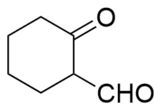
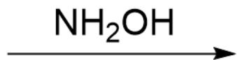
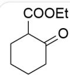
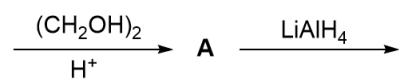
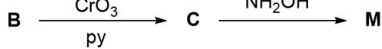
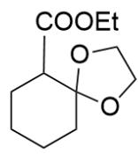
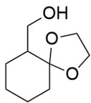
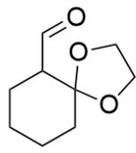
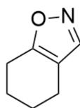
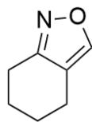

# Question

This image describes a one-step organic reaction where the substrate is O=C1C(CO)CCCC1, reacting with  $\mathrm{NH}_2\mathrm{OH}$  to produce two unknown species  $^{**}\mathrm{M}^{**}$  and  $^{**}\mathrm{N}^{**}$

The  $\mathbf{M}$  and  $\mathbf{N}$  obtained from the reaction above are isomers and do not contain hydroxyl groups. To prepare pure  $\mathbf{M}$ , the following reaction was designed:

This image describes a multi-step tandem organic reaction where the substrate is O=C1CCCCC1C(OCC)=O, first reacting with  $\left(\mathrm{CH}_2\mathrm{OH}\right)_2$  in the presence of hydrogen ions to produce  $^{**}\mathrm{A}^{**}$ ,  $^{**}\mathrm{A}^{**}$  reacting with LiAlH $_4$  to produce  $^{**}\mathrm{B}^{**}$ ,  $^{**}\mathrm{B}^{**}$  reacting with  $\left(\mathrm{CrO}_3\right.$  in the presence of py to produce  $^{**}\mathrm{C}^{**}$ , and  $^{**}\mathrm{C}^{**}$  reacting with NH $_2$ OH to produce  $^{**}\mathrm{M}^{**}$ .

Which of the following statements is correct?

A. The chemical formula of M or N contains 11 hydrogens.  
B. M contains a spirocyclic system  
C. The product of complete hydrogenation of  $\mathbf{N}$  has 13 hydrogen atoms.  
D. N has hydrogen atoms with a chemical shift of 6-10.

E. None of the above options is correct

# Answer

Correct Answer: D

# Detailed Explanation

Let's first analyze the reaction for the synthesis of  $\mathbf{M}$ :

The substrate is added to ethylene glycol and acid, which are classic conditions for protecting ketone carbonyls, generating the five-membered ring ketal A, with the structural formula  $\mathrm{O = C(C1C2(OCC02)CCCC1)OCC}$ .

# CHECKPOINT

1 PTS

A structural formula is  $\mathrm{O = C(C1C2(OCC02)CCC}$  C1)OCC

A is reduced by lithium aluminum hydride, and the ester group is directly reduced to a primary alcohol, so the structural formula of B is OCC1C2(OCCO2)CCCCC1.

# CHECKPOINT

1 PTS

B structural formula is OCC1C2(OCCO2)CCCC1

$\mathbf{B}$  is oxidized by chromium trioxide, and the primary alcohol is oxidized to a carbonyl group, generating an aldehyde, with the structural formula of  $\mathbf{C}$  being  $\mathrm{O = CC1C2(OCC02)CCCC1}$ .

# CHECKPOINT

1 PTS

C structural formula is  $\mathrm{O = CC1C2(OCC02)CCCC}$

C reacts with hydroxylamine. First, the aldehyde group is attacked by the nitrogen atom of hydroxylamine to form an imine structure. Then, it can be found that the hydroxyl group of the imine can exchange with the ketal in the system, generating a new fused five- and six-membered ring system. At the same time, the newly formed five-membered ring has the driving force for aromatization and can lose ethylene glycol to form a five-membered aromatic heterocycle. Thus, the structural formula of M is C1(C=NO2)=C2CCCCC1.

# CHECKPOINT

1 PTS

The hydroxyl group of the imine can exchange with the ketal in the system, generating a new fused five- and six-membered ring system

# CHECKPOINT

1 PTS

The newly formed five-membered ring has the driving force for aromatization

# CHECKPOINT

1 PTS

M structural formula is C1(C=NO2)=C2CCCC1

Analyzing the reaction for the synthesis of  $\mathbf{M}$  and  $\mathbf{N}$ , hydroxylamine reacts with the ketone carbonyl group in the substrate to form an imine. The hydroxyl group of the imine can continue to undergo nucleophilic substitution with

the primary alcohol to form a five-membered ring, and aromatization occurs with the loss of water. At this point, the product is C12=CON=C1CCCCC2, which is exactly an isomer of M. Therefore, the structural formula of N is C12=CON=C1CCCCC2.

# CHECKPOINT

1 PTS

N structural formula is C12=CON=C1CCCC2

Analyzing the options: The chemical formula of  $\mathbf{M}$  contains 9 hydrogens and is a fused five- and six-membered ring system, so options A and B are incorrect.

Complete hydrogenation of  $\mathbf{N}$  will break the nitrogen-oxygen bond to form an amino group and a hydroxyl group, with the product being NC1C(CO)CCCC1, containing 15 hydrogen atoms, so option C is incorrect.

# CHECKPOINT

1 PTS

Complete hydrogenation of N will break the nitrogen-oxygen bond, with the product being NC1C(CO)CCCC1

N contains an aromatic five-membered heterocycle, so the hydrogen on the ring is located in the low-field region of the chemical shift, so option D is correct.

# CHECKPOINT

1 PTS

$\mathbf{N}$  contains an aromatic five-membered heterocycle, so the hydrogen on the ring is located in the low-field region of the chemical shift

In summary, option D is correct.

The following is the structure image of the answer to this question:

  
A

  
B

  
C

  
M+N

This image shows the structural formula of the unknown species in this question