# 题目

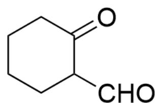

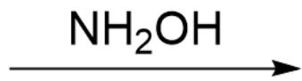

该图描述了一步有机反应, 底物为  $\mathrm{O} = \mathrm{C} 1 \mathrm{C} (\mathrm{CO}) \mathrm{CCCC} 1$ , 与  $\mathrm{NH}_{2} \mathrm{OH}$  反应生成两种未知物种  $^{**} \mathrm{M}^{**}$  和  $^{**} \mathrm{N}^{**}$

上图的反应得到的M和N为同分异构体且不含羟基。为制备纯净的M，设计了以下反应：

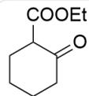

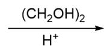

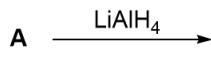

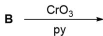

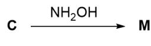

该图片描述了一个有机多步串联反应，底物为O=C1CCCCC1C(OCC)=O，先与  $\left(\mathrm{CH}_{2} \mathrm{OH}\right)_{2}$  在氢离子存在条件下反应生成\*\*\*A\*\*，\*\*A\*\*与LiAlH $_4$  反应生成\*\*B\*\*，\*\*B\*\*与  $\left(\mathrm{CrO}_{3}\right.$  在py存在下反应生成\*\*C\*\*，\*\*C\*\*与  $\mathrm{NH}_{2} \mathrm{OH}$  反应生成\*\*M\*\*。

# 下列说法正确的是：

A. M或N的化学式中含有11个氢。  
B. M中含有螺环体系  
C. N彻底氢化的产物有13个氢原子  
D. N拥有化学位移在8-10的氢原子  
E. 以上选项均不正确

# 答案

正确答案: D

# 详细解析

先分析合成M的反应：

底物加入乙二醇和酸，是经典的保护酮羰基的条件，生成五元环缩酮A，结构式为  $\mathrm{O = C(C1C2(OCC02)CCCC1)OCC}$ 。

CHECKPOINT

1 PTS

A结构式为O=C(C1C2(OCC02)CCCC1)OCC

A被氢化铝锂还原，酯基被直接还原为一级醇，故B结构式为OCC1C2(OCCO2)CCCC1。

CHECKPOINT

1 PTS

B结构式为OCC1C2(OCCO2)CCCC1

B被三氧化铬氧化，一级醇被氧化为羰基，生成醛，C结构式为O=CC1C2(OCCO2)CCCC1。

# CHECKPOINT

1 PTS

C结构式为O=CC1C2(OCC02)CCCC1

C与羟胺反应，首先醛基被羟胺的氮原子亲核变成亚胺结构；之后可以发现，亚胺的羟基可以与体系中的缩酮发生交换，生成新的五并六环系；同时新生成的五元环具有芳构化的动力，可以脱去乙二醇形成五元芳香杂环。从而M的结构式为C1(C=NO2)=C2CCCC1。

# CHECKPOINT

1 PTS

亚胺的羟基可以与体系中的缩酮发生交换，生成新的五并六环系

# CHECKPOINT

1 PTS

新生成的五元环具有芳构化的动力

# CHECKPOINT

1 PTS

M的结构式为C1(C=NO2)=C2CCCC1

分析合成M与N的反应，羟胺与底物中的酮羰基反应形成亚胺，亚胺的羟基可以继续与一级醇发生亲核取代形成五元环，并且芳构化脱去水。此时产物为C12=CON=C1CCCC2，刚好与M互为同分异构体；因此N结构式为C12=CON=C1CCCC2。

# CHECKPOINT

1 PTS

N结构式为C12=CON=C1CCCC2

分析选项：M化学式含有9个氢，且为五并六环系，选项A,B均错误。

N彻底氢化会打断氮氧键形成氨基和羟基，产物为NC1C(CO)CCCC1，含有15个氢原子，选项C错误。

# CHECKPOINT

1 PTS

N彻底氢化会打断氮氧键，产物为NC1C(CO)CCCC1

N含有芳香五元杂环，从而环上的氢位于化学位移低场，选项D正确。

# CHECKPOINT

1 PTS

N含有芳香五元杂环，从而环上的氢位于化学位移低场

综上，选项D正确。

下图为本题答案的结构图片：

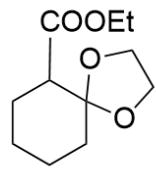  
A

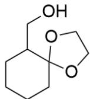  
B

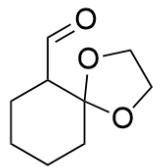  
c

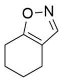  
M+N

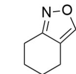

此图为本题的未知物种结构式